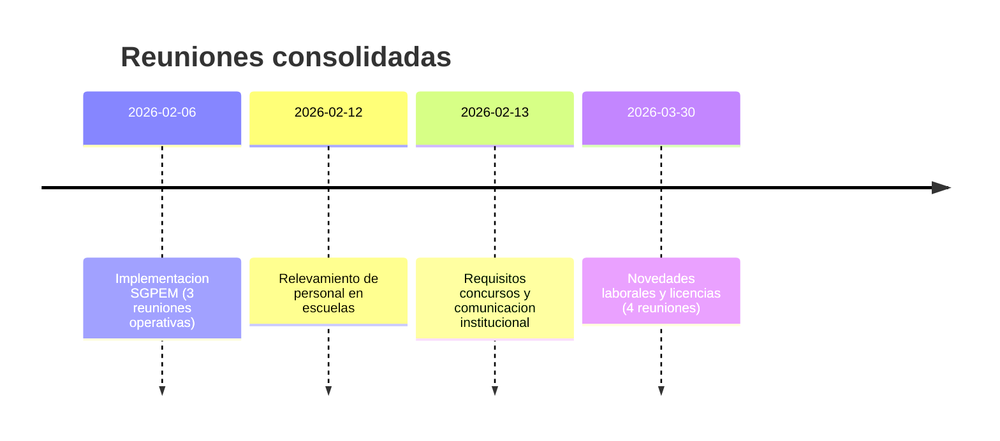

# Cronologia consolidada de reuniones (Febrero-Marzo 2026)

> [!abstract] Objetivo
> Ordenar cronologicamente toda la informacion relevada en reuniones, con contexto, decisiones, riesgos y tareas, manteniendo trazabilidad hacia las notas fuente.

## Linea temporal general

## 2026-02-06 - Implementacion SGPEM

### Contexto
Jornada con tres reuniones criticas para ajustar el diseno funcional del SGPEM frente a problemas reales de operacion y de calidad de datos.

### Reuniones del dia
1. `12:10` Digitalizacion de suplencias y validacion de plazas.
2. `13:25` Licencias y suplencias con foco en sincronizacion POF-Gestion.
3. `14:38` Gestion de inconsistencias en POST y estrategia de resolucion.

### Hallazgos clave
- El modelo original del SGPEM necesita un flujo formal para inconsistencias para no bloquear toda la operacion.
- Se plantea estado intermedio `BAJO_OBSERVACION` para habilitar carga con seguimiento.
- Se identifican casos complejos que requieren reglas especificas: traslados transitorios y licencias medicas 27/28.
- Se define Veron de Astrada como entorno piloto para validacion controlada.

### Impacto funcional
- Ajustes en ciclo de vida de planillas.
- Nuevos requerimientos para validaciones, datos historicos de plaza y sincronizacion entre sistemas.
- Necesidad de modulo especifico para inconsistencias con vista por departamento.

### Tareas y decisiones operativas
- Reunir cargadores para validar flujo de correccion por etapas.
- Medir tiempos reales de resolucion de inconsistencias.
- Definir estrategia formal: observacion con correccion vs bloqueo total.

## 2026-02-12 - Relevamiento de personal en escuelas

### Contexto
Reunion de analisis territorial sobre cobertura de limpieza y redistribucion de porteros.

### Definiciones y foco
- Redistribuir porteros activos segun necesidad real de cada escuela.
- Priorizar escuelas sin empresa de limpieza o con cobertura insuficiente.
- Cruzar formulario de relevamiento con informacion operativa de la empresa de limpieza.

### Tareas relevadas
- Elaborar informe de escuelas sin cobertura adecuada (incluye casos mencionados en la reunion).
- Revisar formulario y agregar preguntas faltantes.
- Hacer seguimiento especifico del caso Escuela Sardi.

### Cambios de personal reportados
- Traslados definitivos en curso.
- TAI enviadas al ministerio para nombramientos.
- Seguimiento de expediente en espera.

## 2026-02-13 - Requisitos de concursos y comunicacion

### Contexto
Reunion orientada a requisitos de concursos docentes, criterios de publicacion y coordinacion interdepartamental de contenido.

### Definiciones de requisitos
- Inscripcion en padron, aparicion en padron y vacante disponible como condiciones base.
- Coincidencia DNI-localidad como requisito de inscripcion territorial.
- Verificacion obligatoria de competencia de titulos antes de la inscripcion.
- Inasistencia por concurso solo justificable con convocatoria formal recibida.

### Comunicacion y web
- Estrategia de contenido util y de valor (calidad por sobre cantidad).
- Ajustes pendientes en pagina "Primeros pasos docencia" (inscripcion extraordinaria, competencia de titulos, DNI-localidad y orientacion inicial).

### Coordinacion y pendientes
- Coordinacion con aula virtual y equipo tecnico para soporte territorial.
- Pendiente de acceso a contenidos de gestion educativa.
- Pendiente de PDF actualizado de competencia de titulos.

> [!warning] Dato a revisar
> La nota fuente tiene `date: 2025-02-13`, pero el titulo y el contenido refieren a 2026. Conviene corregir ese metadato en una nota nueva de normalizacion (sin tocar la historica).

## 2026-03-30 - Novedades laborales y licencias

### Contexto
Bloque de cuatro reuniones para definir direccion funcional del sistema de novedades laborales y su convivencia con el modulo de licencias.

### Reuniones del dia
1. `11:23` Planificacion con Carlos (onboarding tecnico y prioridades).
2. `12:39` Reglas de origen de novedades (establecimiento, nodos, ministerio).
3. `13:37` Preparacion de analisis antes de alinear con Ruben.
4. `15:00` Planificacion principal de novedades laborales.

### Definiciones funcionales principales
- Migracion de planilla mensual consolidada a novedad individual por agente.
- Esquema operativo con notificacion continua y cortes de liquidacion mantenidos (dias 25-28).
- Estrategia por escenarios: con integracion de licencias / sin integracion de licencias.

### Riesgos y bloqueos
- Dependencias administrativas para habilitaciones operativas.
- Limites tecnicos de CISPER para bajas de cargos.
- Incertidumbre de tiempos del sistema de licencias y dependencia de definiciones de gestion.

### Pendientes inmediatos
- Definir matriz funcional por tipo de novedad.
- Consolidar responsables por subproceso y fecha objetivo.
- Integrar revision experta cuando el flujo base este estabilizado.

## Matriz consolidada (fechas, foco y estado)

| Fecha | Eje principal | Nivel de impacto | Estado de seguimiento |
|---|---|---|---|
| 2026-02-06 | Ajustes estructurales SGPEM e inconsistencias | Alto | En seguimiento |
| 2026-02-12 | Relevamiento operativo de cobertura escolar | Medio | Abierto |
| 2026-02-13 | Requisitos normativos y comunicacion institucional | Medio | Abierto |
| 2026-03-30 | Redefinicion funcional de novedades y licencias | Alto | En ejecucion |

## Prioridades transversales (propuestas)

- [ ] Formalizar un backlog unico de reuniones con responsable y fecha compromiso.
- [ ] Consolidar una sola matriz de riesgos (operativos, normativos y tecnicos).
- [ ] Versionar decisiones funcionales por fecha para evitar contradicciones entre documentos.
- [ ] Definir tablero semanal con estado de cada pendiente critico.

## Nota de alineacion estrategica (hito 30/03/2026)

> [!important] Cambio de paradigma confirmado
> Desde el 30/03/2026, el objetivo funcional se redefine: la unidad primaria deja de ser la planilla mensual y pasa a ser la novedad laboral independiente por agente. La planilla se conserva como consolidado resultante para administracion/liquidacion.

### Implicancias para lectura de esta cronologia

- Los registros de febrero deben interpretarse como base historica y de contexto de implementacion inicial.
- Los acuerdos de marzo introducen una transicion de modelo, no una anulacion del antecedente documental.
- A partir de este hito, se recomienda validar coherencia entre documentos tecnicos/funcionales y la nueva unidad de proceso.

### Dependencias transversales asociadas al hito

- Integracion con sistema de licencias medicas en desarrollo paralelo (escenarios con/sin integracion).
- Restriccion operativa de CISPER para bajas de cargos (impacto directo en carga mensual y control).
- Necesidad de cerrar responsables y fechas por subproceso para reducir riesgo de desalineacion.

## Notas fuente (embebidas para detalle completo)

### Fuente 2026-02-06
![[10 - Proyectos/Planillas de novedades/01 - Reuniones/2026/2026-02-06 - Implementación SGPEM]]

### Fuente 2026-02-12
![[10 - Proyectos/Relevamiento de porteros y limpieza/01 - Reuniones/2026/2026-02-12 - Relevamiento de personal en escuelas]]

### Fuente 2026-02-13
![[20 - Áreas/Docencia y concursos/Reuniones/2026/2026-02-13 - Requisitos para concursos de ingreso a la docencia]]

### Fuente 2026-03-30
![[10 - Proyectos/Planillas de novedades/01 - Reuniones/2026/2026-03-30 - Novedades laborales y licencias]]
