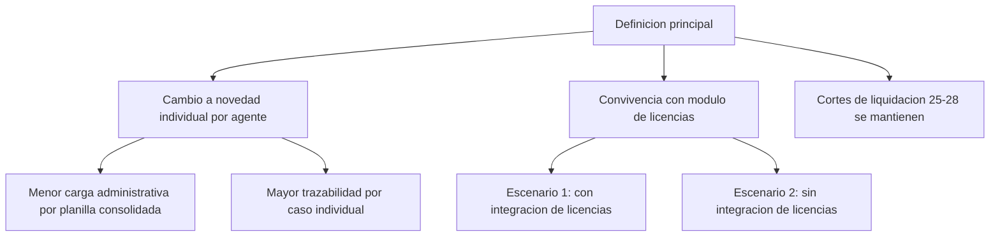

---
tags:
  - reunion
  - cge
  - sgpem
  - novedades-laborales
  - licencias
date: 2026-03-30
tipo: Reunión
fuente: Granola
estado: consolidado
---

# Reuniones del 30 de Marzo, 2026 - Novedades laborales y licencias

> [!abstract] Objetivo del dia
> Consolidar definiciones para el sistema de novedades laborales, coordinar su convivencia con el sistema de licencias medicas y ordenar los proximos pasos operativos.

## Vista rapida

```mermaid
timeline
    title Linea de tiempo - 30/03/2026
    11:23 : Project planning with Carlos
          : Onboarding tecnico y alcance inicial
    12:39 : Novedades laborales y licencias
          : Reglas de origen y flujo por agente
    13:37 : Analysis prep for Ruben's meeting
          : Preparacion de analisis y riesgos de contexto
    15:00 : Novedades laborales planificacion
          : Definiciones funcionales principales
```

## 1) Project planning with Carlos (11:23)

### Contexto
Reunion de arranque para integracion al equipo, definicion de recursos iniciales y orden de prioridades entre licencias y novedades laborales.

### Decisiones tomadas
- Se habilita computadora temporal mientras se gestiona equipo definitivo.
- El desarrollo de licencias medicas se plantea en servidor separado para no sobrecargar el entorno actual.
- Se adopta enfoque Pareto para priorizar lo de mayor impacto.

### Pendientes
- Geronimo: gestionar alta de correo oficial con Vicky (incluye datos personales requeridos).
- Geronimo: coordinar con Silvina temas de incorporacion de Laura.
- Geronimo: revisar documentacion base de licencias medicas.

### Riesgos / bloqueos
- No esta definida la ubicacion fisica definitiva.
- Dependencias de terceros para habilitaciones administrativas.

## 2) Novedades laborales y licencias (12:39)

### Contexto
Reunion tecnica para definir de donde nacen las novedades y como se informan entre establecimiento, nodos y ministerio.

### Decisiones tomadas
- Adscripciones y comisiones se originan en ministerio.
- Novedades iniciadas en establecimiento se informan por nodos laborales.
- El reintegro siempre entra como parte de novedad.
- Se confirma cambio de enfoque: de planilla grupal a novedad individual por agente.

### Pendientes
- Definir responsables formales por subproceso.
- Definir fecha objetivo de implementacion por etapa.

### Riesgos / bloqueos
- No quedaron responsables nominales ni calendario cerrado en esta reunion.

## 3) Analysis prep for Ruben's meeting (13:37)

### Contexto
Preparacion de analisis previo para alinear criterios antes de escalar con Ruben.

### Decisiones tomadas
- Se acuerda analisis preliminar con Emilia antes de incluir a Ruben.
- Posible inclusion de Jorge por experiencia historica del Consejo.

### Pendientes
- Consolidar comparativa Secundaria/Superior vs Primaria con evidencias.
- Ordenar casos historicos 2015-2021 para evitar reprocesos.

### Riesgos / bloqueos
- Contexto sensible con tema Maldonados y ventana corta de resolucion.

## 4) Novedades laborales planificacion (15:00)

### Contexto
Reunion principal del dia para definir estrategia funcional del nuevo sistema de novedades laborales.

### Decisiones tomadas
- Geronimo inicia analisis y desarrollo funcional.
- Se sostienen reuniones semanales iniciales sin Ruben para avanzar mas rapido.
- Se migra de planilla mensual consolidada a formularios individuales por agente.
- Se propone esquema de notificacion continua (24/7), manteniendo cortes de liquidacion entre dias 25 y 28.
- Se evaluan dos escenarios tecnicos: con modulo de licencias y sin modulo de licencias.

### Pendientes
- Definir flujo por tipo de novedad (alta, baja, licencias, reintegro, etc.).
- Reformular el proyecto con la documentacion normativa detectada.
- Integrar a Jorge cuando el flujo funcional base este mas maduro.

### Riesgos / bloqueos
- CISPER no baja cargos automaticamente (solo horas).
- Incertidumbre sobre fechas del sistema de licencias medicas.
- Dependencia de decisiones de nueva gestion ministerial.

## Mapa de decisiones del dia



## Acciones priorizadas (proxima semana)

| Prioridad | Accion | Responsable | Fecha objetivo | Estado |
|---|---|---|---|---|
| Alta | Cerrar accesos operativos (correo + puesto de trabajo) | Geronimo + soporte | 2026-04-01 | Pendiente |
| Alta | Definir matriz funcional por tipo de novedad | Geronimo | 2026-04-02 | Pendiente |
| Alta | Version 0 del flujo individual por agente | Geronimo | 2026-04-03 | Pendiente |
| Media | Documento de riesgos (CISPER/licencias/gestion) | Geronimo | 2026-04-03 | Pendiente |
| Media | Validar inclusion de Jorge en revision funcional | Coordinacion | 2026-04-05 | Pendiente |

## Documentacion normativa mencionada

- Resolucion 114 (procedimientos de novedades laborales).
- Resolucion 2141 (designaciones y formulario unico).
- Manual basico de novedades laborales.
- Decreto sobre designaciones por resolucion ministerial.
- Resolucion actualizada de declaraciones juradas.

## Complemento de completitud (MCP Granola)

> [!info] Alcance de esta ampliacion
> Este bloque agrega datos identificados en notas de Granola para evitar perdida de contexto operativo, funcional y de dependencias. No reemplaza el contenido anterior; lo expande.

### Definiciones ampliadas del enfoque funcional

- Se ratifica que la **unidad de trabajo primaria** es la novedad laboral independiente por agente.
- La planilla pasa a ser un **resultado de consolidacion posterior** (salida administrativa), no el punto de entrada operativo.
- El modelo individual se justifica por trazabilidad por caso y por evitar devoluciones de formularios completos.
- Se prioriza procesamiento continuo de novedades durante el mes, manteniendo corte de liquidacion entre dias 25 y 28.

### Integracion con licencias medicas (dependencia critica)

- Existe un sistema de licencias medicas en desarrollo paralelo con participacion ministerial y de Hacienda.
- Se define trabajar con **dos escenarios de diseno**:
  - Escenario A: convivencia sin integracion plena de licencias.
  - Escenario B: integracion con licencias una vez habilitado el circuito digital.
- La novedad de reintegro mantiene tratamiento en este proyecto, aun con integracion de licencias.
- La licencia medica sigue siendo la novedad mas frecuente que dispara suplencias; condiciona prioridad funcional.

### Reglas de origen de novedades (detalle operativo)

- Adscripciones y comisiones: origen ministerial.
- Novedades iniciadas en establecimiento: canal por nodos laborales.
- Reintegros: se registran por circuito de novedad laboral (no cierre automatico implicito).

### Restricciones tecnicas y de gestion

- CISPER no resuelve baja de cargos en forma automatica (solo horas), generando recarga mensual.
- La resolucion integral del problema de bajas de cargos depende de decisiones de gestion ministerial.
- El cronograma final debe contemplar incertidumbre de salida del sistema de licencias medicas.

### Actores y secuencia de trabajo acordada

- Secuencia inicial de avance funcional: trabajo tecnico semanal sin Ruben para acelerar definicion de base.
- Integracion posterior de revision experta (Ruben/Jorge) cuando el flujo base este suficientemente maduro.
- Se suma analisis preliminar con Emilia antes de escalar validaciones finales.

### Detalles de contexto organizacional relevantes para diseno

- Se releva diferencia de enfoque administrativo entre niveles: primaria con logica desde establecimiento hacia arriba, secundaria/superior con logica mas centralizada.
- Este punto se considera para definir controles preventivos y distribucion de responsabilidades por actor.

### Datos operativos y logistica mencionada en notas fuente

> [!warning] Datos de uso interno
> Informacion de conectividad y logistica de reuniones registrada en notas fuente de trabajo diario. Mantener uso restringido a contexto operativo interno.

- Ubicacion operativa mencionada para reuniones de coordinacion: Catamarca 640 (salon de abajo en una de las convocatorias).
- Red de trabajo mencionada en reunion: Mexalta.

### Acciones adicionales sugeridas para cerrar brechas de informacion

- Documentar explicitamente la regla de compilacion: `novedad independiente -> consolidado administrativo (planilla)`.
- Versionar decision de pivot funcional en los documentos troncales para evitar contradiccion con contenido historico de febrero.
- Consolidar responsables nominales y fecha objetivo por subproceso (aun pendiente de cierre formal).

## Archivos posiblemente impactados (analisis de coherencia)

> [!info] Resultado del analisis
> Estas reuniones impactan directamente en documentacion funcional del SGPEM, especialmente en el cambio a registro individual por agente y en la estrategia de integracion con licencias.

| Archivo | Impacto detectado | Accion aplicada |
|---|---|---|
| [[10 - Proyectos/Planillas de novedades/03 - Diseño técnico/SGPEM - Plan técnico|Plan técnico]] | Medio-alto: el alcance funcional debe reflejar mejor la migracion a esquema individual | Se agrega nota de actualizacion y enlace a esta reunion |
| [[10 - Proyectos/Planillas de novedades/02 - Diseño funcional/SGPEM - Sugerencias operativas|Sugerencias operativas]] | Alto: ya trata inconsistencias/BAJO_OBSERVACION y requiere continuidad con decisiones de marzo | Se agrega nota de continuidad y enlace a esta reunion |
| [[10 - Proyectos/Planillas de novedades/01 - Reuniones/2026/2026-02-06 - Implementación SGPEM|Reunion 6 de febrero SGPEM]] | Medio: funciona como antecedente directo | No se modifica contenido historico; se mantiene como base de febrero |

## Referencias de origen (Granola)

- [Project planning with Carlos](https://notes.granola.ai/d/f04ad779-e321-46bc-846a-cc3af5a86c99)
- [Novedades laborales y licencias](https://notes.granola.ai/d/ceb915ba-0197-478c-b721-ba1fca73ce04)
- [Analysis prep for Ruben's meeting](https://notes.granola.ai/d/bc30f916-2826-4635-9268-01200c25a331)
- [Novedades laborales planificacion](https://notes.granola.ai/d/4ecc71a7-dabd-44ca-9fd9-58407d9117ba)

---

> [!success] Cierre
> Apuntes consolidados para seguimiento operativo y alineacion funcional del SGPEM.
