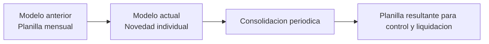
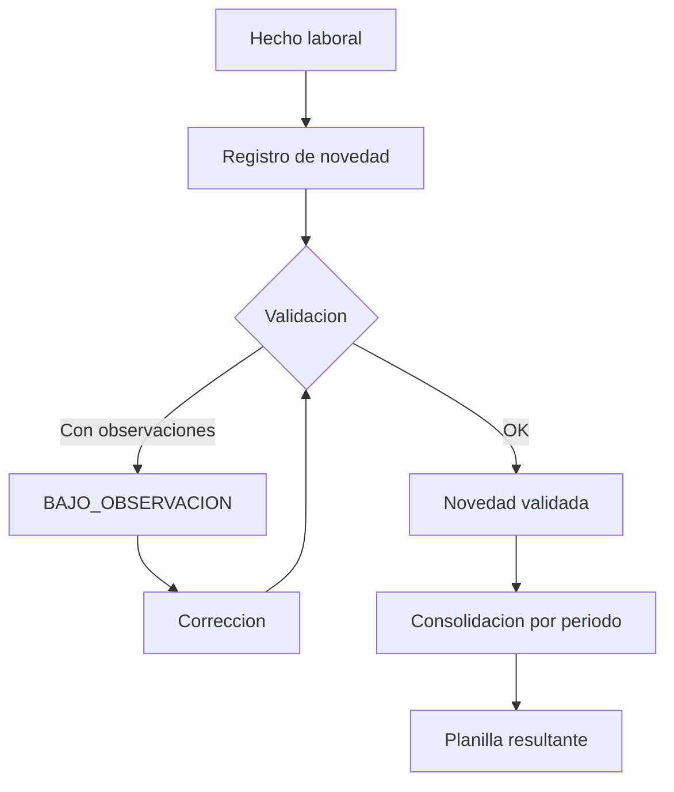
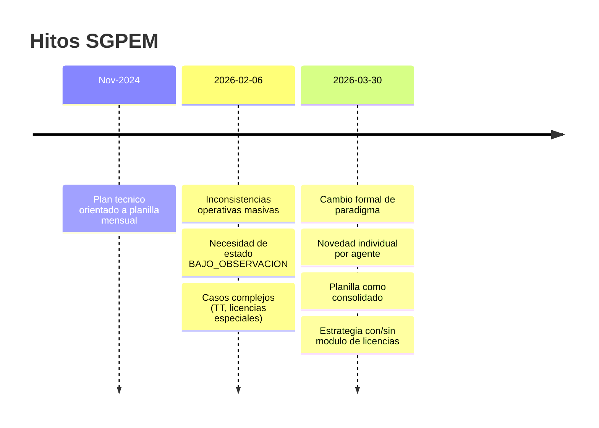
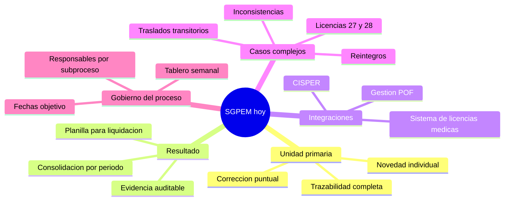
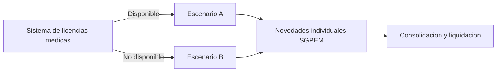

# SGPEM - Documento didactico integral

> [!abstract] Para que sirve esta nota
> Esta nota unifica, en lenguaje claro, las ideas previas y actuales del proyecto.
> La regla principal que ordena todo el trabajo es:
> **la novedad laboral independiente es la unidad primaria; la planilla es el consolidado resultante.**

---

## 1) Idea central en una frase

Antes el sistema giraba alrededor de una planilla mensual por escuela.
Ahora el sistema gira alrededor de cada novedad por agente, registrada y validada de forma continua, y luego consolidada para liquidacion.



---

## 2) Que cambio y por que

## 2.1 Antes (enfoque planilla)

- Carga principalmente a mes vencido.
- Errores u observaciones devolvian bloques grandes de informacion.
- Menor trazabilidad por caso individual.
- Mayor friccion operativa entre escuelas, nodos y personal de control.

## 2.2 Ahora (enfoque novedad)

- Cada novedad se registra de forma independiente por agente.
- La operacion pasa a ser continua (24/7), manteniendo corte de liquidacion entre dias 25 y 28.
- Las observaciones se corrigen por caso puntual sin rechazar todo.
- Se preserva mejor la trazabilidad de decisiones, fechas y responsables.



---

## 3) Cronologia didactica (hitos)



---

## 4) Mapa completo del sistema actual



---

## 5) Reglas funcionales que ordenan el proyecto

1. **Novedad primero, planilla despues.**
2. **No bloqueo ciego:** si falta algo, pasa a observacion con circuito de correccion.
3. **Validacion por criticidad:** lo critico bloquea cierre/liquidacion, lo no critico sigue con trazabilidad.
4. **Separacion de estados:** estado de la novedad no es lo mismo que estado de planilla.
5. **Compilacion por periodo:** la planilla es foto de consolidacion, no formulario primario de trabajo.

---

## 6) Integracion con licencias medicas (escenario dual)

El diseno debe soportar dos escenarios en paralelo:

- **Escenario A (con modulo de licencias):**
  - El inicio de licencia puede llegar prevalidado desde el circuito medico.
  - Disminuye carga administrativa manual.
  - La novedad de reintegro sigue gestionandose como novedad laboral.

- **Escenario B (sin modulo de licencias):**
  - SGPEM cubre ciclo completo de novedades, licencias y reintegros.
  - Mayor carga de validaciones internas y control documental.



---

## 7) Origen de novedades y circuito de informacion

- Adscripciones y comisiones: origen ministerial.
- Novedades iniciadas en establecimiento: via nodos laborales.
- Reintegro: siempre tratado como novedad laboral en SGPEM.

```mermaid
flowchart TD
    A[Ministerio] -->|Adscripciones / comisiones| D[SGPEM - Novedades]
    B[Establecimiento] -->|Novedad detectada| C[Nodo laboral]
    C --> D
    E[Sistema licencias] -->|Inicio licencia (si existe modulo)| D
    D --> F[Reintegro como novedad]
    D --> G[Consolidacion a planilla]
```

---

## 8) Problemas reales que el diseno tiene que resolver

## 8.1 Inconsistencias operativas

- Existen casos donde validaciones demasiado rigidas paralizan la operacion.
- Se necesita estado de observacion y un proceso de resolucion trazable.

## 8.2 Traslados transitorios

- Rompen supuestos simples de unicidad (docente en dos situaciones vinculadas).
- Deben modelarse como caso de negocio valido con reglas explicitas.

## 8.3 Licencias complejas (27/28)

- Requieren validacion diferenciada y no pueden tratarse igual que licencias simples.

## 8.4 Restriccion CISPER

- CISPER no baja cargos automaticamente (solo horas).
- Esto obliga reprocesos mensuales y debe contemplarse en reglas de cierre/liquidacion.

---

## 9) Riesgos y mitigaciones (vision ejecutiva)

| Riesgo | Impacto | Mitigacion propuesta |
|---|---|---|
| Dependencia del timeline de licencias medicas | Alto | Mantener escenario dual hasta integracion efectiva |
| Validaciones excesivamente rigidas | Alto | BAJO_OBSERVACION + SLA de correccion |
| Datos maestros desactualizados (plaza/agente) | Alto | Validacion por criticidad + cola de correccion |
| Falta de responsables nominales | Alto | Asignar duenos por subproceso y fecha objetivo |
| Restricciones CISPER para bajas de cargos | Alto | Regla puente operativa + decision de gestion |

---

## 10) Modelo de estados recomendado (didactico)

## 10.1 Estado de novedad

`DETECTADA -> REGISTRADA -> VALIDADA -> APLICADA -> CERRADA`

Estados alternos:

- `OBSERVADA`
- `RECHAZADA`
- `ANULADA`

## 10.2 Estado de consolidacion/planilla

`BORRADOR -> EN_REVISION_INTERNA -> ENVIADA -> BAJO_OBSERVACION (si aplica) -> APROBADA -> CERRADA`

---

## 11) Que queda por cerrar para ordenar definitivamente

1. Matriz funcional final por tipo de novedad (alta, baja, licencia, reintegro, TT, etc.).
2. Responsables y fechas por subproceso.
3. Regla final de convivencia con modulo de licencias.
4. Criterio operativo de cierre ante limitaciones CISPER.
5. Alineacion completa del plan tecnico historico al paradigma actual.

---

## 12) Guia de lectura recomendada (1 sola ruta)

1. [[10 - Proyectos/Planillas de novedades/00 - Inicio|00 - Inicio]]
2. [[10 - Proyectos/Planillas de novedades/01 - Reuniones/2026/2026-03-30 - Novedades laborales y licencias|Reunion 2026-03-30]]
3. [[10 - Proyectos/Planillas de novedades/02 - Diseño funcional/SGPEM - Marco base de novedades laborales|Marco base funcional]]
4. [[10 - Proyectos/Planillas de novedades/02 - Diseño funcional/SGPEM - Traslados transitorios|Traslados transitorios]]
5. [[10 - Proyectos/Planillas de novedades/03 - Diseño técnico/SGPEM - Plan técnico|Plan tecnico (base historica)]]
6. [[10 - Proyectos/Planillas de novedades/06 - Pendientes/Tablero SGPEM|Tablero SGPEM]]

---

## 13) Fuentes de reuniones del 30-03-2026 (Granola)

- Project planning with Carlos: https://notes.granola.ai/d/f04ad779-e321-46bc-846a-cc3af5a86c99
- Novedades laborales y licencias: https://notes.granola.ai/d/ceb915ba-0197-478c-b721-ba1fca73ce04
- Analysis prep for Ruben's meeting: https://notes.granola.ai/d/bc30f916-2826-4635-9268-01200c25a331
- Novedades laborales planificacion: https://notes.granola.ai/d/4ecc71a7-dabd-44ca-9fd9-58407d9117ba

---

> [!success] Resultado
> Con este marco, cualquier decision nueva puede evaluarse con una pregunta simple:
> **mejora el ciclo de la novedad individual y su consolidacion confiable a planilla?**
