# Traslados Transitorios (TT)
## Análisis de la Problemática y Soluciones Técnicas

### Sistema de Gestión de Planillas Escolares Mensuales (SGPEM)
**Fecha:** Febrero 2026  
**Estado:** Documento técnico de diseño

---

## 1. Introducción: ¿Qué es un Traslado Transitorio?

### 1.1. Definición Operativa

Un **Traslado Transitorio (TT)** es una situación administrativa donde:

- Un docente **titular** de una plaza permanente
- Obtiene autorización para trasladarse temporalmente 
- A otra plaza vacante en una escuela diferente
- Asumiendo el carácter de **interino** en la nueva plaza
- **Sin perder su titularidad** en la plaza original

### 1.2. Características Distintivas

| Característica            | Descripción                                              | Implicancia Técnica               |
| ------------------------- | -------------------------------------------------------- | --------------------------------- |
| **Temporalidad**          | Tiene fecha de inicio y fin definidas                    | Necesita seguimiento temporal     |
| **Dualidad**              | Docente está en DOS plazas simultáneamente               | Rompe regla de unicidad           |
| **Reversibilidad**        | Al finalizar, vuelve automáticamente a su plaza original | Requiere proceso de rollback      |
| **Reserva de plaza**      | La plaza original queda "congelada"                      | No disponible para nuevo titular  |
| **Autorización especial** | Requiere norma legal específica                          | Validación documental obligatoria |

### 1.3. Ejemplo Práctico

**Caso: Profesora María González**

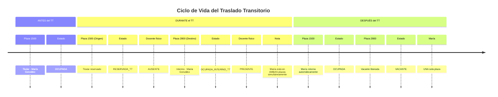

**Estados del Docente durante el TT:**

| Momento | Plaza Origen | Plaza Destino | Total Plazas |
|---------|--------------|---------------|--------------|
| **ANTES** | Titular OCUPADA | - | 1 |
| **DURANTE** | Titular RESERVADA_TT | Interino OCUPADA_INTERINO_TT | **2** ⚠️ |
| **DESPUÉS** | Titular OCUPADA | - | 1 |

---

## 2. El Problema Técnico: Por qué los TT Rompen las Reglas del Sistema

### 2.1. Reglas de Negocio Estándar

El sistema SGPEM (y la mayoría de sistemas administrativos) se basan en estas premisas:

**Regla 1: Unicidad Plaza-Docente**

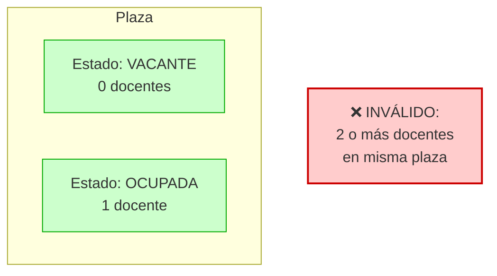

**Regla 2: Unicidad Docente-Plaza**

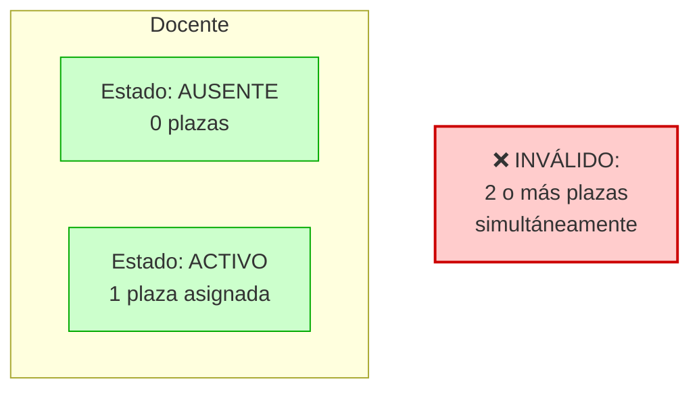

**Regla 3: Estados Mutuamente Exclusivos**

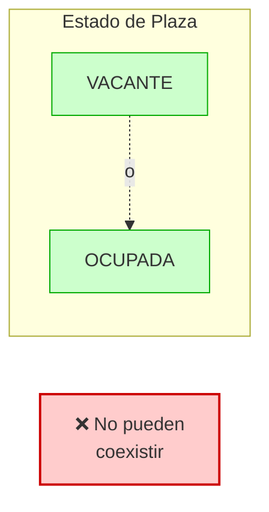

### 2.2. Cómo los TT Violan estas Reglas

#### Violación de Regla 2 (La crítica)

```mermaid
flowchart TB
    subgraph "Sistema Estándar"
        S1[Docente: María González]
        S2[Error: "El docente ya tiene plaza 1500"]
        S3[❌ Acción bloqueada]
    end
    
    subgraph "Realidad (TT válido)"
        R1[Plaza 1500: Titular - RESERVADA]
        R2[Plaza 2800: Interino - ACTIVA]
        R3[✅ Ambas VÁLIDAS y LEGALES]
    end
    
    S1 --> S2 --> S3
    R1 --> R3
    R2 --> R3
    
    style S2 fill:#ffcccc,stroke:#cc0000
    style S3 fill:#ff9999,stroke:#cc0000,stroke-width:3px
    style R1 fill:#ccffcc,stroke:#00aa00
    style R2 fill:#ccffcc,stroke:#00aa00
    style R3 fill:#99ff99,stroke:#00aa00,stroke-width:3px
```

**Problema técnico:** El sistema no tiene concepto de "un docente en dos plazas autorizado".

#### Violación de Regla 3 (La secundaria)

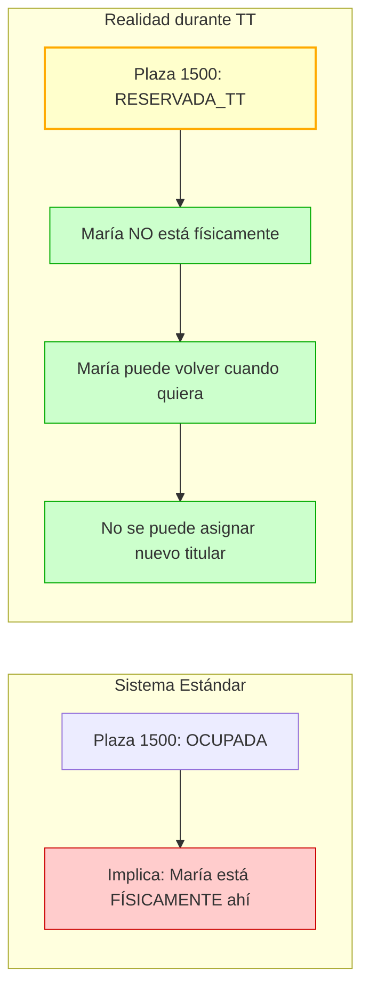

**Problema técnico:** El sistema no distingue entre "ocupada-presente" y "reservada-ausente".

### 2.3. Consecuencias del Problema

#### Escenario 1: Bloqueo Total del Sistema

```mermaid
flowchart TB
    subgraph "Intento de Registro TT"
        A[Director Escuela 200<br/>quiere registrar TT de María]
        B{¿María tiene<br/>otra plaza?}
        C[Plaza 1500:<br/>SÍ existe]
        D{¿Está de<br/>licencia?}
        E[NO - Es TT]
        F[❌ ERROR:<br/>"Docente ya ocupado"]
        G[❌ NO SE PUEDE<br/>REGISTRAR EL TT]
    end
    
    A --> B
    B -->|SÍ| C
    C --> D
    D -->|NO| E
    E --> F
    F --> G
    
    style F fill:#ff9999,stroke:#cc0000,stroke-width:2px
    style G fill:#ff6666,stroke:#990000,stroke-width:3px
```

**Impacto:** El director no puede operar. El TT válido no se puede cargar.

#### Escenario 2: Inconsistencias en Validaciones

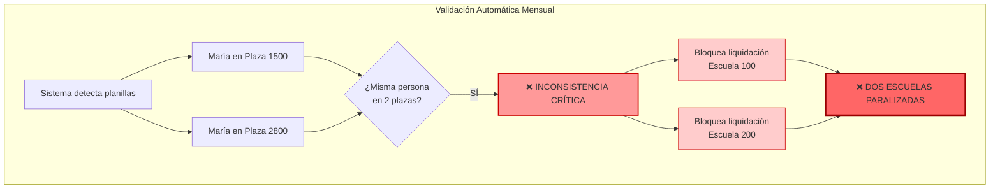

**Impacto:** Validaciones automáticas fallan masivamente.

#### Escenario 3: Pérdida de Derechos del Docente

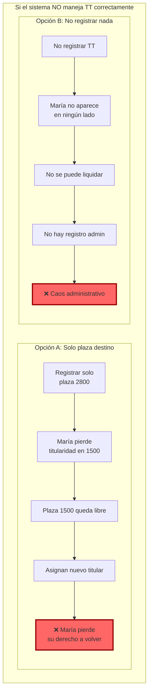

**Impacto:** Violación de derechos laborales del docente.

---

## 3. Comparativa Didáctica: Licencias vs. Traslados Transitorios

### 3.1. Tabla Comparativa

| Aspecto | Licencia | Traslado Transitorio |
|---------|----------|---------------------|
| **Docente en plaza original** | NO (está de licencia) | SÍ (titular reservado) |
| **Docente en plaza destino** | NO (no hay) | SÍ (interino) |
| **Total plazas del docente** | 0 | 2 (origen + destino) |
| **Plaza original disponible** | SÍ (para suplente) | NO (reservada) |
| **Reversibilidad** | Vuelve a su plaza | Vuelve a su plaza |
| **Estado docente** | AUSENTE con causa | TRASLADADO temporalmente |
| **Complejidad técnica** | Estándar | **Alta (caso especial)** |
| **Frecuencia** | Muy común | Común pero menor |

### 3.2. Diagrama de Estados Comparativo

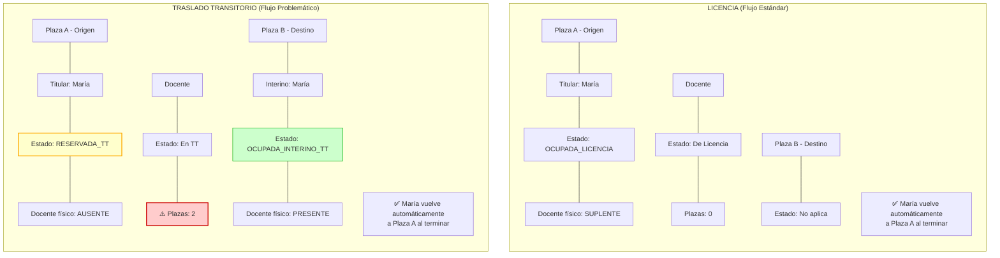

### 3.3. Analogía Visual

**Licencia = Alquilar tu casa mientras viajas**

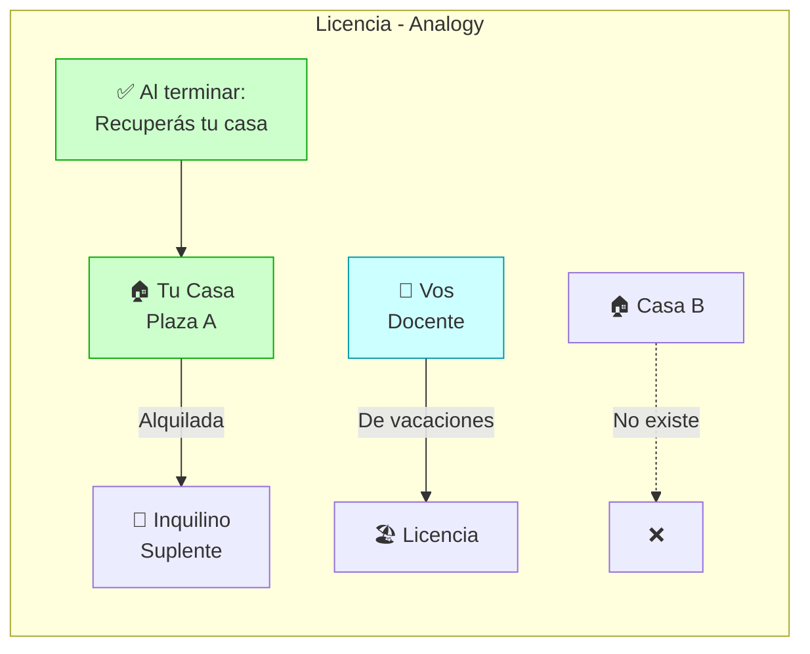

**Traslado Transitorio = Mudanza temporal con reserva**

```mermaid
flowchart TB
    subgraph "Traslado Transitorio - Analogy"
        A1[🏠 Tu Casa<br/>Plaza A] -->|Mantenés pero<br/>no vivís| R1[🔒 RESERVADA]
        D1[👤 Vos<br/>Docente] -->|Vivís temporalmente| B1[🏠 Casa B<br/>Plaza B]
        B1 -->|NO es tuya| I1[🔑 Interino]
        
        R2[✅ Cuando volvés:<br/>Automático a Casa A] --> A1
        B2[✅ Casa B queda libre<br/>para otro] --> B1
        
        C1[⚠️ PUNTO CRÍTICO:<br/>Durante el TT,<br/>"tenés" DOS casas]
    end
    
    style A1 fill:#ffffcc,stroke:#ffaa00,stroke-width:2px
    style B1 fill:#ccffcc,stroke:#00aa00
    style D1 fill:#ffcccc,stroke:#cc0000,stroke-width:2px
    style C1 fill:#ff9999,stroke:#cc0000,stroke-width:3px
```

---

## 4. Soluciones Técnicas Propuestas

### 4.1. Solución A: Estados Extendidos del Sistema (RECOMENDADA)

#### 4.1.1. Principio Fundamental

**En lugar de cambiar la lógica del sistema, expandir los estados posibles para contemplar el TT.**

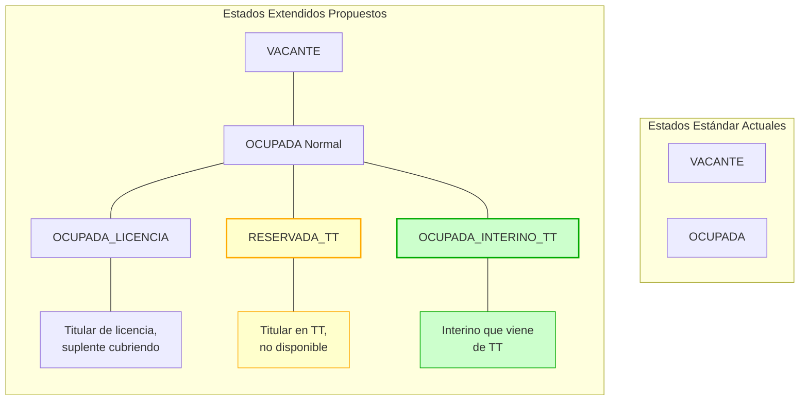

#### 4.1.2. Modelo de Datos Extendido

**Nuevos tipos de estado para plazas:**

```sql
-- Extensión del enum de estados de plaza
ALTER TYPE planillas.estado_plaza_enum 
ADD VALUE 'RESERVADA_TT';

ALTER TYPE planillas.estado_plaza_enum 
ADD VALUE 'OCUPADA_INTERINO_TT';

-- O si se usa tabla de catálogo:
INSERT INTO planillas.estados_plaza (codigo, nombre, descripcion, permite_asignacion) 
VALUES 
('RESERVADA_TT', 'Reservada - Traslado Transitorio', 
 'Plaza de titular que está en traslado transitorio. No disponible para nuevos titulares.', false),
 
('OCUPADA_INTERINO_TT', 'Ocupada - Interino por TT', 
 'Plaza ocupada por interino que proviene de traslado transitorio desde otra escuela.', true);
```

**Nuevos tipos de novedad:**

```sql
INSERT INTO planillas.tipos_novedad 
(codigo, nombre, requiere_plaza_origen, requiere_plaza_destino, es_traslado_transitorio)
VALUES
('TT_SALIDA', 'Traslado Transitorio - Salida', true, false, true),
('TT_INGRESO', 'Traslado Transitorio - Ingreso', false, true, true),
('TT_FIN', 'Fin de Traslado Transitorio', true, true, true);
```

#### 4.1.3. Reglas de Negocio Específicas para TT

```sql
-- Regla TT-001: Validar TT único por docente
CREATE OR REPLACE FUNCTION planillas.validar_unicidad_tt(p_id_agente INTEGER)
RETURNS BOOLEAN AS $$
BEGIN
    RETURN NOT EXISTS (
        SELECT 1 
        FROM planillas.novedades n
        JOIN planillas.tipos_novedad tn ON n.id_tipo = tn.id_tipo
        WHERE n.id_agente = p_id_agente
        AND tn.es_traslado_transitorio = true
        AND n.estado = 'ACTIVO'
        AND n.fecha_fin IS NULL  -- TT sin fecha de fin = vigente
    );
END;
$$ LANGUAGE plpgsql;

-- Regla TT-002: Validar que plaza origen pertenezca al docente
CREATE OR REPLACE FUNCTION planillas.validar_plaza_origen_tt(
    p_id_agente INTEGER, 
    p_id_plaza_origen INTEGER
)
RETURNS BOOLEAN AS $$
BEGIN
    RETURN EXISTS (
        SELECT 1 
        FROM planillas.planilla_agentes pa
        WHERE pa.id_agente = p_id_agente
        AND pa.id_plaza = p_id_plaza_origen
        AND pa.situacion_revista = 'TITULAR'
        AND pa.estado = 'ACTIVO'
    );
END;
$$ LANGUAGE plpgsql;

-- Regla TT-003: Validar que plaza destino esté vacante
CREATE OR REPLACE FUNCTION planillas.validar_plaza_destino_tt(p_id_plaza_destino INTEGER)
RETURNS BOOLEAN AS $$
BEGIN
    RETURN EXISTS (
        SELECT 1 
        FROM planillas.plazas p
        WHERE p.id_plaza = p_id_plaza_destino
        AND p.estado = 'VACANTE'
    );
END;
$$ LANGUAGE plpgsql;
```

#### 4.1.4. Proceso Automatizado de TT

```typescript
// servicios/trasladoTransitorio.ts

interface DatosTT {
  idAgente: number;
  idPlazaOrigen: number;
  idPlazaDestino: number;
  idEscuelaOrigen: number;
  idEscuelaDestino: number;
  fechaInicio: Date;
  fechaFin?: Date;
  normaLegal: string;
}

export async function iniciarTrasladoTransitorio(datos: DatosTT) {
  return await prisma.$transaction(async (tx) => {
    // 1. VALIDACIONES
    // 1.1. ¿El docente ya tiene un TT activo?
    const tieneTTActivo = await tx.novedad.findFirst({
      where: {
        id_agente: datos.idAgente,
        tipo_novedad: { es_traslado_transitorio: true },
        estado: 'ACTIVO',
        fecha_fin: null
      }
    });
    
    if (tieneTTActivo) {
      throw new Error('El docente ya tiene un traslado transitorio activo');
    }
    
    // 1.2. ¿La plaza origen es del docente como titular?
    const plazaOrigenValida = await tx.planilla_agente.findFirst({
      where: {
        id_agente: datos.idAgente,
        id_plaza: datos.idPlazaOrigen,
        situacion_revista: 'TITULAR',
        estado: 'ACTIVO'
      }
    });
    
    if (!plazaOrigenValida) {
      throw new Error('La plaza origen no pertenece al docente como titular');
    }
    
    // 1.3. ¿La plaza destino está vacante?
    const plazaDestino = await tx.plaza.findUnique({
      where: { id: datos.idPlazaDestino }
    });
    
    if (plazaDestino?.estado !== 'VACANTE') {
      throw new Error('La plaza destino no está vacante');
    }
    
    // 2. CREAR NOVEDAD DE SALIDA (Plaza Origen)
    const novedadSalida = await tx.novedad.create({
      data: {
        id_agente: datos.idAgente,
        id_plaza: datos.idPlazaOrigen,
        id_tipo: await obtenerIdTipoNovedad('TT_SALIDA'),
        fecha_inicio: datos.fechaInicio,
        fecha_fin: datos.fechaFin,
        norma_legal: datos.normaLegal,
        estado: 'ACTIVO',
        observaciones: `TT hacia plaza ${datos.idPlazaDestino} (Escuela ${datos.idEscuelaDestino})`
      }
    });
    
    // 3. ACTUALIZAR PLAZA ORIGEN A "RESERVADA_TT"
    await tx.plaza.update({
      where: { id: datos.idPlazaOrigen },
      data: {
        estado: 'RESERVADA_TT',
        observaciones: `Titular en TT desde ${datos.fechaInicio.toISOString().split('T')[0]}. ` +
                      `Reservada para ${datos.idAgente}`
      }
    });
    
    // 4. CREAR NOVEDAD DE INGRESO (Plaza Destino)
    const novedadIngreso = await tx.novedad.create({
      data: {
        id_agente: datos.idAgente,
        id_plaza: datos.idPlazaDestino,
        id_tipo: await obtenerIdTipoNovedad('TT_INGRESO'),
        fecha_inicio: datos.fechaInicio,
        fecha_fin: datos.fechaFin,
        norma_legal: datos.normaLegal,
        estado: 'ACTIVO',
        observaciones: `TT desde plaza ${datos.idPlazaOrigen} (Escuela ${datos.idEscuelaOrigen})`
      }
    });
    
    // 5. ACTUALIZAR PLAZA DESTINO A "OCUPADA_INTERINO_TT"
    await tx.plaza.update({
      where: { id: datos.idPlazaDestino },
      data: {
        estado: 'OCUPADA_INTERINO_TT',
        id_agente_asignado: datos.idAgente,
        observaciones: `Ocupada por interino en TT desde ${datos.fechaInicio.toISOString().split('T')[0]}`
      }
    });
    
    // 6. VINCULAR AMBAS NOVEDADES (para cierre automático)
    await tx.vinculacionTT.create({
      data: {
        id_agente: datos.idAgente,
        id_plaza_origen: datos.idPlazaOrigen,
        id_plaza_destino: datos.idPlazaDestino,
        id_novedad_salida: novedadSalida.id,
        id_novedad_ingreso: novedadIngreso.id,
        fecha_inicio: datos.fechaInicio,
        fecha_fin: datos.fechaFin,
        estado: 'ACTIVO'
      }
    });
    
    return {
      exito: true,
      novedadSalida,
      novedadIngreso,
      mensaje: `Traslado transitorio registrado. El docente ${datos.idAgente} ` +
               `está en plaza ${datos.idPlazaOrigen} (reservada) y ` +
               `plaza ${datos.idPlazaDestino} (interino TT)`
    };
  });
}
```

#### 4.1.5. Cierre Automático de TT

```typescript
export async function cerrarTrasladoTransitorio(
  idAgente: number,
  fechaCierre: Date
) {
  return await prisma.$transaction(async (tx) => {
    // 1. BUSCAR TT ACTIVO
    const vinculacion = await tx.vinculacionTT.findFirst({
      where: {
        id_agente: idAgente,
        estado: 'ACTIVO'
      },
      include: {
        novedad_salida: true,
        novedad_ingreso: true
      }
    });
    
    if (!vinculacion) {
      throw new Error('No hay traslado transitorio activo para este docente');
    }
    
    // 2. CERRAR NOVEDADES
    await tx.novedad.update({
      where: { id: vinculacion.id_novedad_salida },
      data: { 
        fecha_fin: fechaCierre,
        estado: 'CERRADO',
        observaciones: vinculacion.novedad_salida.observaciones + ' | Cerrado: ' + 
                      fechaCierre.toISOString().split('T')[0]
      }
    });
    
    await tx.novedad.update({
      where: { id: vinculacion.id_novedad_ingreso },
      data: { 
        fecha_fin: fechaCierre,
        estado: 'CERRADO',
        observaciones: vinculacion.novedad_ingreso.observaciones + ' | Cerrado: ' +
                      fechaCierre.toISOString().split('T')[0]
      }
    });
    
    // 3. RESTAURAR PLAZA ORIGEN
    await tx.plaza.update({
      where: { id: vinculacion.id_plaza_origen },
      data: {
        estado: 'OCUPADA',
        observaciones: 'Titular retornó de TT el ' + fechaCierre.toISOString().split('T')[0]
      }
    });
    
    // 4. LIBERAR PLAZA DESTINO
    await tx.plaza.update({
      where: { id: vinculacion.id_plaza_destino },
      data: {
        estado: 'VACANTE',
        id_agente_asignado: null,
        observaciones: 'Liberada por fin de TT el ' + fechaCierre.toISOString().split('T')[0]
      }
    });
    
    // 5. CERRAR VINCULACIÓN
    await tx.vinculacionTT.update({
      where: { id: vinculacion.id },
      data: {
        estado: 'CERRADO',
        fecha_cierre_real: fechaCierre
      }
    });
    
    return {
      exito: true,
      mensaje: `TT cerrado. Docente ${idAgente} retornó a plaza ${vinculacion.id_plaza_origen}. ` +
               `Plaza ${vinculacion.id_plaza_destino} liberada.`
    };
  });
}

// Job programado para cerrar TTs vencidos automáticamente
export async function cerrarTTsVencidos() {
  const hoy = new Date();
  
  const ttsVencidos = await prisma.vinculacionTT.findMany({
    where: {
      estado: 'ACTIVO',
      fecha_fin: { lte: hoy }
    }
  });
  
  for (const tt of ttsVencidos) {
    try {
      await cerrarTrasladoTransitorio(tt.id_agente, hoy);
      console.log(`TT cerrado automáticamente: Agente ${tt.id_agente}`);
    } catch (error) {
      console.error(`Error cerrando TT ${tt.id}:`, error);
    }
  }
}
```

### 4.2. Solución B: Modelo de Vínculos Temporales (Alternativa)

#### 4.2.1. Principio Fundamental

**En lugar de modificar estados, crear vínculos temporales entre plazas que indiquen la relación de TT.**

Esta solución es más flexible pero más compleja de implementar.

#### 4.2.2. Modelo de Datos

```sql
-- Tabla central de vínculos de TT
CREATE TABLE planillas.vinculos_temporales (
    id_vinculo          BIGSERIAL PRIMARY KEY,
    id_agente           INTEGER NOT NULL REFERENCES planillas.agentes(id_agente),
    
    -- Plazas involucradas
    id_plaza_permanente INTEGER NOT NULL,  -- Plaza de titularidad
    id_plaza_temporal   INTEGER NOT NULL,  -- Plaza de interinidad TT
    
    -- Contexto
    id_escuela_permanente INTEGER NOT NULL REFERENCES institucional.escuelas(id_escuela),
    id_escuela_temporal   INTEGER NOT NULL REFERENCES institucional.escuelas(id_escuela),
    
    -- Temporalidad
    fecha_inicio        DATE NOT NULL,
    fecha_fin           DATE,
    fecha_fin_real      DATE,  -- Si se cierra anticipadamente
    
    -- Documentación
    norma_legal         VARCHAR(200) NOT NULL,
    expediente          VARCHAR(100),
    
    -- Estado
    estado              VARCHAR(20) NOT NULL DEFAULT 'ACTIVO' 
        CHECK (estado IN ('ACTIVO', 'FINALIZADO', 'CANCELADO')),
    
    -- Auditoría
    creado_por          INTEGER NOT NULL REFERENCES auth.users(id_user),
    fecha_creacion      TIMESTAMP DEFAULT NOW(),
    cerrado_por         INTEGER REFERENCES auth.users(id_user),
    fecha_cierre        TIMESTAMP,
    
    -- Constraints
    CONSTRAINT chk_fechas_validas CHECK (fecha_fin IS NULL OR fecha_fin >= fecha_inicio),
    CONSTRAINT chk_plazas_diferentes CHECK (id_plaza_permanente != id_plaza_temporal),
    CONSTRAINT chk_escuelas_diferentes CHECK (id_escuela_permanente != id_escuela_temporal)
);

-- Índices
CREATE INDEX idx_vinculos_agente ON planillas.vinculos_temporales(id_agente);
CREATE INDEX idx_vinculos_estado ON planillas.vinculos_temporales(estado);
CREATE INDEX idx_vinculos_fechas ON planillas.vinculos_temporales(fecha_inicio, fecha_fin);
```

#### 4.2.3. Lógica de Validación

En esta solución, las plazas mantienen sus estados normales, pero las validaciones consultan la tabla de vínculos:

```sql
-- Función para verificar si un docente está en TT
CREATE OR REPLACE FUNCTION planillas.esta_en_tt(p_id_agente INTEGER)
RETURNS BOOLEAN AS $$
BEGIN
    RETURN EXISTS (
        SELECT 1 
        FROM planillas.vinculos_temporales
        WHERE id_agente = p_id_agente
        AND estado = 'ACTIVO'
        AND (fecha_fin IS NULL OR fecha_fin >= CURRENT_DATE)
    );
END;
$$ LANGUAGE plpgsql;

-- Función para obtener plazas de un docente en TT
CREATE OR REPLACE FUNCTION planillas.obtener_plazas_tt(p_id_agente INTEGER)
RETURNS TABLE (
    id_plaza INTEGER,
    tipo_plaza VARCHAR(20), -- 'PERMANENTE' o 'TEMPORAL'
    id_escuela INTEGER,
    estado_vinculo VARCHAR(20)
) AS $$
BEGIN
    RETURN QUERY
    SELECT 
        CASE 
            WHEN vt.estado = 'ACTIVO' THEN vt.id_plaza_permanente
            ELSE NULL
        END as id_plaza,
        'PERMANENTE'::VARCHAR(20) as tipo_plaza,
        vt.id_escuela_permanente as id_escuela,
        vt.estado as estado_vinculo
    FROM planillas.vinculos_temporales vt
    WHERE vt.id_agente = p_id_agente
    AND vt.estado = 'ACTIVO'
    AND (vt.fecha_fin IS NULL OR vt.fecha_fin >= CURRENT_DATE)
    
    UNION ALL
    
    SELECT 
        vt.id_plaza_temporal as id_plaza,
        'TEMPORAL'::VARCHAR(20) as tipo_plaza,
        vt.id_escuela_temporal as id_escuela,
        vt.estado as estado_vinculo
    FROM planillas.vinculos_temporales vt
    WHERE vt.id_agente = p_id_agente
    AND vt.estado = 'ACTIVO'
    AND (vt.fecha_fin IS NULL OR vt.fecha_fin >= CURRENT_DATE);
END;
$$ LANGUAGE plpgsql;
```

#### 4.2.4. Comparación con Solución A

| Aspecto | Solución A: Estados Extendidos | Solución B: Vínculos Temporales |
|---------|-------------------------------|--------------------------------|
| **Complejidad** | Media | Alta |
| **Cambios en DB** | Agregar enum values | Nueva tabla + lógica de joins |
| **Performance** | Buena (estado en tabla plaza) | Regular (requiere joins) |
| **Flexibilidad** | Limitada a TT | Permite otros vínculos temporales |
| **Mantenimiento** | Simple | Más complejo |
| **Implementación** | 16-20 horas | 32-40 horas |
| **Recomendación** | ✅ **USAR ESTA** | Para futuras extensiones |

---

## 5. Validaciones Específicas para TT

### 5.1. Matriz de Validaciones

| Validación | Momento | Lógica | Error si falla |
|------------|---------|--------|----------------|
| **VV-TT-001** | Inicio TT | Docente no tiene TT activo | "El docente ya tiene un TT vigente" |
| **VV-TT-002** | Inicio TT | Plaza origen es del docente como titular | "El docente no es titular de la plaza origen" |
| **VV-TT-003** | Inicio TT | Plaza destino está vacante | "La plaza destino no está disponible" |
| **VV-TT-004** | Inicio TT | Escuelas origen y destino son diferentes | "El TT debe ser entre escuelas distintas" |
| **VV-TT-005** | Inicio TT | Existe norma legal de autorización | "Se requiere norma legal para el TT" |
| **VV-TT-006** | Durante TT | No se puede asignar nuevo titular a plaza origen | "Plaza reservada por TT" |
| **VV-TT-007** | Durante TT | No se puede finalizar TT de otra escuela | "Solo la escuela origen puede gestionar el TT" |
| **VV-TT-008** | Cierre TT | Fecha de cierre ≥ fecha de inicio | "Fecha de cierre inválida" |
| **VV-TT-009** | Cierre TT | Ambas novedades (salida e ingreso) existen | "Inconsistencia en datos del TT" |
| **VV-TT-010** | Liquidación | Docente en TT aparece en dos escuelas (válido) | No es error, es caso esperado |

### 5.2. Implementación de Validaciones

```typescript
// servicios/validacionesTT.ts

export class ValidadorTT {
  
  async validarInicioTT(datos: DatosTT): Promise<{ valido: boolean; errores: string[] }> {
    const errores: string[] = [];
    
    // VV-TT-001: Unicidad de TT
    const tieneTTActivo = await this.verificarTTActivo(datos.idAgente);
    if (tieneTTActivo) {
      errores.push('VV-TT-001: El docente ya tiene un traslado transitorio activo');
    }
    
    // VV-TT-002: Titularidad plaza origen
    const esTitular = await this.verificarTitularidad(
      datos.idAgente, 
      datos.idPlazaOrigen
    );
    if (!esTitular) {
      errores.push('VV-TT-002: El docente no es titular de la plaza origen');
    }
    
    // VV-TT-003: Plaza destino vacante
    const plazaDisponible = await this.verificarPlazaVacante(datos.idPlazaDestino);
    if (!plazaDisponible) {
      errores.push('VV-TT-003: La plaza destino no está vacante');
    }
    
    // VV-TT-004: Escuelas diferentes
    if (datos.idEscuelaOrigen === datos.idEscuelaDestino) {
      errores.push('VV-TT-004: El TT debe ser entre escuelas diferentes');
    }
    
    // VV-TT-005: Norma legal
    if (!datos.normaLegal || datos.normaLegal.trim().length === 0) {
      errores.push('VV-TT-005: Se requiere norma legal para el traslado transitorio');
    }
    
    return {
      valido: errores.length === 0,
      errores
    };
  }
  
  async validarCierreTT(
    idAgente: number, 
    fechaCierre: Date
  ): Promise<{ valido: boolean; errores: string[] }> {
    const errores: string[] = [];
    
    // VV-TT-008: Fecha de cierre válida
    const tt = await this.obtenerTTActivo(idAgente);
    if (!tt) {
      errores.push('No hay TT activo para cerrar');
      return { valido: false, errores };
    }
    
    if (fechaCierre < tt.fecha_inicio) {
      errores.push('VV-TT-008: La fecha de cierre no puede ser anterior a la de inicio');
    }
    
    // VV-TT-009: Integridad de datos
    const novedadSalida = await this.obtenerNovedad(tt.id_novedad_salida);
    const novedadIngreso = await this.obtenerNovedad(tt.id_novedad_ingreso);
    
    if (!novedadSalida || !novedadIngreso) {
      errores.push('VV-TT-009: Inconsistencia: faltan novedades asociadas al TT');
    }
    
    return {
      valido: errores.length === 0,
      errores
    };
  }
  
  // Métodos privados auxiliares...
  private async verificarTTActivo(idAgente: number): Promise<boolean> {
    // Implementación...
    return false;
  }
  
  private async verificarTitularidad(idAgente: number, idPlaza: number): Promise<boolean> {
    // Implementación...
    return false;
  }
  
  private async verificarPlazaVacante(idPlaza: number): Promise<boolean> {
    // Implementación...
    return false;
  }
  
  private async obtenerTTActivo(idAgente: number): Promise<any> {
    // Implementación...
    return null;
  }
  
  private async obtenerNovedad(idNovedad: number): Promise<any> {
    // Implementación...
    return null;
  }
}
```

---

## 6. Casos de Uso y Ejemplos Prácticos

### 6.1. Caso de Uso 1: Inicio de TT Exitoso

**Actores:** Director Escuela Origen, Director Escuela Destino, Sistema  
**Precondición:** Docente titular con plaza asignada, plaza destino vacante  
**Postcondición:** TT registrado, docente en dos plazas, ambas escuelas operativas

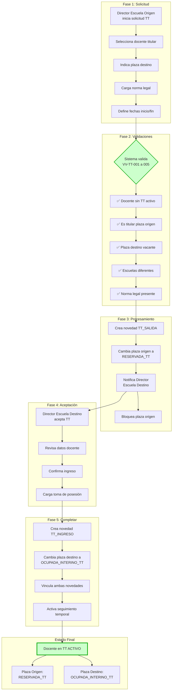

### 6.2. Caso de Uso 2: Cierre Automático de TT

**Actores:** Sistema (automático)  
**Precondición:** TT activo con fecha de fin vencida  
**Postcondición:** TT cerrado, docente vuelve a plaza origen, plaza destino liberada

```mermaid
flowchart TD
    subgraph "Job Diario 3:00 AM"
        A1[Inicia Job<br/>Cierre Automático TT]
        
        subgraph "Detección"
            B1[Consulta TTs vencidos]
            B2[SELECT * FROM vinculacionTT
WHERE estado = 'ACTIVO'
AND fecha_fin <= CURRENT_DATE]
            B3[Para cada TT vencido]
        end
        
        subgraph "Cierre Novedades"
            C1[Cierra TT_SALIDA
fecha_fin = hoy
estado = 'CERRADO']
            C2[Cierra TT_INGRESO
fecha_fin = hoy
estado = 'CERRADO']
        end
        
        subgraph "Actualización Plazas"
            D1[Restaura Plaza Origen
estado = 'OCUPADA'
obs: "Titular retornó"]
            D2[Libera Plaza Destino
estado = 'VACANTE'
id_agente = NULL
obs: "Liberada por fin TT"]
        end
        
        subgraph "Finalización"
            E1[Actualiza Vinculación
estado = 'CERRADO'
fecha_cierre_real = hoy]
            E2[Log del cierre automático]
        end
        
        subgraph "Notificaciones"
            F1[📧 Email Director<br/>Escuela Origen:
"Docente retornó"]
            F2[📧 Email Director<br/>Escuela Destino:
"Plaza liberada"]
            F3[📝 Registro en<br/>Auditoría del Sistema]
        end
        
        subgraph "Estado Final"
            G1[Docente: Solo en<br/>Plaza Origen (Titular)]
            G2[Plaza Origen:<br/>OCUPADA Normal]
            G3[Plaza Destino:<br/>VACANTE]
        end
    end
    
    A1 --> B1 --> B2 --> B3
    B3 --> C1
    B3 --> C2
    C1 --> D1
    C2 --> D2
    D1 --> E1
    D2 --> E1
    E1 --> E2
    E2 --> F1
    E2 --> F2
    E2 --> F3
    F1 --> G1
    F2 --> G2
    F3 --> G3
    
    style G1 fill:#ccffcc,stroke:#00aa00
    style G2 fill:#ccffcc,stroke:#00aa00
    style G3 fill:#ffffcc,stroke:#ffaa00
```

### 6.3. Caso de Uso 3: Intento de Asignación Durante TT

**Actor:** Director de Escuela Origen intenta asignar nuevo titular  
**Validación:** VV-TT-006

```mermaid
flowchart TD
    subgraph "Situación"
        S1[🏫 Plaza 1500
Estado: RESERVADA_TT]
        S2[👤 Director quiere
asignar nuevo titular]
    end
    
    subgraph "Intento de Operación"
        A1[Director selecciona
plaza 1500]
        A2[Selecciona nuevo
docente]
        A3[Intenta guardar]
    end
    
    subgraph "Validación Sistema"
        B1{Verifica estado
de plaza}
        B2[Plaza: RESERVADA_TT]
        B3{¿Hay TT activo?}
        B4[SÍ - María González]
        B5[Regla VV-TT-006]
        B6[❌ BLOQUEAR]
    end
    
    subgraph "Respuesta Sistema"
        C1[❌ ERROR]
        C2["No se puede asignar
nuevo titular"]
        C3[📋 DETALLE]
        C4["La plaza está reservada por
TT activo. Titular: María González
Hasta: 30/06/2026"]
    end
    
    subgraph "Opciones Director"
        D1[a) Cancelar operación]
        D2[b) Contactar Personal Docente
para cancelar TT]
        D3[c) Esperar a que
finalice el TT]
    end
    
    subgraph "Auditoría"
        E1[📝 Registra intento
bloqueado]
        E2[Usuario: ID Director]
        E3[Fecha/hora: Timestamp]
        E4[Motivo: VV-TT-006]
    end
    
    S1 --> S2 --> A1 --> A2 --> A3
    A3 --> B1 --> B2 --> B3 --> B4 --> B5 --> B6
    B6 --> C1 --> C2 --> C3 --> C4
    C4 --> D1
    C4 --> D2
    C4 --> D3
    B6 --> E1 --> E2 --> E3 --> E4
    
    style B6 fill:#ff9999,stroke:#cc0000,stroke-width:3px
    style C1 fill:#ff9999,stroke:#cc0000,stroke-width:2px
    style C2 fill:#ffcccc,stroke:#cc0000
```

### 6.4. Caso de Uso 4: Liquidación Mensual con TT Activos

**Actor:** Sistema de Liquidaciones  
**Escenario:** Fin de mes, proceso de liquidación de sueldos

```mermaid
flowchart TB
    subgraph "Datos del Caso"
        D1[👤 Docente: María González
DNI: 28456789]
        D2[🔄 TT Activo:
Plaza 1500 → Plaza 2800]
        D3[📅 Período: Marzo 2026
Dentro del TT]
    end
    
    subgraph "Procesamiento Escuela 100 (Origen)"
        E1[Detecta docente
en Plaza 1500]
        E2[Verifica:
RESERVADA_TT]
        E3{¿Es Titular?}
        E4[✅ SÍ]
        E5[Liquidar como
TITULAR]
        E6[💰 Monto:
100% sueldo titular]
    end
    
    subgraph "Procesamiento Escuela 200 (Destino)"
        F1[Detecta docente
en Plaza 2800]
        F2[Verifica:
OCUPADA_INTERINO_TT]
        F3{¿Es Interino?}
        F4[✅ SÍ]
        F5[Liquidar como
INTERINO]
        F6[💰 Monto:
100% sueldo
(interino TT = titular)]
    end
    
    subgraph "Validación Sistema"
        V1{Detecta mismo
docente en 2 plazas}
        V2{¿Tiene TT
activo?}
        V3[✅ SÍ]
        V4[🏷️ CASO ESPECIAL:
TT Válido]
        V5[✅ NO genera
inconsistencia]
        V6[✅ Permite
liquidación dual]
    end
    
    subgraph "Resultado"
        R1[✅ María cobra sueldo
normal (1 vez)]
        R2[✅ Escuela 100 liquida
(titularidad)]
        R3[✅ Escuela 200 liquida
(ejercicio)]
        R4[✅ Sistema reconoce
ambas válidas]
    end
    
    D1 --> D2 --> D3
    D3 --> E1 --> E2 --> E3 --> E4 --> E5 --> E6
    D3 --> F1 --> F2 --> F3 --> F4 --> F5 --> F6
    E6 --> V1
    F6 --> V1
    V1 --> V2 --> V3 --> V4 --> V5 --> V6
    V6 --> R1 --> R2 --> R3 --> R4
    
    style E2 fill:#ffffcc,stroke:#ffaa00
    style F2 fill:#ccffcc,stroke:#00aa00
    style V4 fill:#ccffcc,stroke:#00aa00,stroke-width:2px
    style R1 fill:#ccffcc,stroke:#00aa00
    style R2 fill:#ccffcc,stroke:#00aa00
    style R3 fill:#ccffcc,stroke:#00aa00
    style R4 fill:#99ff99,stroke:#00aa00,stroke-width:3px
```

---

## 7. Consideraciones Especiales

### 7.1. Concurrencia y Race Conditions

**Problema:** Dos escuelas intentan operar sobre el mismo TT simultáneamente.

**Solución:** Bloqueo optimista con versiones.

```typescript
// Implementación con Prisma (usa transacciones automáticamente)

async function operacionSeguraTT(idTT: number, operacion: Function) {
  return await prisma.$transaction(async (tx) => {
    // 1. Leer TT con bloqueo
    const tt = await tx.vinculacionTT.findUnique({
      where: { id: idTT },
      // Prisma maneja el bloqueo a nivel de transacción
    });
    
    if (!tt || tt.estado !== 'ACTIVO') {
      throw new Error('TT no disponible para operación');
    }
    
    // 2. Ejecutar operación
    const resultado = await operacion(tx, tt);
    
    // 3. Verificar que TT sigue activo al finalizar
    const ttFinal = await tx.vinculacionTT.findUnique({
      where: { id: idTT }
    });
    
    if (ttFinal?.estado !== 'ACTIVO') {
      throw new Error('TT fue modificado por otro proceso');
    }
    
    return resultado;
  }, {
    // Opciones de transacción
    isolationLevel: 'Serializable', // Nivel más alto de aislamiento
    maxWait: 5000, // 5 segundos esperando
    timeout: 10000 // 10 segundos timeout
  });
}
```

### 7.2. Gestión de Fechas Límite

**Problema:** TTs que se extienden más allá de la fecha prevista.

**Soluciones:**

```typescript
// Opción 1: Extensión de TT
async function extenderTT(
  idAgente: number, 
  nuevaFechaFin: Date,
  motivo: string
) {
  return await prisma.$transaction(async (tx) => {
    const tt = await tx.vinculacionTT.findFirst({
      where: { 
        id_agente: idAgente, 
        estado: 'ACTIVO' 
      }
    });
    
    if (!tt) throw new Error('No hay TT activo');
    
    // Validar que nueva fecha sea posterior a la actual
    if (nuevaFechaFin <= tt.fecha_fin!) {
      throw new Error('Nueva fecha debe ser posterior a la actual');
    }
    
    // Actualizar fechas en todas las entidades
    await tx.vinculacionTT.update({
      where: { id: tt.id },
      data: { 
        fecha_fin: nuevaFechaFin,
        observaciones: (tt.observaciones || '') + ` | Extendido hasta ${nuevaFechaFin.toISOString().split('T')[0]}. Motivo: ${motivo}`
      }
    });
    
    await tx.novedad.update({
      where: { id: tt.id_novedad_salida },
      data: { fecha_fin: nuevaFechaFin }
    });
    
    await tx.novedad.update({
      where: { id: tt.id_novedad_ingreso },
      data: { fecha_fin: nuevaFechaFin }
    });
    
    return { exito: true, mensaje: 'TT extendido correctamente' };
  });
}

// Opción 2: TT sin fecha fin (indefinido)
// NOTA: No recomendado, pero posible
async function crearTTSinFechaFin(datos: DatosTT) {
  // Similar a iniciarTrasladoTransitorio pero sin fecha_fin
  // Requiere seguimiento manual para cierre
}
```

### 7.3. Cancelación de TT

**Escenario:** Se autoriza TT pero debe cancelarse antes de iniciar o durante.

```typescript
async function cancelarTT(
  idAgente: number,
  motivoCancelacion: string,
  usuarioCancelacion: number
) {
  return await prisma.$transaction(async (tx) => {
    const tt = await tx.vinculacionTT.findFirst({
      where: { 
        id_agente: idAgente, 
        estado: 'ACTIVO' 
      }
    });
    
    if (!tt) throw new Error('No hay TT activo para cancelar');
    
    const hoy = new Date();
    
    // Cancelar novedades
    await tx.novedad.update({
      where: { id: tt.id_novedad_salida },
      data: { 
        estado: 'CANCELADO',
        fecha_fin: hoy,
        observaciones: `CANCELADO: ${motivoCancelacion}`
      }
    });
    
    await tx.novedad.update({
      where: { id: tt.id_novedad_ingreso },
      data: { 
        estado: 'CANCELADO',
        fecha_fin: hoy,
        observaciones: `CANCELADO: ${motivoCancelacion}`
      }
    });
    
    // Restaurar plaza origen inmediatamente
    await tx.plaza.update({
      where: { id: tt.id_plaza_origen },
      data: { 
        estado: 'OCUPADA',
        observaciones: `TT cancelado el ${hoy.toISOString().split('T')[0]}. Motivo: ${motivoCancelacion}`
      }
    });
    
    // Liberar plaza destino
    await tx.plaza.update({
      where: { id: tt.id_plaza_destino },
      data: { 
        estado: 'VACANTE',
        id_agente_asignado: null,
        observaciones: `Liberada por cancelación de TT el ${hoy.toISOString().split('T')[0]}`
      }
    });
    
    // Marcar vinculación como cancelada
    await tx.vinculacionTT.update({
      where: { id: tt.id },
      data: {
        estado: 'CANCELADO',
        fecha_cierre: hoy,
        observaciones: `Cancelado por usuario ${usuarioCancelacion}. Motivo: ${motivoCancelacion}`
      }
    });
    
    // Notificar a ambas escuelas
    await notificarCancelacionTT(tt, motivoCancelacion);
    
    return { exito: true, mensaje: 'TT cancelado. Docente retornó a plaza origen.' };
  });
}
```

### 7.4. Auditoría y Trazabilidad

**Requerimiento:** Todo movimiento de TT debe quedar registrado.

```sql
-- Tabla de auditoría específica para TT
CREATE TABLE planillas.auditoria_tt (
    id_auditoria        BIGSERIAL PRIMARY KEY,
    id_vinculo          BIGINT REFERENCES planillas.vinculos_temporales(id_vinculo),
    id_agente           INTEGER NOT NULL,
    accion              VARCHAR(50) NOT NULL, -- 'INICIO', 'CIERRE', 'CANCELACION', 'EXTENSION'
    
    -- Datos antes de la acción
    datos_anteriores    JSONB,
    
    -- Datos después de la acción
    datos_nuevos        JSONB,
    
    -- Contexto
    usuario_ejecutor    INTEGER REFERENCES auth.users(id_user),
    fecha_accion        TIMESTAMP DEFAULT NOW(),
    ip_origen           INET,
    user_agent          TEXT
);

-- Trigger para auditoría automática
CREATE OR REPLACE FUNCTION planillas.audit_cambios_tt()
RETURNS TRIGGER AS $$
BEGIN
    IF TG_OP = 'UPDATE' THEN
        INSERT INTO planillas.auditoria_tt (
            id_vinculo,
            id_agente,
            accion,
            datos_anteriores,
            datos_nuevos,
            usuario_ejecutor,
            ip_origen,
            user_agent
        ) VALUES (
            NEW.id,
            NEW.id_agente,
            CASE 
                WHEN OLD.estado = 'ACTIVO' AND NEW.estado = 'CERRADO' THEN 'CIERRE'
                WHEN OLD.estado = 'ACTIVO' AND NEW.estado = 'CANCELADO' THEN 'CANCELACION'
                WHEN OLD.fecha_fin != NEW.fecha_fin THEN 'EXTENSION'
                ELSE 'MODIFICACION'
            END,
            to_jsonb(OLD),
            to_jsonb(NEW),
            current_setting('app.current_user_id')::INTEGER,
            inet_client_addr(),
            current_setting('app.user_agent', true)
        );
    END IF;
    RETURN NEW;
END;
$$ LANGUAGE plpgsql;

CREATE TRIGGER trigger_audit_tt
    AFTER UPDATE ON planillas.vinculos_temporales
    FOR EACH ROW EXECUTE FUNCTION planillas.audit_cambios_tt();
```

---

## 8. Impacto en el Plan de Implementación SGPEM

### 8.1. Estimación de Esfuerzo

| Componente | Horas | Prioridad | Fase |
|------------|-------|-----------|------|
| **Modelo de datos extendido** (estados, tipos novedad) | 4 | ALTA | 1 |
| **API endpoints TT** (CRUD + validaciones) | 12 | ALTA | 1 |
| **Proceso automatizado** (inicio/cierre TT) | 8 | ALTA | 1 |
| **Validaciones específicas** (VV-TT-001 a 010) | 6 | ALTA | 1 |
| **UI/UX** (formularios, flujos) | 8 | MEDIA | 2 |
| **Tests** (unitarios + integración) | 8 | ALTA | 1-2 |
| **Documentación** | 4 | BAJA | 3 |
| **Job de cierre automático** | 4 | MEDIA | 2 |
| **Auditoría** | 4 | BAJA | 2 |
| **TOTAL** | **58 horas** | | |

### 8.2. Integración con Fases del Proyecto

**Fase 0 (Corrección Inconsistencias):**
- Identificar cuántos TTs activos hay actualmente
- Documentar casos para pruebas

**Fase 1 (Módulo Inconsistencias):**
- ✅ **Incluir TT como caso especial** en validaciones
- No marcar como inconsistencia crítica
- Mostrar como "caso especial válido"

**Fase 2 (Adaptaciones SGPEM):**
- Implementar solución A (estados extendidos)
- Integrar con validaciones de planillas
- Probar flujo completo

**Fase 3 (Piloto Verón):**
- Identificar escuelas con historial de TTs
- Incluir casos de TT en testing
- Validar liquidación con TTs

### 8.3. Riesgos Específicos de TT

| Riesgo | Probabilidad | Impacto | Mitigación |
|--------|--------------|---------|------------|
| **Docente no retorna** de TT (abandono) | Media | Alto | Proceso de baja automática después de X días |
| **Plaza destino necesita titular** durante TT | Media | Medio | Posibilidad de cortar TT anticipadamente |
| **Error en cierre automático** | Baja | Crítico | Job con rollback manual, alertas |
| **TT superpuesto** (uno nuevo antes de cerrar otro) | Baja | Alto | Validación VV-TT-001 estricta |
| **Datos inconsistentes** entre escuelas | Media | Medio | Sincronización en tiempo real, webhooks |

---

## 9. Conclusión

### 9.1. Resumen del Problema

Los **Traslados Transitorios** representan el único caso donde un mismo docente ocupa **dos plazas simultáneamente** de manera legítima y normativa:

- **Plaza origen:** Como titular (reservada, derecho preservado)
- **Plaza destino:** Como interino (ejerciendo actualmente)

Esto viola la regla de unicidad estándar del sistema pero es **completamente válido** administrativamente.

### 9.2. Solución Recomendada

**Solución A: Estados Extendidos** es la opción más pragmática:

✅ **Ventajas:**
- Simple de implementar (58 horas)
- No requiere cambios radicales en arquitectura
- Fácil de entender para usuarios
- Performance óptima
- Fácil de mantener

❌ **Limitaciones:**
- Solo sirve para TT (no escalable a otros casos)
- Requiere modificar enums/tablas de estados

### 9.3. Decisión de Diseño

**Aprobar implementación de TT en SGPEM:**

| Aspecto         | Valor                                    |
| --------------- | ---------------------------------------- |
| **Es crítico**  | SÍ - Bloquea casos reales frecuentes     |
| **Es complejo** | MEDIO - Manejable con estados extendidos |
| **Es costoso**  | 58 horas (~1.5 semanas)                  |
| **Es urgente**  | SÍ - Debe estar en piloto Verón          |
### 9.4. Próximos Pasos

1. **Esta semana:** 
   - Aprobar diseño técnico de TT
   - Identificar escuelas con historial de TTs para piloto

2. **Semana siguiente:**
   - Iniciar desarrollo de módulo TT
   - Crear tabla de vinculación
   - Implementar validaciones básicas

3. **Durante Fase 2:**
   - Integrar TT con flujo de planillas.
   - Probar casos de uso completos.
   - Documentar para usuarios.

4. **Antes del piloto:**
   - Validar liquidación con TTs.
   - Capacitar a directores sobre el flujo
   - Preparar casos de prueba

---

## Anexos

### Anexo A: Diagrama Entidad-Relación (TT)

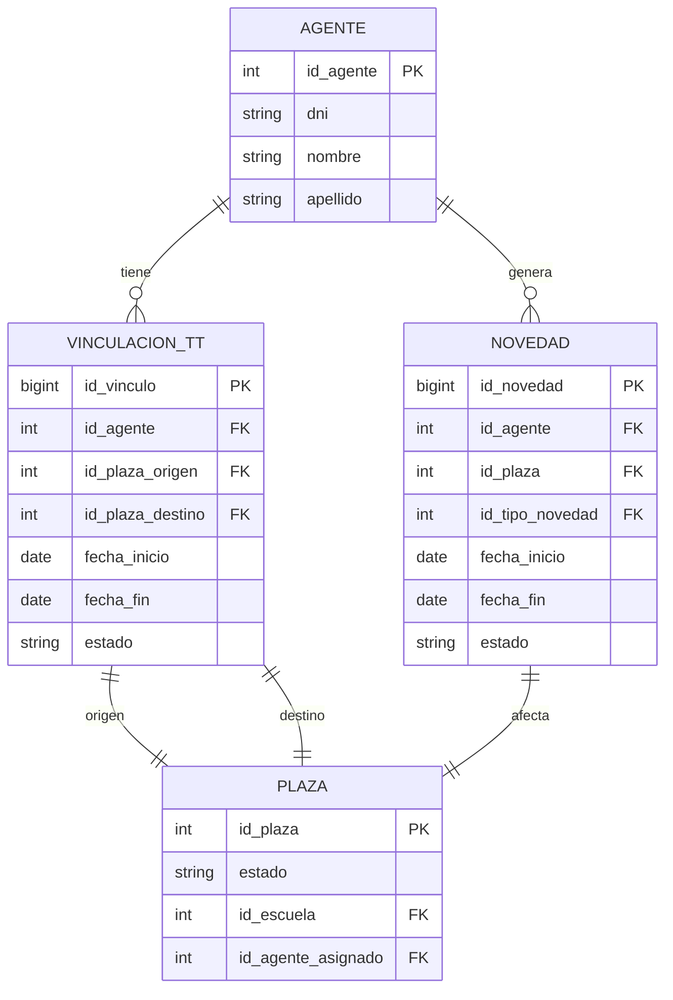

### Anexo B: Flujo de Estados (Diagrama)

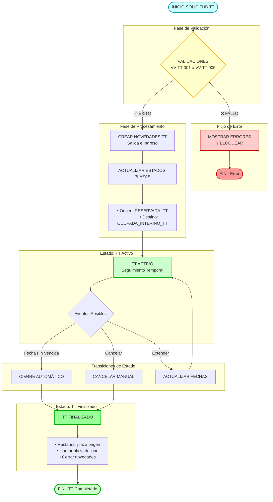

### Anexo C: Casos de Prueba Sugeridos

| ID     | Caso                      | Datos                                      | Resultado Esperado                         |
| ------ | ------------------------- | ------------------------------------------ | ------------------------------------------ |
| TT-001 | Inicio TT exitoso         | Docente titular, plaza destino vacante     | TT creado, ambas plazas actualizadas       |
| TT-002 | TT con mismo docente      | Intentar segundo TT para mismo docente     | Error VV-TT-001                            |
| TT-003 | TT plaza origen ajena     | Docente intenta TT de plaza que no es suya | Error VV-TT-002                            |
| TT-004 | TT plaza destino ocupada  | Plaza destino tiene otro docente           | Error VV-TT-003                            |
| TT-005 | Cierre automático         | Fecha fin = hoy                            | TT cierra, docente vuelve a origen         |
| TT-006 | Cancelación TT            | Cancelar durante TT activo                 | Ambas plazas restauradas inmediatamente    |
| TT-007 | Extensión TT              | Extender fecha fin                         | Fechas actualizadas en todas las entidades |
| TT-008 | Liquidación con TT        | Mes completo dentro de TT                  | Liquida correctamente en ambas escuelas    |
| TT-009 | Asignación sobre plaza TT | Intentar nuevo titular en origen           | Bloqueado, mensaje explicativo             |
| TT-010 | TT con mismo escuela      | Origen y destino misma escuela             | Error VV-TT-004                            |

---

**Documento elaborado:** 9 de febrero de 2026  
**Versión:** 1.0  
**Autor:** Equipo Técnico SGPEM  
**Revisores:** Pendiente  
**Estado:** Propuesta de diseño técnico

---

*Documento confidencial - Consejo General de Educación de la Provincia de Corrientes*
