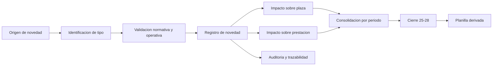
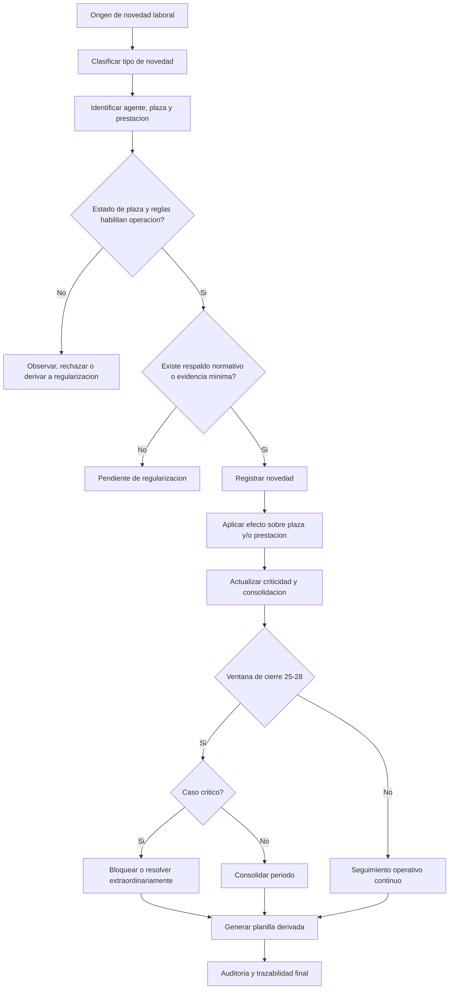

# SGPEM - Plan tecnico v5

## Consejo General de Educacion - Provincia de Corrientes

> **Estado del proyecto:** propuesta tecnico-funcional para decision ejecutiva e implementacion por etapas
> **Version:** 5.0
> **Origen:** reencuadre integral del sistema sobre POF y novedades laborales generales

> [!important] Decision rectora
> SGPEM es un **sistema de gestion de novedades laborales de la Planta Organica Funcional (POF)**.
> La unidad de trabajo no es la planilla mensual ni un modulo especifico de licencias.
> La unidad de trabajo es la **novedad laboral trazable sobre agente, plaza y prestacion de servicio**.

> [!success] Decision institucional de alcance
> Las **licencias** pasan a ser un **tipo de novedad laboral** dentro de un sistema general que tambien debe cubrir suplencias, interinatos, traslados, adscripciones, comisiones de servicio, tareas pasivas, reubicaciones, bajas definitivas, inasistencias y movimientos de plaza.

---

## Tabla de contenidos

1. [Resumen ejecutivo](#1-resumen-ejecutivo)
2. [Decision rectora y cambio de paradigma](#2-decision-rectora-y-cambio-de-paradigma)
3. [Alcance v5](#3-alcance-v5)
4. [Marco normativo y conceptual de POF](#4-marco-normativo-y-conceptual-de-pof)
5. [Modelo operativo del sistema](#5-modelo-operativo-del-sistema)
6. [Arquitectura objetivo](#6-arquitectura-objetivo)
7. [Modelo de dominio v5](#7-modelo-de-dominio-v5)
8. [Taxonomia de novedades laborales](#8-taxonomia-de-novedades-laborales)
9. [Reglas por estado de plaza](#9-reglas-por-estado-de-plaza)
10. [Reglas por prestacion de servicio](#10-reglas-por-prestacion-de-servicio)
11. [Reglas transversales de validacion](#11-reglas-transversales-de-validacion)
12. [Integraciones externas](#12-integraciones-externas)
13. [Politica de cierre 25-28](#13-politica-de-cierre-25-28)
14. [Diseno API v5](#14-diseno-api-v5)
15. [Lineamientos de interfaz](#15-lineamientos-de-interfaz)
16. [Roles y permisos](#16-roles-y-permisos)
17. [Seguridad observabilidad y operacion](#17-seguridad-observabilidad-y-operacion)
18. [Estrategia de implementacion por fases](#18-estrategia-de-implementacion-por-fases)
19. [Riesgos y mitigaciones](#19-riesgos-y-mitigaciones)
20. [Criterios de aceptacion](#20-criterios-de-aceptacion)
21. [Flujo E2E general del sistema](#21-flujo-e2e-general-del-sistema)
22. [Flujograma general](#22-flujograma-general)
23. [Anexos por tipo de novedad](#23-anexos-por-tipo-de-novedad)
24. [Recomendacion ejecutiva para comite](#24-recomendacion-ejecutiva-para-comite)
25. [Referencias minimas](#25-referencias-minimas)
26. [Historial de versiones](#26-historial-de-versiones)

---

## 1. Resumen ejecutivo

SGPEM v5 redefine el marco del proyecto para alinearlo con la logica normativa y operativa de la Planta Organica Funcional.

La conclusion principal es directa:

1. El sistema no debe organizarse alrededor de la planilla.
2. El sistema tampoco debe organizarse alrededor de licencias como caso dominante.
3. El sistema debe organizarse alrededor de **novedades laborales** que afectan:
   - un agente,
   - una plaza,
   - una prestacion de servicio,
   - y eventualmente la liquidacion.

La planilla pasa a ser una consecuencia administrativa posterior. La novedad pasa a ser el hecho primario de gestion.

En terminos ejecutivos, esto resuelve cinco problemas estructurales:

1. Evita que el sistema siga siendo una planilla digital con formularios dispersos.
2. Permite unificar bajo un mismo modelo licencias, suplencias, traslados, adscripciones, comisiones y bajas.
3. Hace trazable el impacto sobre la plaza y sobre la prestacion de servicio, no solo sobre el agente.
4. Permite consolidar el cierre 25-28 sobre hechos ya registrados y no sobre reconstruccion de ultimo momento.
5. Reduce el riesgo de inconsistencia entre POF, novedades y liquidacion.

La version v5 asume como base normativa el Manual Basico de Planta Organica Funcional, que establece que una novedad laboral es todo cambio que modifica una prestacion de servicio o el estado de una plaza, ya sea en forma transitoria o definitiva.

---

## 2. Decision rectora y cambio de paradigma

## 2.1 Decision institucional

Se adopta el siguiente principio rector:

> **SGPEM debe ser el sistema de gestion de novedades laborales sobre la POF, y no un sistema de planillas con automatizaciones parciales.**

## 2.2 Cambio de paradigma

### Paradigma anterior

- la planilla mensual era el artefacto visible principal,
- muchas novedades se reconstruian al cierre,
- distintos tipos de movimiento convivian sin un modelo comun,
- licencias, suplencias, traslados y bajas se trataban por circuitos heterogeneos,
- la trazabilidad sobre plaza y prestacion era debil o indirecta.

### Paradigma v5

- la novedad laboral es el hecho primario,
- plaza y prestacion quedan modeladas como objetos de primer nivel,
- la planilla se deriva del consolidado,
- cada tipo de novedad conserva reglas especificas pero dentro de una arquitectura comun,
- las integraciones externas quedan subordinadas al modelo general y no al reves.

## 2.3 Formula de lectura correcta del sistema

La secuencia conceptual correcta en v5 es:

`establecimiento -> plaza -> prestacion -> agente -> novedad -> consolidacion -> planilla`

No debe invertirse a:

`planilla -> carga mensual -> interpretacion tardia de movimientos`

## 2.4 Implicancia para toma de decisiones

El proyecto deja de evaluarse con la pregunta "como mejoramos la planilla" y pasa a evaluarse con esta pregunta:

> **como registramos, validamos y trazamos mejor cada novedad laboral para que la planilla sea solo la salida administrativa final?**

---

## 3. Alcance v5

Incluye:

- marco general de novedades laborales de POF,
- modelo de plaza y prestacion de servicio,
- taxonomia de tipos de novedad,
- reglas por estado de plaza,
- reglas por situacion de revista y motivos de ingreso/egreso,
- integraciones externas subordinadas al modelo general,
- politica de cierre 25-28 por criticidad,
- lineamientos de UX, API, operacion y auditoria,
- anexos operativos por tipo de novedad,
- tabla normativa completa de motivos de ingreso y egreso.

No incluye en esta version:

- reglamentacion legal articulo por articulo fuera de las referencias ya normadas,
- cronograma nominal de responsables por area,
- plan de capacitacion institucional detallado,
- detalle tecnico de implementacion de cada integracion externa futura.

---

## 4. Marco normativo y conceptual de POF

## 4.1 Planta Organica Funcional

La POF representa el conjunto dinamico de plazas de un establecimiento y las prestaciones de servicio que los agentes cumplen en ellas a lo largo del tiempo.

La implicancia central para SGPEM es que el sistema debe registrar cambios sobre una estructura viva, no sobre una foto mensual.

## 4.2 Plaza

La plaza es la posicion laboral especifica, unica e indivisible en la que un agente presta servicios y cumple una funcion determinada.

Propiedades relevantes para el sistema:

- codigo de plaza,
- nivel de cargo,
- descripcion de funcion,
- turno,
- tipo de plaza,
- cargo asociado,
- estado de plaza,
- terminalidad si aplica,
- pertenencia al establecimiento.

La plaza no es un dato accesorio. Es uno de los objetos primarios del sistema.

## 4.3 Prestacion de servicio

La prestacion de servicio es el ejercicio efectivo de una funcion en una plaza por parte de un agente.

Propiedades relevantes:

- cargo presupuestario,
- motivo de ingreso,
- motivo de egreso,
- situacion de revista,
- fecha de ingreso,
- fecha de egreso,
- norma legal de ingreso,
- norma legal de egreso,
- condicion activa o no activa.

La prestacion permite modelar el hecho laboral real. Muchas novedades no cambian la plaza, pero si cambian la prestacion. Otras cambian ambas.

## 4.4 Agente

El agente sigue siendo eje de trazabilidad, pero no debe modelarse aislado. Toda lectura institucionalmente util requiere saber:

- en que plaza esta,
- bajo que prestacion,
- con que situacion de revista,
- con que norma legal,
- y que novedad altero ese estado.

## 4.5 Estado de plaza

El manual normativo identifica estos estados:

- `VACANTE`
- `NORMAL`
- `DESAFECTADA`
- `RECURRIDA`
- `INCONSISTENTE`
- `ANULADA`

Estos estados no son solo informativos. Determinan operaciones permitidas y bloqueadas.

## 4.6 Situacion de revista

En plazas docentes, la situacion de revista surge de la relacion entre estado de plaza, motivo de ingreso y tipo de ocupacion.

Situaciones relevantes:

- `TITULAR`
- `INTERINO`
- `SUPLENTE`
- equivalentes no docentes segun regimen.

## 4.7 Norma legal

Toda prestacion valida nace, se modifica o cesa por algun respaldo formal.

Tipos de soporte esperables:

- decreto,
- resolucion ministerial,
- disposicion de direccion de nivel,
- acto administrativo equivalente segun circuito.

SGPEM debe poder relacionar cada novedad con su respaldo, incluso cuando la carga operativa inicial se haga por flujo digital y la norma se incorpore en una instancia posterior controlada.

---

## 5. Modelo operativo del sistema

## 5.1 Regla general

Toda novedad laboral debe responder a estas preguntas minimas:

1. que tipo de novedad es,
2. quien es el agente afectado,
3. que plaza o plazas intervienen,
4. que prestacion se inicia, modifica, suspende o cesa,
5. cual es el respaldo normativo o evidencia minima,
6. que impacto produce en liquidacion, cobertura y consolidacion.

## 5.2 Cadena operativa de referencia

1. Deteccion o recepcion de la novedad.
2. Identificacion del tipo.
3. Identificacion de agente, plaza y prestacion impactada.
4. Validacion normativa y operativa.
5. Registro de la novedad.
6. Aplicacion del efecto sobre plaza y/o prestacion.
7. Actualizacion de criticidad y consolidacion.
8. Cierre o arrastre controlado.
9. Generacion de planilla derivada.

## 5.3 Principio de simplificacion ejecutiva

Aunque cada tipo de novedad tenga reglas propias, el sistema debe mantener un esqueleto comun. Esa unificacion es la que vuelve viable la gestion, la auditoria y la evolucion del proyecto.

---

## 6. Arquitectura objetivo

## 6.1 Componentes

| Capa | Componente | Funcion principal |
|---|---|---|
| Frontend | UI operativa SGPEM | Operacion sobre novedades, plazas y consolidacion |
| API | Servicios de dominio SGPEM v5 | Gestion de novedades, validaciones y cierres |
| Dominio | Motor de novedades laborales | Reglas sobre plaza, prestacion y agente |
| Integracion | Adaptadores externos | Ingreso de datos desde sistemas o circuitos externos |
| Persistencia | Base transaccional `planillas` | Registro de entidades y auditoria |
| Operacion | Scheduler, alertas y conciliacion | Procesos de cierre, SLA y control |

## 6.2 Flujo macro

## 6.3 Origenes de novedad admitidos

- establecimiento,
- nodo laboral,
- direccion de nivel,
- ministerio,
- integracion externa,
- proceso de conciliacion o regularizacion.

## 6.4 Regla de integracion

Las integraciones no crean una categoria paralela de sistema. Toda integracion externa debe aterrizar en una novedad laboral tipificada dentro del modelo comun.

---

## 7. Modelo de dominio v5

## 7.1 Entidades nucleares

| Entidad | Proposito institucional |
|---|---|
| `establecimientos` | Lugar de trabajo sobre el que se organiza la POF |
| `plazas` | Posiciones laborales formales del establecimiento |
| `agentes` | Personas que cumplen o cumplieron prestaciones |
| `prestaciones_servicio` | Vinculo efectivo entre agente y plaza |
| `novedades` | Hecho laboral registrado y trazable |
| `tipos_novedad` | Catalogo comun de tipos de novedad |
| `motivos_ingreso` | Catalogo normativo de motivos de ingreso |
| `motivos_egreso` | Catalogo normativo de motivos de egreso |
| `situaciones_revista` | Relacion juridico-funcional con la plaza |
| `estados_plaza` | Estado normativo/operativo de la plaza |
| `normas_legales` | Respaldo formal de ingreso, egreso o movimiento |
| `novedad_origenes` | Fuente del dato y mecanismo de ingreso |
| `consolidaciones_periodo` | Agrupacion administrativa por periodo |
| `planillas` | Salida derivada del consolidado |
| `auditoria` | Trazabilidad de cambios, decisiones y eventos |

## 7.2 Relaciones esenciales

1. Un establecimiento contiene muchas plazas.
2. Una plaza puede tener distintas prestaciones a lo largo del tiempo.
3. Una prestacion vincula a un agente con una plaza bajo un regimen determinado.
4. Una novedad puede afectar una plaza, una prestacion o ambas.
5. Muchas novedades convergen en una consolidacion.
6. La planilla expresa el resultado administrativo del consolidado.

## 7.3 Campos minimos recomendados para `novedades`

| Campo | Proposito |
|---|---|
| `id_tipo_novedad` | Clasificar la novedad |
| `id_agente` | Trazar persona afectada |
| `id_plaza` | Trazar plaza impactada |
| `id_prestacion` | Trazar prestacion afectada |
| `origen_novedad` | Identificar fuente de carga |
| `fecha_efectiva_desde` | Inicio del impacto |
| `fecha_efectiva_hasta` | Fin si aplica |
| `criticidad_cierre` | Clasificar impacto en cierre |
| `id_norma_legal` | Respaldo formal |
| `estado_novedad` | Ciclo interno de gestion |
| `observaciones` | Contexto operativo |
| `id_evento_origen` | Correlacion tecnica si hay integracion |

## 7.4 Estados base de novedad

Se recomienda un catalogo simple y comun:

`DETECTADA -> REGISTRADA -> VALIDADA -> APLICADA -> CERRADA`

Estados alternos:

- `OBSERVADA`
- `ANULADA`

No todos los tipos recorreran el mismo camino con la misma profundidad, pero compartir un lenguaje comun reduce friccion operativa y facilita control.

---

## 8. Taxonomia de novedades laborales

## 8.1 Familias principales

| Familia | Tipo de impacto principal | Naturaleza |
|---|---|---|
| Creacion de plaza | Estructura POF | Definitiva |
| Desafectacion de plaza | Estructura POF | Definitiva o por terminalidad |
| Alta por designacion | Prestacion | Definitiva |
| Baja por cese | Prestacion y plaza | Definitiva |
| Licencia | Prestacion | Transitoria |
| Reintegro | Prestacion | Transitoria/de cierre |
| Suplencia | Prestacion | Transitoria |
| Interinato | Prestacion | Sobre vacante segun regimen |
| Traslado transitorio | Plaza + prestacion | Transitoria |
| Traslado definitivo | Plaza + prestacion | Definitiva |
| Adscripcion | Prestacion | Transitoria |
| Comision de servicio | Prestacion | Transitoria |
| Tareas pasivas | Prestacion | Transitoria |
| Afectacion | Prestacion | Transitoria |
| Permuta | Plaza + prestacion | Definitiva |
| Reubicacion | Plaza + prestacion | Definitiva |
| Inasistencia justificada/injustificada | Prestacion | Puntual |
| Paro | Prestacion | Puntual/masivo |

## 8.2 Lectura institucional de cada familia

### Estructura POF

- creacion de plaza,
- desafectacion de plaza.

No se trata de un simple alta administrativa: define que posiciones pueden existir y operar.

### Prestacion ordinaria

- altas,
- bajas,
- licencias,
- reintegros,
- inasistencias,
- paro.

Representa cambios sobre el ejercicio habitual de la funcion.

### Cobertura y reemplazo

- suplencias,
- reemplazos temporarios equivalentes.

Resuelve continuidad del servicio cuando un docente debe ser reemplazado temporariamente o existe otra causal transitoria equivalente. No incluye interinatos, porque el interino ocupa cargo vacante.

### Vacantes e interinatos

- interinatos,
- titularizaciones u otras provisiones de vacante equivalentes.

Resuelve la ocupacion y regularizacion de cargos vacantes. Puede apoyarse en adjudicaciones, concursos o mecanismos normativos equivalentes.

### Movilidad funcional

- traslado transitorio,
- traslado definitivo,
- adscripcion,
- comision de servicio,
- tareas pasivas,
- afectacion,
- permuta,
- reubicacion.

Son casos donde la lectura solo por agente resulta insuficiente. Debe observarse simultaneamente origen, destino, caracter temporal y estado de la plaza.

---

## 9. Reglas por estado de plaza

## 9.1 Estados base normativos

| Estado | Significado | Regla general |
|---|---|---|
| `VACANTE` | Plaza sin titular activo definitivo | Permite ingresos validos segun regimen |
| `NORMAL` | Plaza con ocupacion regular | Permite licencias y egresos del ocupante |
| `DESAFECTADA` | Plaza fuera de uso | Bloquea operaciones salvo excepciones normadas |
| `RECURRIDA` | Plaza bajo medida cautelar | Requiere tratamiento condicionado |
| `INCONSISTENTE` | Plaza con error o dato invalido | Bloquea movimientos hasta regularizar |
| `ANULADA` | Plaza registrada erroneamente | No admite movimientos |

## 9.2 Operaciones esperables por estado

| Estado de plaza | Operaciones permitidas principales | Operaciones bloqueadas |
|---|---|---|
| `NORMAL` con titular activo | Licencia, egreso transitorio, egreso definitivo, desafectacion | Alta incompatible de nuevo ocupante |
| `NORMAL` con titular no activo y suplente activo | Reingreso titular, fin de suplencia, licencia suplente, desafectacion | Alta incompatible fuera de reglas |
| `VACANTE` sin prestacion | Alta de titular o interino, desafectacion | Movimientos que exijan ocupante previo |
| `VACANTE` con interino activo | Licencia interino, egreso interino, desafectacion | Alta incompatible |
| `DESAFECTADA` | Reubicacion si hay disponibilidad, regularizacion atrasada normada | Nuevas designaciones ordinarias |
| `RECURRIDA` | Segun medida judicial | Operacion libre sin respaldo |
| `INCONSISTENTE` | Regularizacion de inconsistencia | Designaciones y movimientos |
| `ANULADA` | Ninguna operacion funcional | Cualquier alta, baja o movimiento |

## 9.3 Regla ejecutiva para SGPEM

Ninguna novedad debe aplicarse sin consultar el estado de plaza. Esta validacion no es de calidad de dato solamente; es una validacion normativa.

## 9.4 Efecto sobre diseno de sistema

El motor de reglas debe poder responder antes de aplicar una novedad:

1. si la plaza admite la operacion,
2. si la situacion actual del ocupante lo permite,
3. si la novedad cambia el estado de la plaza,
4. si la operacion requiere otra novedad correlativa.

---

## 10. Reglas por prestacion de servicio

## 10.1 Propiedades operativas minimas

Toda prestacion debe guardar como minimo:

- agente,
- plaza,
- cargo presupuestario,
- situacion de revista,
- motivo de ingreso,
- fecha de ingreso,
- norma legal de ingreso,
- motivo de egreso si aplica,
- fecha de egreso si aplica,
- norma legal de egreso si aplica,
- estado activo/no activo.

## 10.2 Principio rector

La prestacion es la forma concreta en la que el agente ocupa o cumple una funcion. Muchas novedades no deben leerse como "movi al agente" sino como:

- suspendi temporalmente una prestacion,
- termine una prestacion,
- inicie una prestacion en otra plaza,
- cambie la naturaleza de la ocupacion,
- restableci una prestacion anterior.

## 10.3 Reglas clave

1. Todo ingreso debe tener motivo de ingreso valido.
2. Todo egreso debe tener motivo de egreso valido.
3. La situacion de revista debe ser consistente con estado de plaza y tipo de ocupacion.
4. Una plaza vacante no debe sostener un titular salvo error o estado previo a regularizar.
5. Una salida transitoria no equivale a egreso definitivo.
6. Un regreso por cese de situacion transitoria debe quedar trazado como nuevo motivo de ingreso o regularizacion segun norma.

## 10.4 Prestacion activa y no activa

SGPEM debe distinguir entre:

- prestacion activa,
- prestacion no activa por licencia,
- prestacion no activa por salida transitoria,
- prestacion cerrada por egreso definitivo.

Esta distincion es esencial para cobertura, reemplazo, arrastre y liquidacion.

---

## 11. Reglas transversales de validacion

## 11.1 Validaciones estructurales

1. Toda novedad debe tener tipo.
2. Toda novedad debe identificar agente, plaza o prestacion segun corresponda.
3. Toda novedad debe registrar origen.
4. Toda novedad debe ser auditable.

## 11.2 Validaciones temporales

1. `fecha_desde <= fecha_hasta` cuando aplique.
2. No debe haber superposiciones invalidas de prestaciones incompatibles.
3. Los cierres de situaciones transitorias deben respetar la cronologia del antecedente.
4. La fecha efectiva puede diferir de la fecha de norma, pero ambas deben existir cuando la normativa lo requiera.

## 11.3 Validaciones normativas

1. El motivo de ingreso debe pertenecer al catalogo valido.
2. El motivo de egreso debe pertenecer al catalogo valido.
3. La operacion debe ser coherente con el estado de plaza.
4. La situacion de revista resultante debe ser consistente.

## 11.4 Validaciones de integracion

1. Todo evento externo debe ser idempotente.
2. Toda integracion debe vincularse a un tipo de novedad existente.
3. Ninguna integracion puede bypassear reglas de plaza y prestacion.

## 11.5 Validaciones de cierre

1. Toda novedad con impacto salarial relevante debe estar consolidable o clasificada.
2. Los casos criticos no pueden desaparecer del cierre por omision.
3. Los casos no criticos pueden arrastrarse solo con politica explicita.

---

## 12. Integraciones externas

## 12.1 Principio general

La arquitectura de SGPEM no se organiza alrededor de las integraciones. Las integraciones se subordinan a la arquitectura de novedades laborales.

## 12.2 Licencias como integracion especifica

Las licencias se modelan como novedad de interrupcion temporal de prestacion.

Regla institucional vigente para esta version:

- SGPEM integra solo licencias aprobadas con impacto laboral,
- la licencia rechazada no crea automaticamente una interrupcion temporal valida; puede exigir reclasificacion, observacion o derivacion a otra novedad segun el caso,
- la informacion integrada debe desembocar en una novedad laboral tipificada,
- el reintegro sigue siendo novedad propia de SGPEM.

## 12.3 Integraciones futuras plausibles

El modelo v5 permite incorporar en el futuro otras fuentes, por ejemplo:

- movimientos de RRHH,
- designaciones digitalizadas,
- actos de nivel central,
- circuitos de regularizacion.

La condicion de diseno es siempre la misma: la fuente externa debe aterrizar en una novedad del catalogo comun.

## 12.4 Datos minimos para integraciones

Toda integracion externa que impacte una novedad debe poder aportar, segun corresponda:

- correlacion tecnica,
- agente,
- plaza o plazas afectadas,
- fechas efectivas,
- norma o evidencia,
- tipo de novedad de destino,
- datos suficientes para criticidad y consolidacion.

---

## 13. Politica de cierre 25-28

## 13.1 Regla base

El cierre se define por criticidad y no por mera presencia de pendientes.

- **Critica:** bloquea o exige tratamiento extraordinario.
- **Media:** puede exigir regularizacion antes de consolidar cierto impacto.
- **No critica:** admite arrastre controlado con evidencia.

## 13.2 Criterios de criticidad

Una novedad tiende a ser critica cuando:

- modifica liquidacion en forma relevante,
- deja cobertura inconsistente,
- compromete trazabilidad normativa,
- afecta una plaza en estado incompatible,
- o impide explicar el estado resultante de POF.

## 13.3 Casos de referencia

| Caso | Criticidad sugerida | Tratamiento |
|---|---|---|
| Baja definitiva sin norma o fecha valida | Critica | Bloquear o regularizar |
| Licencia aprobada sin datos minimos | Critica | Rechazo tecnico o bloqueo |
| Traslado transitorio sin plaza destino valida | Critica | No aplicar |
| Adscripcion/comision vigente sin fecha de cierre clara | Media | Seguimiento y control |
| Inasistencia puntual sin alto impacto | No critica | Arrastre controlado |
| Evento duplicado correctamente detectado | No critica | Solo auditoria |

## 13.4 Efecto ejecutivo esperado

El objetivo no es endurecer el cierre sino volverlo explicable. El cierre 25-28 debe pasar de ser una zona de reconstruccion a una zona de decision basada en novedades ya trazadas.

---

## 14. Diseno API v5

## 14.1 Principio de contrato

La API debe reflejar el modelo general de POF y novedades laborales. No debe exponer un contrato que sugiera que el sistema esta organizado por casos aislados.

Base URL sugerida: `/api/v5`

## 14.2 Dominios de endpoints

### Novedades

| Metodo | Endpoint | Proposito |
|---|---|---|
| `POST` | `/novedades` | Registrar novedad laboral |
| `GET` | `/novedades` | Buscar novedades con filtros |
| `GET` | `/novedades/{id}` | Ver detalle, impacto y trazabilidad |
| `PATCH` | `/novedades/{id}` | Actualizar campos permitidos |
| `POST` | `/novedades/{id}/validar` | Confirmar validacion operativa |
| `POST` | `/novedades/{id}/aplicar` | Aplicar efecto sobre plaza/prestacion |
| `POST` | `/novedades/{id}/cerrar` | Cerrar novedad |

### Plazas

| Metodo | Endpoint | Proposito |
|---|---|---|
| `GET` | `/plazas` | Buscar plazas |
| `GET` | `/plazas/{id}` | Ver detalle de plaza |
| `POST` | `/plazas` | Crear plaza |
| `POST` | `/plazas/{id}/desafectar` | Desafectar plaza |
| `POST` | `/plazas/{id}/regularizar` | Resolver inconsistencia |

### Prestaciones

| Metodo | Endpoint | Proposito |
|---|---|---|
| `GET` | `/prestaciones/{id}` | Ver detalle de prestacion |
| `POST` | `/prestaciones` | Registrar prestacion inicial |
| `POST` | `/prestaciones/{id}/egresar` | Registrar egreso |
| `POST` | `/prestaciones/{id}/reingresar` | Registrar retorno o cese de situacion transitoria |

### Integraciones

| Metodo | Endpoint | Proposito |
|---|---|---|
| `POST` | `/integraciones/eventos` | Ingreso generico de eventos externos |
| `POST` | `/integraciones/licencias/aprobadas` | Alta de licencia aprobada como novedad |
| `POST` | `/integraciones/polling/ejecutar` | Conciliacion/fallback |
| `GET` | `/integraciones/eventos/{id}` | Estado de procesamiento |

### Consolidacion y planilla

| Metodo | Endpoint | Proposito |
|---|---|---|
| `POST` | `/consolidaciones/periodos/{id}/pre-cierre` | Evaluar criticidad del periodo |
| `POST` | `/consolidaciones/periodos/{id}/cerrar` | Ejecutar cierre |
| `GET` | `/planillas` | Listado de salidas derivadas |
| `GET` | `/planillas/{id}` | Ver detalle de planilla |

## 14.3 Convenciones de error minimas

| Codigo | Tipo |
|---|---|
| `NVL_VALIDATION_ERROR` | Regla o dato invalido |
| `PLZ_INVALID_STATE` | Operacion no permitida por estado de plaza |
| `PRS_INVALID_STATE` | Operacion no permitida por estado de prestacion |
| `EXT_EVENT_DUPLICATE` | Evento externo duplicado |
| `EXT_EVENT_MISSING_DATA` | Evento sin datos minimos |
| `CLS_BLOCKED_CRITICAL` | Cierre bloqueado por criticidad |

---

## 15. Lineamientos de interfaz

## 15.1 Principio de UX

La interfaz debe hacer evidente que el usuario trabaja sobre casos trazables de POF y no sobre una planilla como contenedor principal.

## 15.2 Pantallas minimas

1. Bandeja de novedades por agente, plaza, establecimiento y periodo.
2. Detalle de novedad con trazabilidad normativa.
3. Vista de plaza con estado, ocupacion y operaciones permitidas.
4. Vista de prestacion de servicio con ingreso, egreso y situacion de revista.
5. Panel de pre-cierre 25-28 con criticidad.
6. Vista de planilla derivada con navegacion hacia novedades subyacentes.

## 15.3 Reglas de presentacion

- mostrar el tipo de novedad de forma primaria,
- mostrar plaza y prestacion afectadas,
- resaltar estado de plaza cuando condicione operaciones,
- separar visualmente novedad, consolidacion y planilla,
- permitir navegar desde planilla a las novedades que la originan,
- evitar que la interfaz transmita la idea de que todo empieza en la planilla.

---

## 16. Roles y permisos

| Rol | Alcance principal |
|---|---|
| `director` | Informa novedades del establecimiento y consulta consolidado |
| `supervisor` | Monitorea novedades de su zona y valida excepciones de primer nivel |
| `cge_revisor` | Revisa consolidaciones, observaciones y cierres |
| `cge_admin` | Configura catalogos, periodos, integraciones y parametros |
| `auditor` | Consulta transversal de trazabilidad y reportes |

## 16.1 Principios de autorizacion

1. autorizacion por rol,
2. autorizacion por alcance territorial o institucional,
3. auditoria reforzada en acciones de cierre y regularizacion,
4. segregacion entre registrar, validar y cerrar cuando el caso lo requiera.

---

## 17. Seguridad observabilidad y operacion

## 17.1 Seguridad

- autenticacion centralizada,
- autorizacion por rol y alcance,
- validacion estricta de payloads,
- firma/verificacion de eventos externos,
- trazabilidad de toda decision critica,
- bitacora de regularizaciones manuales.

## 17.2 Observabilidad

Indicadores minimos:

1. novedades registradas por tipo,
2. pendientes criticos por periodo,
3. eventos externos conciliados,
4. plazas inconsistentes pendientes,
5. tiempo medio entre deteccion y aplicacion,
6. bloqueos de cierre por categoria de problema,
7. porcentaje de planillas con trazabilidad completa.

## 17.3 Operacion

- scheduler de conciliacion,
- reintentos con backoff,
- cola de fallos de integracion,
- tablero diario de pendientes criticos,
- alerta previa al 25-28,
- reporte de regularizaciones manuales y casos arrastrados.

---

## 18. Estrategia de implementacion por fases

## Fase 0 - Reencuadre y base normativa

- validar modelo conceptual de plaza y prestacion,
- consolidar catalogos de tipos de novedad,
- consolidar motivos de ingreso y egreso,
- fijar politica institucional de cierre.

## Fase 1 - Nucleo comun de novedades

- habilitar modelo de novedades general,
- habilitar trazabilidad por agente, plaza y prestacion,
- habilitar UI base y auditoria.

## Fase 2 - Tipos estructurales de mayor impacto

- altas y bajas,
- licencias y reintegros,
- suplencias,
- interinatos,
- traslados transitorios.

## Fase 3 - Movilidad funcional extendida

- adscripciones,
- comisiones de servicio,
- tareas pasivas,
- afectaciones,
- permutas,
- reubicaciones.

## Fase 4 - Consolidacion madura

- politica de cierre 25-28 estabilizada,
- integraciones externas controladas,
- tableros ejecutivos y auditoria consolidada.

---

## 19. Riesgos y mitigaciones

| Riesgo | Impacto | Mitigacion |
|---|---|---|
| Recaer en logica centrada en planilla | Alto | UX y modelo centrados en novedad/plaza/prestacion |
| Submodelar plaza y prestacion | Alto | Adopcion normativa completa en dominio |
| Tratar licencias como caso dominante | Alto | Integraciones subordinadas al catalogo comun |
| Estados de plaza mal aplicados | Alto | Motor de validacion obligatorio |
| Eventos externos incompletos | Alto | Rechazo tecnico + SLA de correccion |
| Cierre 25-28 con exceso de excepciones | Alto | criticidad + seguimiento temprano |
| Circuitos manuales no explicitados | Medio/Alto | documentar alcance y circuitos complementarios |

---

## 20. Criterios de aceptacion

Se considera v5 tecnicamente e institucionalmente implementable cuando:

1. el sistema opera sobre novedades laborales y no sobre planillas como objeto rector,
2. plaza y prestacion estan modeladas como entidades de primer nivel,
3. cada tipo relevante de novedad puede clasificarse dentro del catalogo comun,
4. el estado de plaza condiciona efectivamente las operaciones,
5. toda planilla es resultado derivado de consolidacion,
6. toda novedad tiene trazabilidad suficiente para auditoria,
7. las integraciones externas aterrizan en novedades tipificadas,
8. el cierre 25-28 funciona por criticidad y no por reconstruccion tardia.

---

## 21. Flujo E2E general del sistema

## 21.1 Secuencia general

1. Se detecta o recibe una novedad laboral.
2. Se identifica el tipo de novedad.
3. Se identifica agente, plaza y prestacion impactada.
4. Se verifica estado de plaza y coherencia normativa.
5. Se verifica respaldo minimo o norma legal aplicable.
6. Se registra la novedad.
7. Se aplica el efecto sobre plaza y/o prestacion.
8. Se recalcula cobertura, continuidad y criticidad.
9. La novedad queda disponible para seguimiento operativo.
10. El periodo consolida las novedades aplicables.
11. En la ventana 25-28 se decide cierre, bloqueo o arrastre.
12. La planilla se genera como salida derivada.
13. La auditoria conserva la traza completa desde el origen hasta la planilla.

## 21.2 Ejemplos de lectura E2E por tipo

### Licencia aprobada

- ingresa como novedad de interrupcion temporal,
- impacta prestacion,
- puede habilitar cobertura,
- consolida y luego exige reintegro como novedad propia.

### Traslado transitorio

- afecta plaza origen y plaza destino,
- afecta prestacion de salida e ingreso,
- requiere consistencia bilateral,
- tiene cierre posterior por retorno.

### Baja definitiva

- cierra prestacion,
- puede dejar plaza vacante,
- puede disparar cobertura o designacion posterior,
- impacta directamente en consolidado y liquidacion.

---

## 22. Flujograma general

## 22.1 Lectura ejecutiva del flujograma

1. El sistema empieza en la novedad, no en la planilla.
2. La validacion pasa siempre por plaza y prestacion.
3. El cierre opera sobre hechos ya aplicados.
4. La planilla aparece al final como salida derivada.

---

## 23. Anexos por tipo de novedad

## 23.1 Anexos recomendados

1. Licencias y reintegros.
2. Suplencias e interinatos.
3. Traslados transitorios.
4. Traslados definitivos.
5. Adscripciones, comisiones de servicio, tareas pasivas y afectaciones.
6. Altas y bajas definitivas.
7. Creacion y desafectacion de plaza.
8. Inasistencias y paro.

## 23.2 Motivos de ingreso a la plaza (catalogo normativo base)

| Codigo | Descripcion | Tipo |
|---|---|---|
| 9 | Reincorporacion | Definitiva |
| 11 | Titular Designado | Definitiva |
| 12 | Interino Designado | Definitiva |
| 13 | Suplente Designado | Definitiva |
| 14 | Suplencia en Cargo de Mayor Jerarquia | Transitoria |
| 15 | Interinato en Cargo de Mayor Jerarquia | Transitoria |
| 16 | Traslado Transitorio | Transitoria |
| 17 | Comision de Servicio | Transitoria |
| 18 | Tareas Pasivas | Transitoria |
| 22 | Adscripcion | Transitoria |
| 23 | Afectacion | Transitoria |
| 24 | Interino Designado por Propuesta | Definitiva |
| 25 | Suplente Designado por Propuesta | Definitiva |
| 31 | Permuta | Definitiva |
| 32 | Reubicacion | Definitiva |
| 41 | Cese de Suplencia en Cargo de Mayor Jerarquia | Definitiva |
| 51 | Cese de Interinato en Cargo de Mayor Jerarquia | Definitiva |
| 56 | Cese de Traslado Transitorio | Definitiva |
| 57 | Cese de Adscripcion | Definitiva |
| 74 | Traslado Definitivo | Definitiva |
| 75 | Traslado Definitivo Interjurisdiccional | Definitiva |
| 77 | Ascenso de Jerarquia | Definitiva |
| 83 | Cese de Afectacion | Definitiva |
| 85 | Cese Comision de Servicio | Definitiva |
| 86 | Cese Tareas Pasivas | Definitiva |

## 23.3 Motivos de egreso de la plaza (catalogo normativo base)

| Codigo | Descripcion | Tipo |
|---|---|---|
| 14 | Suplencia en Cargo de Mayor Jerarquia | Transitoria |
| 15 | Interinato en Cargo de Mayor Jerarquia | Transitoria |
| 16 | Traslado Transitorio | Transitoria |
| 17 | Comision de Servicio | Transitoria |
| 18 | Tareas Pasivas | Transitoria |
| 21 | Pase a Disponibilidad | Transitoria |
| 22 | Adscripcion | Transitoria |
| 23 | Afectacion | Transitoria |
| 31 | Permuta | Definitiva |
| 41 | Cese de Suplencia en Cargo de Mayor Jerarquia | Definitiva |
| 51 | Cese de Interinato en Cargo de Mayor Jerarquia | Definitiva |
| 52 | Cese de Suplencia | Definitiva |
| 53 | Cese de Interinato | Definitiva |
| 56 | Cese de Traslado Transitorio | Definitiva |
| 57 | Cese de Adscripcion | Definitiva |
| 72 | Renuncia por Jubilacion | Definitiva |
| 73 | Fallecimiento | Definitiva |
| 74 | Traslado Definitivo | Definitiva |
| 75 | Traslado Definitivo Interjurisdiccional | Definitiva |
| 76 | Renuncia por Motivos Particulares | Definitiva |
| 77 | Ascenso de Jerarquia | Definitiva |
| 79 | Retiro Voluntario | Definitiva |
| 80 | Cesantia | Definitiva |
| 83 | Cese de Afectacion | Definitiva |
| 85 | Cese Comision de Servicio | Definitiva |
| 86 | Cese Tareas Pasivas | Definitiva |

## 23.4 Interpretacion de uso para SGPEM

Estos catalogos no deben quedar solo como tabla historica. Deben alimentar:

- reglas de validacion,
- formularios y UX,
- motor de cambios de prestacion,
- trazabilidad administrativa,
- criterios de consolidacion y auditoria.

---

## 24. Recomendacion ejecutiva para comite

> [!success] Recomendacion
> Aprobar v5 como marco institucional del proyecto SGPEM. Esta version ordena el sistema sobre la logica real de la POF, reduce el sesgo planillocentrico y permite incorporar licencias, traslados, suplencias y demas novedades bajo una arquitectura comun, trazable y auditable.

Condiciones sugeridas para aprobacion:

1. validar el catalogo comun de tipos de novedad,
2. validar catalogos base de motivos de ingreso y egreso,
3. fijar la politica institucional de criticidad 25-28,
4. acordar el alcance de las integraciones externas iniciales,
5. ejecutar piloto de implementacion sobre tipos de novedad de mayor impacto.

---

## 25. Referencias minimas

- [[30 - Referencias/Normativa novedades laborales/Manual Basico Estab.pdf]]
- [[10 - Proyectos/Planillas de novedades/03 - Diseño técnico/SGPEM - Plan técnico v3]]
- [[10 - Proyectos/Planillas de novedades/03 - Diseño técnico/SGPEM - Plan técnico v4]]
- [[10 - Proyectos/Planillas de novedades/02 - Diseño funcional/SGPEM - Marco base de novedades laborales]]
- [[10 - Proyectos/Planillas de novedades/02 - Diseño funcional/SGPEM - Documento didactico integral]]
- [[10 - Proyectos/Planillas de novedades/02 - Diseño funcional/SGPEM - Paquete visual integral]]
- [[10 - Proyectos/Planillas de novedades/02 - Diseño funcional/SGPEM - Traslados transitorios]]
- [[Analisis detallado - Impacto en flujo y circuito SGPEM por integracion de licencias en tiempo real]]

---

## 26. Historial de versiones

| Version | Fecha | Autor | Cambios |
|---|---|---|---|
| 5.0 | 2026-03-31 | G. Serial | Reencuadre integral del proyecto sobre POF, novedades laborales generales, planilla derivada y catalogos normativos base de ingreso/egreso |

---

*Documento tecnico v5 del SGPEM para decision ejecutiva e implementacion por fases bajo paradigma de novedades laborales de la Planta Organica Funcional.*
