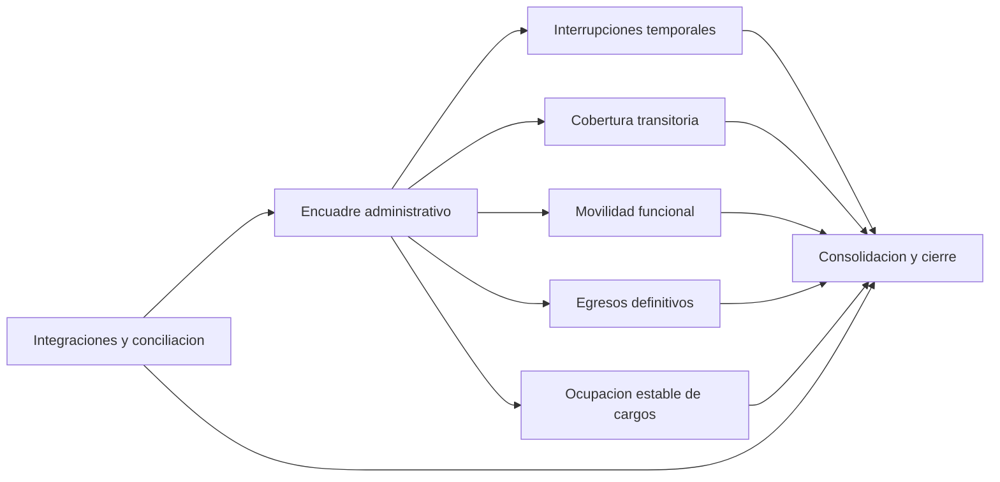

# Mapa y clasificacion

Esta nota unifica el mapa general y la clasificacion inicial del dominio. Sirve para responder dos preguntas:

1. que bounded contexts existen,
2. como decidir rapidamente a cual pertenece un caso.

## Criterio rector

El bounded context se decide por la `pregunta dominante` del caso, no por la pantalla, el actor, el codigo administrativo o la etiqueta de ingreso/egreso.

## Mapa rapido

## Clasificacion rapida

| Bounded context | Pregunta dominante | Casos tipicos |
| --- | --- | --- |
| [[BC-01 - Encuadre administrativo de la novedad]] | que es este caso y a donde debe ir | recepcion, clasificacion, derivacion |
| [[BC-02 - Interrupciones temporales]] | se interrumpe temporalmente la prestacion | licencias, inasistencias, paro, reintegros |
| [[BC-03 - Cobertura transitoria]] | corresponde cubrir temporalmente una ausencia o reemplazo | suplencias y cierre de coberturas |
| [[BC-04 - Movilidad funcional]] | se mueve o reasigna funcionalmente al agente | traslados, adscripciones, comisiones, mayor jerarquia |
| [[BC-05 - Egresos definitivos]] | se cierra definitivamente el vinculo laboral | renuncia, jubilacion, fallecimiento, cesantia |
| [[BC-06 - Ocupacion estable de cargos]] | se ocupa establemente un cargo habilitado | interinatos, titularizaciones, continuidad o conversion valida |
| [[BC-07 - Integraciones y conciliación]] | como aterriza un ingreso externo en el modelo comun | designaciones, actos o eventos externos |
| [[BC-08 - Consolidacion y cierre]] | se puede consolidar, arrastrar o bloquear el caso | resultados ya tratados por otros contexts |

## Reglas de corte

1. Si el problema principal es `clasificar y derivar`, va a `BC-01`.
2. Si el problema principal es `interrumpir temporalmente`, va a `BC-02`.
3. Si el problema principal es `cubrir temporalmente`, va a `BC-03`.
4. Si el problema principal es `mover o reasignar`, va a `BC-04`.
5. Si el problema principal es `cerrar definitivamente`, va a `BC-05`.
6. Si el problema principal es `ocupar establemente`, va a `BC-06`.
7. Si el problema principal es `traducir o conciliar un ingreso externo`, va a `BC-07`.
8. Si el problema principal es `consolidar o cerrar administrativamente`, va a `BC-08`.

## No confundir

1. `BC-02` no es `BC-03`.
2. `BC-03` no es `BC-06`.
3. `BC-04` puede generar efectos derivados en `BC-03` o `BC-06`, pero no se mezcla con ellos.
4. `BC-07` no resuelve negocio funcional profundo.
5. `BC-08` no corrige lo que debio resolverse antes.
