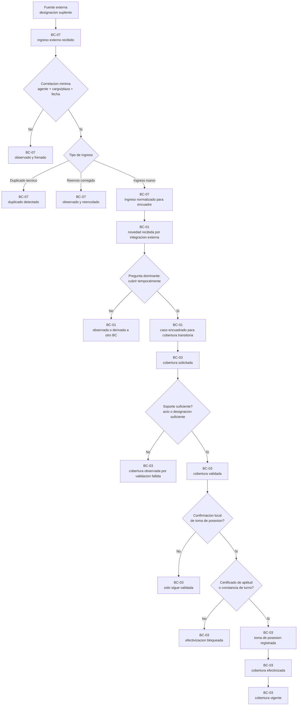

# Interfaz prioritaria - BC-07 a BC-01 a BC-03 - Designacion suplente

> [!abstract] Proposito
> Esta nota baja el recorrido priorizado del primer caso de integracion externa tratado en el proyecto: `designacion suplente`. Su objetivo es fijar el handoff semantico entre `[[BC-07 - Integraciones y conciliación]]`, `[[BC-01 - Encuadre administrativo de la novedad]]` y `[[BC-03 - Cobertura transitoria]]` sin obligar a resolver antes otros bounded contexts.

## Vista general actual

## 1. Alcance

- cubre `designacion suplente` como primer ingreso externo prioritario,
- fija la ruta `BC-07 -> BC-01 -> BC-03` para nuevas designaciones,
- incluye duplicados, reenvios corregidos y contradicciones como parte del primer corte,
- no define payload técnico final ni contrato API,
- no resuelve el causante profundo de otros contexts mas alla de la referencia minima necesaria para encuadre y cobertura.

## 2. Regla de recorrido priorizado

1. `BC-07 - Integraciones y conciliación` recibe, traduce y correlaciona el ingreso externo.
2. Si el ingreso describe una `designacion suplente` nueva y no tiene contradicción bloqueante, `BC-07` lo entrega a `[[BC-01 - Encuadre administrativo de la novedad]]`.
3. `BC-01` decide si la pregunta dominante del caso es realmente `cubrir temporalmente`.
4. Si la respuesta es afirmativa, `BC-01` deriva a `[[BC-03 - Cobertura transitoria]]`.
5. `BC-03` decide si ese soporte alcanza para `cobertura validada` y, mas adelante, si la confirmacion local de `toma de posesion` permite efectivizarla.

## 3. Por que no se deriva directo a BC-03 en este corte

- para no dejar que la taxonomía externa gobierne por si sola el bounded context de destino,
- para mantener un punto de control común de encuadre mientras el proyecto todavia se implementa por partes,
- para permitir que una misma infraestructura de integración pueda alimentar despues otros contexts sin cambiar su semántica base,
- para separar desde origen la logica de `ingreso externo` de la logica propia de `cobertura transitoria`.

## 4. Datos minimos del handoff BC-07 -> BC-01

- `tipo de fuente`,
- `huella externa`,
- `agente` correlacionado,
- `cargo/plaza`,
- `fecha desde` o `fecha efectiva`,
- `tipo de hecho interpretado` = `designacion suplente`,
- `evidencia preservada`,
- `soporte informado por la fuente`,
- trazabilidad de si se trata de ingreso nuevo, duplicado o reenvio corregido.

## 5. Datos minimos del handoff BC-01 -> BC-03

- caso ya encuadrado como `cobertura transitoria`,
- referencia a la `designacion suplente` recibida,
- `docente reemplazado` o `referencia funcional equivalente` cuando corresponda,
- `agente reemplazante` si ya fue identificado,
- `establecimiento`,
- `cargo/plaza`,
- `fecha desde`,
- `fecha hasta` cuando exista,
- referencia al soporte recibido,
- `toma de posesion declarada` cuando venga informada en origen,
- `observaciones documentales` de origen cuando existan,
- evidencia externa preservada,
- trazabilidad de origen del ingreso externo.

## 6. Soporte suficiente en este recorrido

En este recorrido, `BC-07` no decide por si solo si el soporte ya es suficiente para validar la cobertura. Solo preserva y entrega la evidencia.

La lectura de `soporte suficiente` queda en `[[BC-03 - Cobertura transitoria]]`, donde puede tomar formas como:

- `designacion suficiente`,
- `acto administrativo`,
- `propuesta respaldada`,
- `acta de consejo`,
- otro `respaldo suficiente` trazable segun circuito.

## 7. Duplicados, correcciones y contradicciones

### 7.1 Duplicado tecnico

- si el ingreso ya fue absorbido sin diferencia relevante, `BC-07` lo marca como `duplicado tecnico`,
- no reabre encuadre ni cobertura por el solo reenvio.

### 7.2 Reenvio corregido

- si el ingreso trae diferencia relevante respecto de uno ya procesado, `BC-07` lo trata como `reenvio corregido`,
- la salida base del primer corte es `observar y reencolar`,
- no se autoactualiza en forma silenciosa el caso funcional ya tratado.

### 7.3 Contradiccion con realidad local

- si la fuente externa contradice en forma fuerte la realidad operativa local, `BC-07` observa y frena,
- el caso no avanza a `BC-01` ni a `BC-03` hasta revision posterior.

## 8. Preguntas que responde cada contexto

### 8.1 BC-07 - Integraciones y conciliación

- que llego,
- si se entiende como `designacion suplente`,
- con que realidad interna correlaciona,
- si es nuevo, duplicado o correccion,
- si puede pasar a encuadre.

### 8.2 BC-01 - Encuadre administrativo de la novedad

- si el caso pertenece realmente a `cobertura transitoria`,
- si la pregunta dominante es `cubrir temporalmente`,
- si ya puede derivarse a `BC-03`.

### 8.3 BC-03 - Cobertura transitoria

- si el soporte alcanza para `cobertura validada`,
- si la cobertura queda observada por validacion fallida,
- si la confirmacion local de `toma de posesion` permite efectivizar,
- como se sostiene, revisa o cierra la cobertura.

## 9. Regla de implementacion por etapas

Esta interfaz permite avanzar por partes sin ensuciar el proyecto:

1. primero puede implementarse `BC-07` como nucleo reusable de ingresos externos,
2. despues `BC-01` sigue actuando como puerta comun de encuadre,
3. finalmente `BC-03` puede implementarse sin absorber logica de duplicados, reenvios o contradicciones de origen.

El resultado buscado no es retrasar `BC-03`, sino hacer que llegue con ingresos mejor ordenados y con una base de integracion reutilizable para los siguientes bounded contexts.
