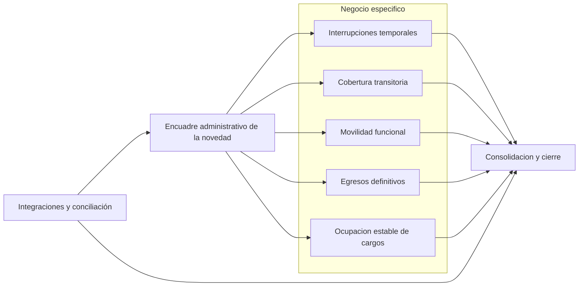
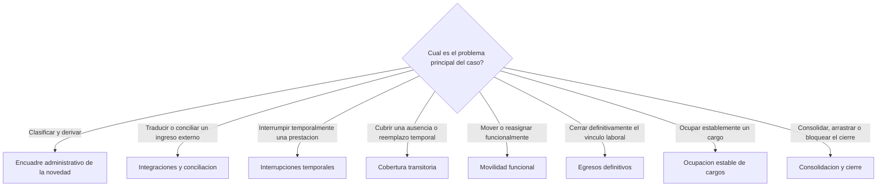
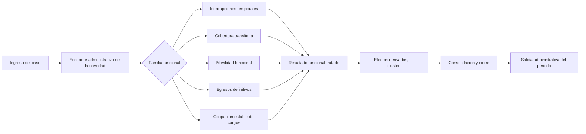
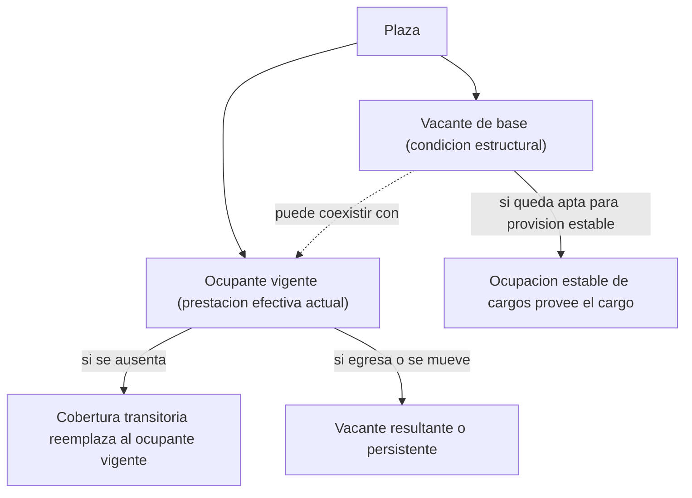
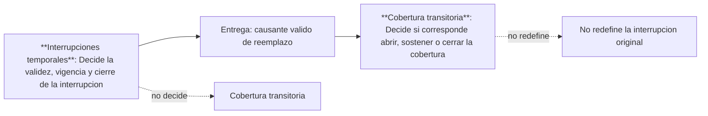
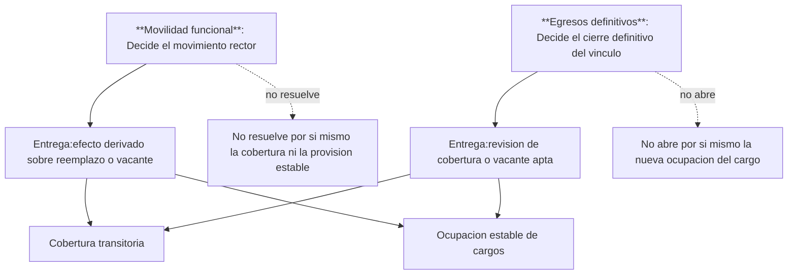
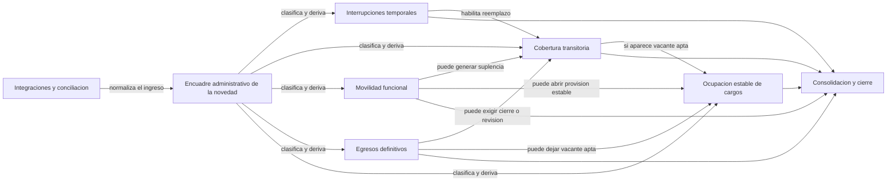

> [!abstract] Propósito
> Este documento unifica y resume la etapa de diseño de bounded contexts para el dominio de novedades laborales. Está escrito para lectura ejecutiva independiente: explica el recorte estratégico, las decisiones de partición ya tomadas, el rol de cada bounded context, los principales criterios de frontera, las definiciones transversales que sostienen el diseño y los temas que todavía requieren cierre antes de una siguiente etapa más técnica.
> 
> **El objetivo es evitar que la complejidad de una licencia médica (BC-02) "contamine" la lógica de un traslado funcional (BC-04).**

## 1. Resumen ejecutivo

La etapa de diseño relevada propone ordenar el dominio de novedades laborales no por pantallas, formularios, actores o listas nominales de códigos, sino por **problemas de negocio distintos que conviene mantener consistentes dentro de una misma frontera**.

El resultado es un mapa de ocho bounded contexts:

1. Encuadre administrativo de la novedad.
2. Interrupciones temporales.
3. Cobertura transitoria.
4. Movilidad funcional.
5. Egresos definitivos.
6. Ocupación estable de cargos.
7. Integraciones y conciliación.
8. Consolidación y cierre.

La lógica general del diseño es la siguiente:

- primero se recibe, encuadra y deriva el caso,
- luego se resuelve su familia funcional principal,
- después se registran sus efectos derivados,
- y finalmente se decide su consolidación administrativa para cierre de período.

La propuesta evita cuatro errores frecuentes del dominio:

- ==mezclar interrupciones con coberturas,==
- ==mezclar suplencias con interinatos u otras ocupaciones estables,==
- ==dejar que el nombre administrativo del código defina por sí solo el modelo,==
- ==y usar el cierre de período para reinterpretar problemas que debieron resolverse ante==s.

Desde el punto de vista ejecutivo, el diseño ya tiene una base consistente y varias decisiones estratégicas cerradas. Aun así, la etapa no debe considerarse completamente finalizada: persisten preguntas abiertas en automatización, autoridad operativa por subtipo, reglas finas de efectivización y criterios de criticidad para cierre.

### 1.1 Vista general del dominio

El siguiente esquema resume la arquitectura conceptual del recorte y permite ver, de un vistazo, cómo se relacionan entrada, negocio específico, soporte de integración y cierre administrativo.

> [!info] Lectura visual
> La entrada no resuelve el negocio profundo. Las integraciones no gobiernan el modelo. Las familias funcionales resuelven el caso y el cierre administrativo opera al final, sobre resultados ya tratados.

## 2. Alcance de esta etapa de diseño

Esta etapa cubre la delimitación estratégica del dominio de novedades laborales y la organización de sus principales familias de problemas.

Incluye:

- definición de los bounded contexts principales,
- criterio de partición por pregunta dominante del caso,
- reglas de borde entre familias,
- primeras interfaces semánticas entre contextos,
- conceptos transversales necesarios para no deformar el diseño,
- y cierre ejecutivo de varios hotspots de clasificación.

Queda explícitamente fuera de este recorte:

- la administración estructural completa de plazas o de la POF,
- la liquidación como dominio autónomo posterior,
- la toma de posesión como bounded context separado,
- la definición de APIs, eventos técnicos, tablas o payloads,
- y el modelado exhaustivo de todos los subtipos normativos del catálogo real.

En otras palabras, esta etapa no baja todavía a diseño técnico detallado. Su función es fijar un lenguaje de negocio consistente para que una etapa posterior pueda construir procesos, eventos, reglas y validaciones sin volver a mezclar problemas distintos. 

## 3. Criterio rector del diseño

La decisión central del recorte es que cada caso debe leerse por su **pregunta dominante**.

Eso significa que un mismo rótulo administrativo puede no pertenecer siempre al mismo lugar si el problema de negocio real cambia. Por ejemplo:

- un caso no pertenece a Cobertura transitoria solo porque exista reemplazo administrativo, sino cuando la pregunta principal es si corresponde cubrir una ausencia temporal,
- un caso no pertenece a Ocupación estable de cargos solo porque aparezca la palabra `interinato`, sino cuando el problema principal sea proveer establemente un cargo,
- y un caso no pertenece a Egresos definitivos solo porque el nombre administrativo diga `cese`, sino cuando el problema principal sea cerrar definitivamente el vínculo laboral.

Este criterio es importante porque permite ordenar el dominio por decisiones sustantivas y no por arrastre histórico de nomenclaturas o circuitos administrativos.

### 3.1 Arbol de decision por pregunta dominante

Este gráfico expresa la regla más importante del diseño: cada caso se asigna según el problema principal que debe resolverse.

## 4. Estado general de la etapa

La etapa puede considerarse **avanzada en su recorte estratégico**, con un nivel de madurez desigual entre piezas.

Ya se encuentra consolidado:

- el mapa general de **ocho contextos delimitados**,
- la diferenciación entre familias funcionales principales,
- la exclusión de `vacante` como bounded context autónomo,
- la exclusión de `toma de posesión` como bounded context autónomo,
- la idea de que las integraciones no deben gobernar el modelo,
- y varias decisiones ejecutivas sobre casos especialmente dudosos.

Todavía requiere profundización:

- el catálogo fino de algunos subtipos,
- la definición operativa exacta de ciertas automatizaciones,
- la autoridad final por subtipo o por nivel,
- la política de criticidad y arrastre para cierre,
- y la traducción posterior de estas fronteras a diseño técnico.

## 5. Arquitectura conceptual del dominio

La arquitectura conceptual propuesta organiza el recorrido del caso en cuatro capas.

### 5.1 Capa de entrada

Aquí se recibe el caso y se lo vuelve comprensible dentro del dominio.

- Encuadre administrativo de la novedad ordena el ingreso común.
- Integraciones y conciliación normaliza ingresos externos.

### 5.2 Capa de negocio específico

Aquí se resuelven las familias funcionales que concentran las decisiones principales.

- Interrupciones temporales.
- Cobertura transitoria.
- Movilidad funcional.
- Egresos definitivos.
- Ocupación estable de cargos.

### 5.3 Capa de cierre administrativo

Aquí no se vuelve a resolver el caso desde cero. Se decide si lo ya tratado puede consolidarse, debe observarse o bloquea el cierre.

- Consolidación y cierre.

### 5.4 Capa transversal

Aquí viven definiciones que atraviesan varios contextos y deben mantenerse consistentes, aunque no se transformen por eso en nuevos bounded contexts.

Los principales conceptos transversales detectados son:

- plaza,
- estado de plaza,
- vacante de base,
- ocupante vigente,
- vacante resultante,
- vacante persistente,
- cambio de carácter de vacante,
- y toma de posesión como umbral de efectivización en varias familias.

## 6. Los ocho **contextos delimitados** del diseño

### 6.1 Encuadre administrativo de la novedad

**Rol ejecutivo**

Encuadre administrativo de la novedad es la puerta de entrada común del dominio. Su función no es resolver licencias, coberturas, egresos o movimientos, sino recibir la novedad, darle un encuadre inicial, medir si tiene datos suficientes y derivarla a la familia funcional correcta.

**Qué problema resuelve**

Resuelve el problema de admisión, clasificación temprana y derivación. En términos prácticos, evita que cada flujo funcional tenga que decidir por sí mismo si el caso realmente le pertenece.

**Qué incluye**

- recepción de novedades desde origen local, central o externo,
- identificación preliminar del tipo de caso,
- validación de datos mínimos,
- clasificación por familia funcional,
- definición de estados tempranos como recibida, pendiente, observada, clasificada, derivada o rechazada,
- y decisión sobre si un caso puede derivarse automáticamente o requiere revisión humana.

**Qué no debe hacer**

No debe resolver el negocio profundo de las familias. Si intenta absorber licencias, suplencias, movimientos o egresos, pierde su función y vuelve a mezclar el dominio.

**Decisiones más relevantes**

- a qué familia pertenece el caso,
- si hay completitud mínima para admitirlo,
- si debe quedar pendiente por faltante simple,
- si debe quedar observado por contradicción o duda de encuadre,
- y si la derivación puede automatizarse según origen, evidencia y ausencia de contradicción.

**Lectura ejecutiva**

Este bounded context es crítico porque disciplina la entrada. Si el encuadre es débil, todo el resto del diseño pierde valor. Si el encuadre es sólido, el resto del dominio puede operar sobre casos ya inteligibles y trazables.

### 6.2 Interrupciones temporales

**Rol ejecutivo**

Interrupciones temporales concentra las novedades que suspenden, alteran o pausan temporalmente una prestación sin convertirla en egreso definitivo.

**Qué problema resuelve**

Resuelve si realmente existe una interrupción válida, qué subtipo corresponde, desde cuándo rige, bajo qué soporte se sostiene y cuándo se considera cerrada o reanudada.

**Qué incluye**

- licencias médicas,
- licencias extraordinarias,
- licencias para personal suplente,
- inasistencias,
- paro,
- reintegros,
- y observación o cierre de interrupciones temporales.

**Qué no debe hacer**

No debe absorber la cobertura transitoria derivada ni confundirse con egresos definitivos. También debe evitar confundirse con reincorporaciones a ocupación estable.

**Criterios estructurales**

- una interrupción temporal no equivale a egreso,
- todo reintegro exige antecedente válido,
- el reintegro cierra una temporalidad previa y no debe confundirse con reincorporación,
- no deben admitirse solapamientos inválidos,
- y la autoridad operativa no es uniforme, sino dependiente del subtipo.

**Lectura ejecutiva**

Este contexto concentra gran parte del volumen cotidiano del dominio. Por eso es uno de los más relevantes operativamente, aunque muchos de sus subtipos no aparezcan visibles en catálogos simples de ingreso o egreso de plaza.

### 6.3 Cobertura transitoria

**Rol ejecutivo**

Cobertura transitoria reúne las novedades cuyo sentido principal es cubrir temporalmente una ausencia o sostener un reemplazo habilitado por un causante transitorio.

**Qué problema resuelve**

Resuelve si corresponde abrir una cobertura, a quién reemplaza, con qué trazabilidad se sostiene, cuándo queda efectivizada y cuándo debe cerrarse, revisarse o regularizarse.

**Qué incluye**

- suplencias por licencias o interrupciones validadas,
- suplencias derivadas de movimientos de mayor jerarquía,
- vigencia y cierre de coberturas,
- regularizaciones excepcionales,
- y trazabilidad entre cobertura y causante.

**Qué no debe hacer**

No debe absorber interinatos ni titularizaciones. Tampoco debe confundirse con la interrupción original que la habilita.

**Criterios estructurales**

- no hay cobertura sin causante válido,
- toda cobertura debe explicar a quién reemplaza o qué referencia funcional cubre,
- la cobertura reemplaza al ocupante vigente o a la prestación temporariamente ausente, no a la vacante de base,
- la toma de posesión es el umbral de efectivización,
- y si el causante desaparece o cambia, la cobertura debe revisarse o cerrarse.

**Lectura ejecutiva**

Este contexto es uno de los puntos de mayor confusión histórica del dominio porque operativamente se parece a otras figuras, pero estratégicamente no debe confundirse con provisión estable de cargos.

### 6.4 Movilidad funcional

**Rol ejecutivo**

Movilidad funcional concentra los casos cuyo problema principal es mover, reasignar o redirigir funcionalmente al agente.

**Qué problema resuelve**

Resuelve la trazabilidad del movimiento: origen, destino, subtipo, vigencia, soporte y, cuando corresponde, efectivización por toma de posesión.

**Qué incluye**

- traslados transitorios,
- traslados definitivos,
- adscripciones,
- comisiones de servicio,
- tareas pasivas,
- permutas,
- reubicaciones,
- movimientos por mayor jerarquía,
- afectaciones y su cierre.

**Qué no debe hacer**

No debe reabsorberse como licencia, cobertura, egreso u ocupación estable. Puede generar efectos derivados sobre esas familias, pero sin perder por ello su rectoría.

**Criterios estructurales**

- toda movilidad debe explicar origen y destino funcional,
- debe quedar explícito el subtipo normativo,
- un movimiento puede validarse antes de quedar efectivizado,
- la toma de posesión se exige cuando el subtipo habilita ejercicio efectivo en destino,
- y los efectos derivados deben salir a otros contextos cuando el problema principal cambie.

**Lectura ejecutiva**

Es un contexto de alta complejidad porque combina trazabilidad bilateral, distintos subtipos normativos y efectos colaterales sobre coberturas, vacantes u ocupaciones. La decisión más importante del diseño es que esos efectos derivados no le quitan su rectoría al movimiento principal.

### 6.5 Egresos definitivos

**Rol ejecutivo**

Egresos definitivos reúne los casos cuyo efecto principal es **cerrar definitivamente un vínculo laboral**.

**Qué problema resuelve**

Resuelve cuál es la causal normativa real del egreso, cuál es su fecha efectiva, qué evidencia alcanza para aplicarlo y qué efectos inmediatos produce sobre la plaza y los casos dependientes.

**Qué incluye**

- renuncias aceptadas,
- jubilaciones,
- ceses por fallecimiento,
- sanciones expulsivas como cesantía y exoneración,
- otras causales equivalentes de cierre definitivo,
- expresión de vacancia, cambio de carácter de vacante o cierre de plaza,
- y tratamiento de efectos dependientes.

**Qué no debe hacer**

No debe confundirse con interrupciones temporales ni con la ocupación posterior del cargo. Tampoco debe absorber la liquidación externa de beneficios previsionales o de familiares.

**Criterios estructurales**

- `baja` y `cese` son rótulos administrativos generales y no alcanzan por sí solos,
- no hay egreso definitivo sin causal y fecha trazables,
- la renuncia no produce efecto definitivo por simple presentación cuando requiere aceptación,
- el contexto cierra el vínculo del ocupante vigente, no abre por sí mismo la ocupación posterior,
- y si existían coberturas dependientes, deben revisarse o cerrarse expresamente.

**Lectura ejecutiva**

Este contexto es decisivo porque expresa el cierre irreversible del caso y sus efectos inmediatos, pero sin invadir el terreno de la provisión posterior del cargo.

### 6.6 Ocupación estable de cargos

**Rol ejecutivo**

Ocupación estable de cargos concentra las novedades cuyo sentido principal es proveer de manera estable un cargo o plaza habilitada.

**Qué problema resuelve**

Resuelve si existe una vacante real o habilitación suficiente, cuál es el subtipo de provisión estable, qué soporte habilita el caso y en qué momento la ocupación queda efectivizada mediante toma de posesión.

**Qué incluye**

- interinatos ordinarios,
- titularizaciones por ingreso,
- titularizaciones por ascenso,
- reincorporaciones que restituyen a una ocupación estable de base,
- continuidad o conversión con antecedente de suplencia cuando el régimen lo habilita,
- y otras provisiones estables equivalentes.

**Qué no debe hacer**

No debe confundirse con suplencia, reemplazo temporario o simple movimiento funcional. Tampoco debe absorber toda la administración estructural de plazas.

**Criterios estructurales**

- no hay interinato sin vacante real,
- toda ocupación estable debe apoyarse en vacante real o habilitación estructural externa ya trazada,
- la suplencia reemplaza la ausencia del ocupante vigente, no la vacante de base,
- la ocupación estable puede validarse antes, ==pero no queda efectivizada sin toma de posesión,==
- y la continuidad desde una suplencia antecedente ==nunca debe presumirse como automática==  (como ocurre en primaria).

**Lectura ejecutiva**

Este contexto es estratégico porque fija una frontera muy sensible: distingue provisión estable de reemplazo temporario. Esa frontera es una de las decisiones de diseño más importantes del proyecto.

### 6.7 Integraciones y conciliación

**Rol ejecutivo**

Integraciones y conciliación ordena la entrada de eventos, actos o resultados externos para que puedan ser entendidos dentro del lenguaje propio del dominio.

**Qué problema resuelve**

Resuelve si un ingreso externo es legible, correlacionable, auditable, duplicado o corregido; si puede mapearse de manera segura; y si corresponde derivarlo a un contexto funcional o al encuadre común.

**Qué incluye**

- recepción técnica de ingresos externos,
- traducción al lenguaje canónico,
- correlación con agente, cargo, plaza o caso,
- control de duplicidad, reenvío e idempotencia,
- conciliación semántica,
- regularización mínima de ingreso y trazabilidad,
- y derivación posterior.

**Qué no debe hacer**

No debe reemplazar la resolución del negocio funcional. Tampoco debe permitir que el contrato técnico externo defina el modelo central del sistema propuesto.

**Criterios estructurales**

- ningún evento externo puede saltearse las reglas centrales del dominio,
- duplicado y reenvío corregido no son lo mismo,
- la derivación directa solo es válida cuando el mapeo canónico es seguro,
- si el caso sigue siendo ambiguo debe pasar por el encuadre común,
- y la confianza de origen no reemplaza la autoridad operativa final del contexto de destino.

**Lectura ejecutiva**

Este contexto protege al dominio principal de quedar subordinado a la forma de los datos externos. Su aporte estratégico es permitir integración sin perder autonomía conceptual. 0

### 6.8 Consolidación y cierre

**Rol ejecutivo**

Consolidación y cierre reúne la lógica administrativa de criticidad, consolidación, arrastre y cierre de período.

**Qué problema resuelve**

Resuelve si un caso ya tratado por otros contextos puede consolidarse, si debe observarse, si puede arrastrarse con política explícita o si bloquea el cierre.

**Qué incluye**

- criticidad,
- estado de cierre,
- observaciones de cierre,
- arrastre controlado,
- bloqueo de cierre,
- consolidación por período,
- y salida administrativa derivada a planilla.

**Qué no debe hacer**

No debe reinterpretar desde cero el negocio principal del caso. Si lo hace, transforma el cierre en un espacio de corrección tardía y desordena todo el modelo.

**Criterios estructurales**

- la planilla es salida derivada y no fuente primaria,
- una novedad crítica no puede desaparecer del cierre por omisión,
- los casos no críticos solo pueden arrastrarse con política explícita,
- y este contexto decide sobre consolidación y cierre, no sobre el negocio base.

**Lectura ejecutiva**

Este contexto separa claramente la urgencia del cierre de período de la resolución funcional de los casos. Esa separación es esencial para evitar que el dominio se vuelva planillocéntrico.

### 6.9 Ruta de vida de una novedad

Una vez entendidos los ocho contextos, el siguiente esquema muestra cómo circula un caso a través del diseño sin volver a mezclar responsabilidades.

> [!info] Lectura visual
> El caso primero se encuadra, luego se resuelve en su familia principal y recién después puede generar efectos derivados y pasar al cierre. Ese orden evita que un contexto reabra decisiones que pertenecen a otro.

## 7. Conceptos transversales que sostienen el diseño

### 7.1 Plaza, estado de plaza y vacante

El diseño ya tomó una decisión importante: `vacante` no se modela como bounded context propio dentro del mapa de novedades laborales.

La vacante se trata como un concepto transversal ligado a la plaza, su estado y su carácter. Por eso:

- algunos contextos pueden generar una vacante resultante,
- otros pueden consumir una vacante apta para provisión estable,
- y otros necesitan distinguir vacante de base de ocupante vigente para no equivocarse de problema.

### 7.2 Vacante de base y ocupante vigente

La distinción entre `vacante de base` y `ocupante vigente` es una de las piezas más importantes de todo el recorte.

Permite explicar casos como estos:

- una plaza puede seguir siendo vacante en sentido estructural aunque tenga un interino activo,
- una suplencia puede recaer sobre la ausencia de ese ocupante vigente sin reemplazar por eso la vacante de base,
- un egreso puede cerrar el vínculo del ocupante vigente sin agotar por ello la lectura estructural posterior de la plaza.

> [!important] Lectura visual
> La cobertura transitoria reemplaza la ausencia del ocupante vigente. La ocupación estable, en cambio, resuelve la provisión del cargo cuando existe vacante apta. ==Esa distinción es una de las fronteras más importantes del diseño.==

### 7.3 Toma de posesión

La toma de posesión no se propone como bounded context separado, pero sí aparece como umbral transversal de efectivización en varias familias.

Cumple un papel ejecutivo claro:

- en coberturas, marca cuándo la cobertura pasa de validada a efectivizada,
- en movimientos, marca cuándo comienza el ejercicio efectivo en destino cuando el subtipo así lo exige,
- y en ocupaciones estables, marca cuándo la provisión deja de ser solo designación o adjudicación y pasa a ser ejercicio estable del cargo.

### 7.4 Fronteras lógicas entre contextos

Los siguientes diagramas muestran el tipo de frontera que el diseño intenta preservar: cada contexto decide su propio problema, entrega un resultado semántico y el contexto siguiente trabaja sobre ese resultado, sin absorber la regla de negocio anterior.

#### 7.4.1 Interrupciones temporales y Cobertura transitoria

#### 7.4.2 Movilidad funcional y Egresos definitivos como origen de efectos derivados

> [!info] Lectura visual
> La frontera entre contextos no corta la continuidad del caso: corta la mezcla de reglas. Un contexto puede habilitar o disparar el trabajo del siguiente, pero no por eso absorbe su decisión de negocio.

### 7.5 Interfaces criticas resumidas

El siguiente mapa no intenta mostrar todas las conexiones del dominio. Solo presenta los handoffs más sensibles, es decir, aquellos donde la confusión conceptual puede deformar el recorte.

> [!info] Lectura visual
> Las interfaces críticas no niegan la frontera entre contextos. Al contrario: muestran dónde debe hacerse un handoff explícito para evitar que un contexto absorba decisiones que no le corresponden.

## 8. Decisiones ejecutivas ya cerradas en esta etapa

La etapa ya consolidó varias decisiones que reducen ambigüedad en el mapa.

### 8.1 Reincorporación

Se decidió tratarla dentro de **Ocupación estable de cargos** como retorno a una ocupación estable de base, y no como simple cierre de una interrupción temporal.

### 8.2 Reintegro

Se consolidó dentro de **Interrupciones temporales** como cierre de la temporalidad de una ausencia o interrupción previa.

### 8.3 Interinato en cargo de mayor jerarquía

Se resolvió que pertenece a **Movilidad funcional** porque prevalece el movimiento rector por sobre el rótulo administrativo de `interinato`.

### 8.4 Pase a disponibilidad

Se resolvió dentro de **Movilidad funcional** por su relación con desplazamiento, disponibilidad y reubicación posterior.

### 8.5 Afectación y cese de afectación

Se consolidaron dentro de **Movilidad funcional** como apertura y cierre de un movimiento funcional transitorio.

### 8.6 Cese de interinato en cargo de mayor jerarquía

Se resolvió dentro de **Movilidad funcional** como cierre del movimiento rector de mayor jerarquía.

### 8.7 Cese de interinato

Se resolvió dentro de **Ocupación estable de cargos** como cierre del ciclo de vida de la revista interina y no como egreso definitivo rector del vínculo general.

## 9. Riesgos de diseño que este recorte ya ayuda a evitar

La propuesta reduce varios riesgos estructurales.

-  **Evita mezclar reemplazo con provisión estable:** 
Sin esta delimitación, suplencias e interinatos terminan absorbidos por el mismo circuito. El recorte evita eso y ordena el problema por naturaleza de negocio.

-  **Evita que el código administrativo gobierne el modelo:**
El diseño prioriza la pregunta dominante del caso y no la apariencia superficial del nombre administrativo.

-  **Riesgo de subordinar el dominio a integraciones externas:**
Integraciones y conciliación normaliza sin redefinir el modelo central. Esto es clave para no quedar atados a formatos, contratos o nomenclaturas externas.

-  **Riesgo de volver planillocéntrico el dominio:**
Consolidación y cierre queda al final de la cadena y no reemplaza la resolución funcional. Así se evita que la urgencia del cierre distorsione el corazón del negocio.

-  **Riesgo de confundir vacante con novedad autónoma:**
La vacante se mantiene como concepto transversal, lo que permite usarla donde corresponde sin romper el mapa en más contextos de los necesarios.

## 10. Temas abiertos que siguen requiriendo cierre

Aunque el recorte general es sólido, todavía quedan temas abiertos que conviene tratar como agenda de profundización.

### 10.1 Automatización segura

Sigue pendiente definir con mayor precisión:

- qué condiciones exactas habilitan derivación automática,
- qué automatizaciones pueden hacerse por subtipo,
- y qué umbrales de confianza y completitud deben cumplirse.

### 10.2 Autoridad operativa por subtipo

En varios contextos ya está claro que la autoridad no es uniforme, pero todavía falta cerrar con más precisión qué nivel o actor tiene última palabra en ciertos subtipos.

### 10.3 Reglas finas de efectivización

La toma de posesión aparece como criterio fuerte en varias familias, pero todavía quedan dudas finas sobre excepciones o regímenes particulares.

### 10.4 Criterios de cierre y criticidad

Todavía falta bajar con más detalle:

- qué casos son críticos desde el primer corte,
- qué evidencia mínima habilita arrastre,
- y qué decisiones conviene automatizar en cierre de período.

### 10.5 Subtipos todavía no suficientemente discriminados

Persisten preguntas abiertas sobre:

- licencias extraordinarias,
- subvariantes de mayor jerarquía,
- diferencias entre mecanismos de adjudicación,
- causales equivalentes de egreso,
- y condiciones exactas de continuidad o conversión desde suplencias antecedentes.

## 11. Valor ejecutivo del diseño alcanzado

El diseño:

- crea un lenguaje común para hablar del dominio,
- evita que el proyecto siga organizándose por circuitos administrativos mezclados,
- permite pensar integraciones sin perder autonomía conceptual,
- reduce errores de clasificación que después contaminan etapas posteriores,
- y deja preparada una base razonable para pasar a eventos canónicos, reglas más finas y diseño técnico.

En términos de gobierno del proyecto, esta etapa ya ofrece un marco suficientemente sólido para ordenar la conversación entre negocio, operación, análisis funcional y diseño posterior.

## 12. Próximos pasos 

El camino lógico para la etapa siguiente sería:

1. cerrar preguntas abiertas con mayor impacto transversal,
2. priorizar automatizaciones seguras por familia,
3. definir eventos canónicos y handoffs semánticos por contexto,
4. validar el recorte contra el catálogo real de motivos de ingreso y egreso,
5. y recién después bajar a contratos técnicos, eventos, tablas o APIs.

La recomendación ejecutiva es no saltar directamente a diseño técnico sin cerrar al menos los puntos abiertos que afectan automatización, autoridad operativa y efectivización.

## 13. Documentos fuente consolidados en este informe

Este informe se construyó a partir de la carpeta completa de diseño de bounded contexts y consolida especialmente el contenido de los siguientes documentos:

- `BC-01 - Encuadre administrativo de la novedad.md`
- `BC-02 - Interrupciones temporales.md`
- `BC-03 - Cobertura transitoria.md`
- `BC-04 - Movilidad funcional.md`
- `BC-05 - Egresos definitivos.md`
- `BC-06 - Ocupacion estable de cargos.md`
- `BC-07 - Integraciones y conciliación.md`
- `BC-08 - Consolidacion y cierre.md`
- `Clasificacion de novedades laborales por bounded context.md`
- `Concepto transversal - Plaza, estado y vacante.md`
- `Mapa de bounded contexts - Novedades laborales.md`
- `Matriz comparativa - Bounded contexts de novedades laborales.md`
- `Matriz de interfaces - Bounded contexts de novedades laborales.md`

## 14. Cierre

La etapa de diseño analizada ya permitió transformar un dominio históricamente mezclado en un mapa comprensible de problemas de negocio. El principal mérito del trabajo no está en haber enumerado ocho contextos, sino en haberles dado una lógica de frontera razonable, haber identificado sus puntos de confusión más delicados y haber fijado un lenguaje transversal que hace posible seguir avanzando sin volver a mezclar todo.

Ese es el activo más importante que deja esta etapa.
