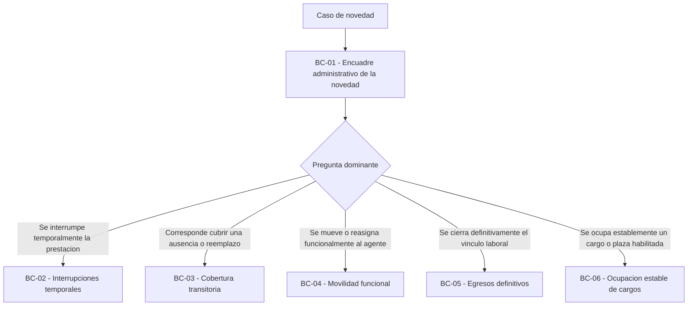
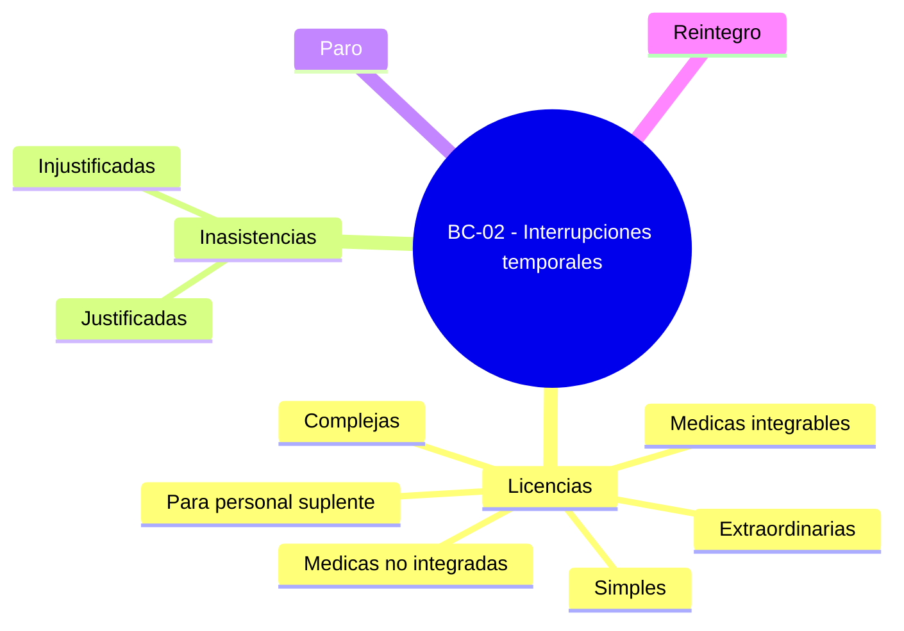
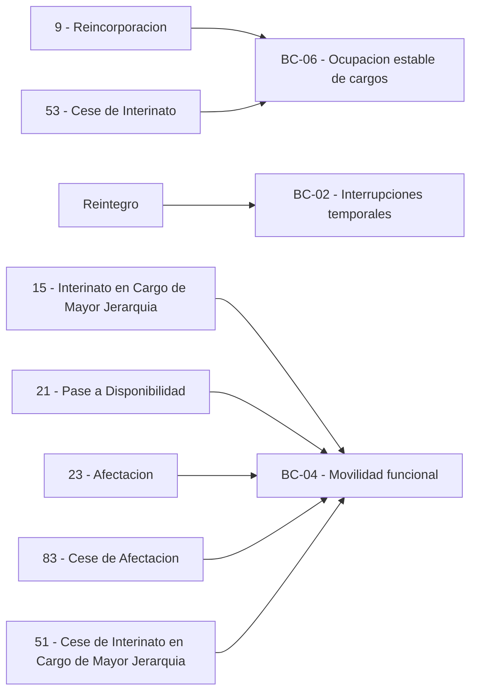

# Clasificación de novedades laborales por bounded context

> [!abstract] Propósito
> Esta nota clasifica las novedades laborales segun su bounded context rector. No se organiza primero por si se produce en el establecimiento o esta centralizado, por `ingreso` o `egreso`, ni por formulario, ni por lista plana de códigos. Se organiza por la pregunta dominante del caso. Incorpora, ademas, el cierre ejecutivo de los hotspots de mapeo ya resueltos.
## 1. Criterio general

1. El bounded context rector se decide por el problema principal del caso.
2. `Ingreso/egreso` y `transitoria/definitiva` ayudan a leer el catalogo administrativo, pero no alcanzan por si solos para decidir pertenencia.
3. Un mismo código puede requerir lectura dual según el problema rector; por eso se explicitan interfaces derivadas cuando corresponde.
4. El catalogo de `motivos de ingreso/egreso de plaza` no agota todas las familias relevantes del dominio.
5. `BC-02 - Interrupciones temporales` es una de las familias mas voluminosas y frecuentes del dominio aunque sus subfamilias no aparezcan como códigos de ingreso/egreso de plaza.

## 2. Regla de lectura del documento

| Bounded context rector                            | Pregunta dominante                                     | Que tipo de casos absorbe                                                            | Interfaces derivadas frecuentes                                                                                             |
| ------------------------------------------------- | ------------------------------------------------------ | ------------------------------------------------------------------------------------ | --------------------------------------------------------------------------------------------------------------------------- |
| [[BC-01 - Encuadre administrativo de la novedad]] | Que es este caso y a donde debe ir                     | Recepcion, clasificacion y derivacion                                                | Hacia todos los contextos funcionales                                                                                       |
| [[BC-02 - Interrupciones temporales]]             | Se interrumpe temporalmente la prestacion              | Licencias, inasistencias, paro, reintegros                                           | Hacia `[[BC-03 - Cobertura transitoria]]` y `[[BC-08 - Consolidacion y cierre]]`                                            |
| [[BC-03 - Cobertura transitoria]]                 | Corresponde cubrir una ausencia o reemplazo temporario | Suplencias y cierres de cobertura                                                    | Hacia `[[BC-06 - Ocupacion estable de cargos]]` o `[[BC-08 - Consolidacion y cierre]]`                                      |
| [[BC-04 - Movilidad funcional]]                   | Se mueve o reasigna funcionalmente al agente           | Traslados, adscripciones, comisiones, tareas pasivas, reubicaciones, mayor jerarquia | Hacia `[[BC-03 - Cobertura transitoria]]`, `[[BC-06 - Ocupacion estable de cargos]]` o `[[BC-08 - Consolidacion y cierre]]` |
| [[BC-05 - Egresos definitivos]]                   | Se cierra definitivamente el vinculo laboral           | Renuncias aceptadas, jubilacion, fallecimiento, cesantia y retiro                    | Hacia `[[BC-03 - Cobertura transitoria]]`, `[[BC-06 - Ocupacion estable de cargos]]` o `[[BC-08 - Consolidacion y cierre]]` |
| [[BC-06 - Ocupación estable de cargos]]           | Se ocupa establemente un cargo o plaza habilitada      | Interinatos, titularizaciones, continuidad/conversion valida                         | Hacia `[[BC-08 - Consolidacion y cierre]]`                                                                                  |
| [[BC-07 - Integraciones y conciliación]]          | Como aterriza un ingreso externo en el modelo común    | Eventos, actos o resultados externos                                                 | Hacia `[[BC-01 - Encuadre administrativo de la novedad]]` o directo a contextos funcionales                                 |
| [[BC-08 - Consolidacion y cierre]]                | Se puede consolidar, arrastrar o bloquear el caso      | Resultados ya tratados por otros contexts                                            | No reemplaza la resolución base                                                                                             |

### 2.1 Arbol de decision rapido

## 3. BC-01 - Encuadre administrativo de la novedad

Este contexto no tiene motivos rectores propios del catalogo normativo base. Su problema principal es recibir, clasificar y derivar.

| Rol                          | Que recibe                                                       | Resultado esperado                                                                                                                                                                      | Observaciones                                                              |
| ---------------------------- | ---------------------------------------------------------------- | --------------------------------------------------------------------------------------------------------------------------------------------------------------------------------------- | -------------------------------------------------------------------------- |
| Entrada administrativa comun | Casos desde establecimiento, nivel central o integracion externa | Caso clasificado, observado, pendiente, derivado o rechazado                                                                                                                            | No resuelve licencias, coberturas, movilidad, egresos ni ocupacion estable |
| Preclasificacion por familia | Datos minimos, origen, evidencia y pregunta dominante            | Derivacion a `BC-02 - Interrupciones temporales`, `BC-03 - Cobertura transitoria`, `BC-04 - Movilidad funcional`, `BC-05 - Egresos definitivos` o `BC-06 - Ocupacion estable de cargos` | La autoridad final varia por familia y subtipo                             |

## 4. BC-02 - Interrupciones temporales

`BC-02 - Interrupciones temporales` merece un tratamiento especial porque concentra una parte muy grande del volumen cotidiano del dominio. Su baja visibilidad en el catalogo de ingreso/egreso de plaza no implica baja relevancia funcional.

### 4.1 Familias relevantes del dominio que caen aquí

> [!info]
> Las filas siguientes no forman una taxonomia perfectamente cerrada. Algunas expresan complejidad operativa (`licencia simple`, `licencia compleja`) y otras expresan subfamilias funcionales mas finas (`licencia medica integrable`, `reintegro`, `paro`). Se usan aqui para enriquecer el mapa del dominio y no para congelar todavia el catalogo final.

| Subfamilia                       | Soporte minimo                                    | Validacion clave                                            | Origen operativo predominante                           | Puede habilitar cobertura                        | Observaciones                                                         |
| -------------------------------- | ------------------------------------------------- | ----------------------------------------------------------- | ------------------------------------------------------- | ------------------------------------------------ | --------------------------------------------------------------------- |
| Licencia simple                  | Articulo o motivo + periodo                       | Fechas validas y no solapamiento invalido                   | Mixto                                                   | Depende subtipo                                  | Lectura operativa util para casos de baja complejidad documental      |
| Licencia compleja                | Documento medico + dictamen o validacion especial | Estado de validacion previo a cierre de periodo             | Mixto con peso de integracion o control central         | Si, segun subtipo                                | Alta criticidad operativa cuando falta dictamen                       |
| Licencias medicas integrables    | Certificado o aprobacion externa confiable        | Correlacion, consistencia e idempotencia                    | Integracion externa                                     | Si, segun norma y vigencia                       | SGPEM consume solo licencias aprobadas con impacto laboral            |
| Licencias medicas no integradas  | Certificado o soporte medico suficiente           | Validacion interna y trazabilidad del antecedente           | Local o central asistido                                | Si, segun subtipo                                | Deben poder convivir con el escenario sin modulo medico               |
| Licencias extraordinarias        | Acto administrativo                               | Subtipo correcto, autoridad y vigencia                      | SGPEM central                                           | Depende subtipo                                  | No deben confundirse con movilidad funcional                          |
| Licencias para personal suplente | Acto o constancia suficiente                      | Condicion de suplencia al momento del caso                  | Mixto con validacion final de Direccion de nivel        | Puede habilitar nueva cobertura segun regla fina | Requieren lectura diferenciada del caracter suplente                  |
| Inasistencia justificada         | Fecha + motivo + constancia local                 | No conflicto con licencia vigente                           | Fuertemente local                                       | No por defecto                                   | Ordenamiento posterior o muestreo inteligente                         |
| Inasistencia injustificada       | Fecha + registro local                            | Trazabilidad minima y no contradiccion con licencia vigente | Inevitablemente local                                   | No por defecto                                   | Predomina registracion local                                          |
| Paro                             | Fecha + alcance                                   | Consistencia por agente/plaza                               | Fuertemente local                                       | No por defecto                                   | Caso masivo y de alta localia operativa                               |
| Reintegro                        | Fecha de reintegro + referencia a licencia previa | Continuidad temporal y cierre del antecedente               | Local asistido con validacion central sobre antecedente | Puede cerrar o impedir cobertura existente       | Sigue siendo novedad propia de SGPEM aun con integracion de licencias |

### 4.1.1 Mapa visual de familias de BC-02 - Interrupciones temporales

### 4.2 Reglas distintivas de BC-02 - Interrupciones temporales

1. SGPEM integra solo licencias aprobadas con impacto laboral.
2. La licencia rechazada no crea automáticamente una interrupción temporal valida.
3. Una licencia rechazada puede exigir reclasificacion, observación o derivación a otra novedad, por ejemplo una inasistencia injustificada o una regularización de cobertura, segun el caso.
4. Toda licencia integrada debe desembocar en una novedad laboral tipificada.
5. El reintegro sigue siendo novedad propia de SGPEM.
6. No toda interrupción habilita cobertura; primero debe existir interrupción valida y causal habilitante.
7. Inasistencias y paro admiten mayor peso de registracion local que otros subtipos.
8. El modelo debe soportar dos escenarios: con modulo de licencias medicas y sin modulo de licencias medicas.

### 4.3 Interfaces frecuentes de BC-02 - Interrupciones temporales

| Interfaz                                                                                   | Sentido               | Regla principal                                                      |
| ------------------------------------------------------------------------------------------ | --------------------- | -------------------------------------------------------------------- |
| [[BC-01 - Encuadre administrativo de la novedad]] -> [[BC-02 - Interrupciones temporales]] | Entrada               | La pregunta dominante pasa a ser `interrumpir temporalmente`         |
| [[BC-07 - Integraciones y conciliación]] -> [[BC-02 - Interrupciones temporales]]          | Entrada               | Solo cuando el evento externo ya es legible como interrupción valida |
| [[BC-02 - Interrupciones temporales]] -> [[BC-03 - Cobertura transitoria]]                 | Habilitación          | Solo si la interrupcion valida habilita reemplazo temporario         |
| [[BC-02 - Interrupciones temporales]] -> [[BC-08 - Consolidacion y cierre]]                | Salida administrativa | Cuando la interrupcion ya fue aplicada, observada o cerrada          |

## 5. BC-03 - Cobertura transitoria

| Codigo o familia                                   | Tipo administrativo o familiar | Rol en `BC-03 - Cobertura transitoria`                                              | Interfaces derivadas                                                          | Nivel de certeza | Observaciones                                                                                               |
| -------------------------------------------------- | ------------------------------ | ----------------------------------------------------------------------------------- | ----------------------------------------------------------------------------- | ---------------- | ----------------------------------------------------------------------------------------------------------- |
| 13 - Suplente Designado                            | Ingreso definitivo de plaza    | Cobertura transitoria por designacion suplente                                      | Puede consolidar o derivar a cierre                                           | Alta             | El catalogo lo llama definitivo, pero el problema rector sigue siendo suplencia                             |
| 14 - Suplencia en Cargo de Mayor Jerarquia         | Ingreso transitorio            | Cobertura derivada de mayor jerarquia                                               | Interfaz fuerte con `BC-04 - Movilidad funcional`                             | Alta             | Si el caso rector es el movimiento, `BC-04 - Movilidad funcional` sigue siendo rector del origen del efecto |
| 25 - Suplente Designado por Propuesta              | Ingreso definitivo de plaza    | Cobertura transitoria por propuesta                                                 | Puede consolidar o derivar                                                    | Alta             | No cambia la pertenencia por el mecanismo administrativo                                                    |
| 41 - Cese de Suplencia en Cargo de Mayor Jerarquia | Egreso definitivo de plaza     | Cierre de cobertura en destino, cuando el problema dominante es cerrar la suplencia | Puede convivir con retorno de movimiento en `BC-04 - Movilidad funcional`     | Media            | Requiere mirar si domina el cierre de la cobertura o el retorno del movimiento rector                       |
| 52 - Cese de Suplencia                             | Egreso definitivo de plaza     | Cierre de suplencia                                                                 | Puede derivar a `BC-06 - Ocupacion estable de cargos` si aparece vacante apta | Alta             | No debe releerse como egreso definitivo natural                                                             |
| Suplencia por licencia validada                    | Familia funcional              | Cobertura habilitada por interrupcion valida                                        | Entra desde `BC-02 - Interrupciones temporales`                               | Alta             | Caso frecuente del dominio cotidiano                                                                        |
| Suplencia por interrupcion validada                | Familia funcional              | Cobertura habilitada por causante transitorio                                       | Entra desde `BC-02 - Interrupciones temporales`                               | Alta             | No requiere que el causante sea siempre una licencia medica                                                 |

## 6. BC-04 - Movilidad funcional

| Código o familia                                    | Tipo administrativo o familiar           | Rol en `BC-04 - Movilidad funcional`                           | Interfaces derivadas                                                      | Nivel de certeza | Observaciones                                                          |
| --------------------------------------------------- | ---------------------------------------- | -------------------------------------------------------------- | ------------------------------------------------------------------------- | ---------------- | ---------------------------------------------------------------------- |
| 15 - Interinato en Cargo de Mayor Jerarquia         | Ingreso transitorio                      | Movimiento rector hacia cargo de mayor jerarquia               | Puede generar cobertura en origen o decisiones posteriores en destino     | Alta             | Caso rector de movilidad en mayor jerarquia                            |
| 16 - Traslado Transitorio                           | Ingreso transitorio / egreso transitorio | Movimiento temporal con retorno esperable                      | Puede derivar a cobertura o cierre                                        | Alta             | Caso tipico de movilidad                                               |
| 17 - Comisión de Servicio                           | Ingreso transitorio / egreso transitorio | Movimiento institucional temporal ==(con retorno esperable?)== | Puede requerir toma de posesión y cierre posterior                        | Alta             | Origen frecuentemente ministerial                                      |
| 18 - Tareas Pasivas                                 | Ingreso transitorio / egreso transitorio | Reasignacion funcional dentro de encuadre especifico           | Puede impactar cobertura o consolidación                                  | Alta             | No debe reabsorberse como licencia pura                                |
| 21 - Pase a Disponibilidad                          | Egreso transitorio                       | Efecto de salida asociado a plaza y disponibilidad             | Interfaz transversal con plaza/reubicacion                                | Alta             | Estado transitorio previo a reubicacion o salida funcional equivalente |
| 22 - Adscripcion                                    | Ingreso transitorio / egreso transitorio | Movimiento institucional temporal                              | Cierre o retorno en el mismo contexto                                     | Alta             | Caso bien alineado con movilidad                                       |
| 23 - Afectacion                                     | Ingreso transitorio / egreso transitorio | Movimiento funcional transitorio                               | Cierre con `83`                                                           | Alta             | Subtipo consolidado dentro de movilidad funcional                      |
| 31 - Permuta                                        | Ingreso definitivo / egreso definitivo   | Intercambio funcional bilateral                                | Requiere consistencia de ambas partes                                     | Alta             | No debe confundirse con traslado ordinario                             |
| 32 - Reubicacion                                    | Ingreso definitivo                       | Movimiento rector por disponibilidad o supresion               | Puede consumir `21 - Pase a Disponibilidad`                               | Alta             | Debe mantenerse separado de traslado comun                             |
| 41 - Cese de Suplencia en Cargo de Mayor Jerarquia  | Ingreso definitivo                       | Retorno a plaza base cuando domina el cierre del movimiento    | Puede convivir con cierre de cobertura en `BC-03 - Cobertura transitoria` | Media            | Codigo dual segun pregunta dominante                                   |
| 51 - Cese de Interinato en Cargo de Mayor Jerarquia | Ingreso/egreso definitivo                | Retorno o cierre del movimiento de mayor jerarquia             | Puede afectar ocupacion del destino                                       | Alta             | Cierre del movimiento rector de mayor jerarquia                        |
| 56 - Cese de Traslado Transitorio                   | Ingreso/egreso definitivo                | Cierre del movimiento transitorio                              | Sale a consolidacion                                                      | Alta             | Retorno funcional claro                                                |
| 57 - Cese de Adscripcion                            | Ingreso/egreso definitivo                | Cierre del movimiento temporal                                 | Sale a consolidacion                                                      | Alta             | Retorno funcional claro                                                |
| 74 - Traslado Definitivo                            | Ingreso definitivo / egreso definitivo   | Movimiento definitivo entre destinos                           | Puede dejar vacante resultante o persistente                              | Alta             | El problema rector sigue siendo movilidad                              |
| 75 - Traslado Definitivo Interjurisdiccional        | Ingreso definitivo / egreso definitivo   | Movimiento definitivo entre jurisdicciones                     | Puede dejar vacante resultante                                            | Alta             | Misma semantica rectora que traslado definitivo                        |
| 77 - Ascenso de Jerarquia                           | Ingreso definitivo / egreso definitivo   | Movimiento jerarquico con impacto funcional y de plaza         | Puede generar efectos derivados sobre cobertura o vacante                 | Alta             | No debe reducirse a egreso natural                                     |
| 83 - Cese de Afectacion                             | Ingreso/egreso definitivo                | Cierre del movimiento de afectacion                            | Sale a consolidacion                                                      | Alta             | Cierre propio de una movilidad funcional transitoria                   |
| 85 - Cese Comision de Servicio                      | Ingreso/egreso definitivo                | Cierre o retorno del movimiento                                | Sale a consolidacion                                                      | Alta             | Sin mayor duda                                                         |
| 86 - Cese Tareas Pasivas                            | Ingreso/egreso definitivo                | Cierre o retorno del movimiento                                | Sale a consolidacion                                                      | Alta             | Sin mayor duda                                                         |

## 7. BC-05 - Egresos definitivos

| Codigo o familia | Tipo administrativo o familiar | Rol en `BC-05 - Egresos definitivos` | Interfaces derivadas | Nivel de certeza | Observaciones |
| --- | --- | --- | --- | --- | --- |
| 72 - Renuncia por Jubilacion | Egreso definitivo | Renuncia aceptada con puente hacia jubilacion o retiro | Puede dejar vacante apta para `BC-06 - Ocupacion estable de cargos` | Alta | No agota por si sola el cierre jubilatorio definitivo del vinculo cuando ese cierre depende de decreto |
| 73 - Fallecimiento | Egreso definitivo | Cierre definitivo por hecho trazable | Puede exigir cierre de coberturas dependientes | Alta | Causal directa de egreso |
| 76 - Renuncia por Motivos Particulares | Egreso definitivo | Cierre definitivo por acto voluntario aceptado | Puede dejar vacante resultante | Alta | Egreso natural del catalogo |
| 79 - Retiro Voluntario | Egreso definitivo | Cierre definitivo con regimen especial | Puede dejar vacante resultante | Alta | Debe mantenerse en familia de egresos |
| 80 - Cesantia | Egreso definitivo | Cierre definitivo sancionatorio | Puede exigir revision de casos dependientes | Alta | No debe mezclarse con causales protectorias |
| Jubilacion | Familia funcional | Cierre jubilatorio definitivo | Puede dejar vacante apta para `BC-06 - Ocupacion estable de cargos` | Alta | Cuando el cierre depende de decreto, representa el ultimo estado con vinculo laboral del agente en este sistema |

> [!note]
> El catalogo de egresos alimenta fuertemente este contexto, pero no todo `cese de...` pertenece a `BC-05 - Egresos definitivos`. Muchos `cese de...` son en realidad cierres de cobertura o cierres de movilidad.

## 8. BC-06 - Ocupacion estable de cargos

| Codigo o familia                                      | Tipo administrativo o familiar | Rol en `BC-06 - Ocupacion estable de cargos`                | Interfaces derivadas                                                      | Nivel de certeza | Observaciones                                                                 |
| ----------------------------------------------------- | ------------------------------ | ----------------------------------------------------------- | ------------------------------------------------------------------------- | ---------------- | ----------------------------------------------------------------------------- |
| 9 - Reincorporacion                                   | Ingreso definitivo             | Reapertura o reingreso estable a plaza                      | Puede requerir precision normativa adicional                              | Alta             | Retorno a ocupacion estable de base; si reabre ocupacion estable, sigue la logica de validacion previa y toma de posesion local |
| 11 - Titular Designado                                | Ingreso definitivo             | Ocupacion estable permanente                                | Sale a **consolidacion**                                                  | Alta             | Sin mayor duda                                                                |
| 12 - Interino Designado                               | Ingreso definitivo             | Ocupacion estable no permanente sobre vacante real          | Puede luego sufrir interrupciones o cierres                               | Alta             | Caso canonico del contexto                                                    |
| 24 - Interino Designado por Propuesta                 | Ingreso definitivo             | Ocupacion estable no permanente por mecanismo de propuesta  | Sale a consolidacion                                                      | Alta             | El mecanismo no cambia la pertenencia                                         |
| 53 - Cese de Interinato                               | Egreso definitivo              | Cierre de ocupacion estable no permanente                   | Puede dejar vacante o requerir interfaz con `BC-05 - Egresos definitivos` | Alta             | Cierra la revista interina por fecha limite del origen; no requiere toma de posesion |
| Continuidad o conversion con antecedente de suplencia | Familia funcional              | Pase desde cobertura antecedente a ocupacion estable valida | Entra desde `BC-03 - Cobertura transitoria`                               | Media            | Requiere vacante real, norma habilitante, validacion rectora y nueva toma de posesion |

> [!note]
> En este contexto, `estable` no equivale necesariamente a `permanente`. El interino integra `BC-06 - Ocupacion estable de cargos` aunque no sea titular.
> Las aperturas estables pueden quedar validadas antes, frecuentemente por `Direccion de nivel` cuando salen por resolucion ministerial, pero no quedan efectivizadas sin toma de posesion local.

## 9. BC-07 - Integraciones y conciliación

Este contexto no tiene motivos rectores propios del catalogo normativo base. Su trabajo es aterrizar ingresos externos al lenguaje común y derivarlos sin deformar el modelo principal.

| Tipo de ingreso externo              | Puede derivar a                       | Condicion principal                                        | Observaciones                                                                                                             |
| ------------------------------------ | ------------------------------------- | ---------------------------------------------------------- | ------------------------------------------------------------------------------------------------------------------------- |
| Licencia aprobada                    | `BC-02 - Interrupciones temporales`   | Correlacion suficiente y mapping canonico seguro           | La licencia rechazada no crea automaticamente una interrupcion temporal valida; puede exigir reclasificacion o derivacion |
| Evento medico                        | `BC-02 - Interrupciones temporales`   | Evento legible, consistente e idempotente                  | SGPEM no replica el tramite medico completo                                                                               |
| Acto digitalizado de movimiento      | `BC-04 - Movilidad funcional`         | Origen, destino y vigencia trazables                       | Puede requerir pasar primero por `BC-01 - Encuadre administrativo de la novedad`                                          |
| Resultado de concurso o adjudicacion | `BC-06 - Ocupacion estable de cargos` | Vacante o habilitacion correlacionada y soporte suficiente | No equivale por si solo a ocupación efectivizada                                                                          |
| Acto o evento de egreso              | `BC-05 - Egresos definitivos`         | Causal y fecha suficientemente trazables                   | Si hay ambiguedad fuerte, vuelve a encuadre                                                                               |

## 10. BC-08 - Consolidacion y cierre

Este contexto no tiene motivos rectores propios del catalogo normativo base. Recibe resultados ya tratados por otros bounded contexts.

| Que recibe | Que decide | Que no debe hacer |
| --- | --- | --- |
| Resultados de interrupciones, coberturas, movilidad, egresos, ocupaciones estables e integraciones | Consolidar, arrastrar, observar o bloquear segun criticidad | Reinterpretar desde cero la novedad base |
| Evidencia complementaria de integracion o trazabilidad | Explicabilidad administrativa del cierre | Rehacer validaciones funcionales profundas |

## 11. Casos historicamente discutidos y criterio adoptado

### 11.1 9 - Reincorporación

**Por que generaba duda**

- No es una designación ordinaria mas.
- Puede leerse como reingreso excepcional a una plaza por norma legal.
- La pregunta es si debe modelarse como ocupación estable especial o como familia autónoma en otro recorte.

**Opcion A**

- Tratarla dentro de `BC-06 - Ocupacion estable de cargos` como subtipo especial.

**Opcion B**

- Tratarla fuera de `BC-06 - Ocupacion estable de cargos` como caso singular de reanudacion o restitucion.

**Impacto en el diseno**

- Si sale de `BC-06 - Ocupacion estable de cargos`, aumenta la fragmentacion del mapa por excepciones.

**Decision ejecutiva final**

- Se asigna a `BC-06 - Ocupacion estable de cargos`.
- Se trata como retorno a una ocupacion estable de base y no como simple cierre de una interrupcion temporal.

### 11.2 15 - Interinato en Cargo de Mayor Jerarquia

**Por que generaba duda**

- El nombre administrativo mezcla `interinato` con `mayor jerarquia`.
- Puede empujar a leerlo como provision estable del destino, cuando en realidad el problema principal puede ser el movimiento rector.

**Opcion A**

- Tratarlo en `BC-04 - Movilidad funcional` como movimiento rector con efectos derivados.

**Opcion B**

- Tratarlo en `BC-06 - Ocupacion estable de cargos` por la palabra `interinato`.

**Impacto en el diseno**

- Si cae en `BC-06 - Ocupacion estable de cargos`, se borra la centralidad del movimiento y se mezclan efectos de origen y destino.

**Decision ejecutiva final**

- Se asigna a `BC-04 - Movilidad funcional`.
- Prevalece la naturaleza del movimiento rector por sobre el rotulo administrativo de `interinato`.

### 11.3 21 - Pase a Disponibilidad

**Por que generaba duda**

- Se ubica cerca del estado de plaza y de la disponibilidad del agente.
- No es un traslado ordinario, pero tampoco un egreso definitivo puro.

**Opcion A**

- Tratarlo en `BC-04 - Movilidad funcional` por su relación con desplazamiento, reubicacion y nuevo destino.

**Opcion B**

- Tratarlo como caso transversal mas pegado a plaza/POF.

**Impacto en el diseno**

- Si sale del mapa principal, se debilita la interfaz con reubicacion.

**Decision ejecutiva final**

- Se asigna a `BC-04 - Movilidad funcional`.
- Se trata como estado transitorio del agente ante la perdida de su silla estructural y como antesala obligatoria de `32 - Reubicacion`.

### 11.4 23 - Afectacion y 83 - Cese de Afectacion

**Por que generaba duda**

- El recorte actual de `BC-04 - Movilidad funcional` habia dejado `afectacion` fuera provisoriamente.
- El catalogo administrativo la presenta como ingreso/egreso transitorio claro.

**Opcion A**

- Reincorporarla a `BC-04 - Movilidad funcional` como subtipo propio.

**Opcion B**

- Mantenerla fuera hasta tener respaldo normativo mas fino.

**Impacto en el diseno**

- Si se mantiene fuera, el mapa queda menos alineado con el catalogo operativo real.

**Decision ejecutiva final**

- `23 - Afectacion` y `83 - Cese de Afectacion` se mantienen en `BC-04 - Movilidad funcional`.
- Se consolidan como movimientos funcionales transitorios y su cierre, sin dejar el subtipo abierto.

### 11.5 51 - Cese de Interinato en Cargo de Mayor Jerarquia

**Por que generaba duda**

- Puede leerse como cierre de ocupacion en destino o como retorno/cierre del movimiento rector.
- El catalogo administrativo no resuelve por si solo cual es la pregunta dominante.

**Opcion A**

- Tratarlo en `BC-04 - Movilidad funcional` como cierre del movimiento de mayor jerarquia.

**Opcion B**

- Tratarlo en `BC-06 - Ocupacion estable de cargos` por su rotulo de interinato.

**Impacto en el diseno**

- Llevarlo a `BC-06 - Ocupacion estable de cargos` fragmenta el patron de `mayor jerarquia` y complica la trazabilidad entre origen y destino.

**Decision ejecutiva final**

- Se asigna a `BC-04 - Movilidad funcional`.
- Se trata como cierre del movimiento de mayor jerarquia y no como cierre de ocupacion estable del destino.

### 11.6 53 - Cese de Interinato

**Por que generaba duda**

- Es un cierre de interinato, pero no siempre se lo vive operativamente como egreso definitivo natural.
- Puede leerse como cierre de ocupación estable no permanente o como baja definitiva del caso.

**Opcion A**

- Tratarlo en `BC-06 - Ocupacion estable de cargos` como cierre de ocupación estable no permanente.

**Opcion B**

- Tratarlo en `BC-05 - Egresos definitivos` por su efecto de salida definitiva de la plaza.

**Impacto en el diseno**

- Si se lo mueve a `BC-05 - Egresos definitivos`, se separa artificialmente la vida y cierre del interinato.

**Decision ejecutiva final**

- Se asigna a `BC-06 - Ocupacion estable de cargos`.
- Se trata como cierre del ciclo de vida de la revista interina y no como egreso definitivo rector del vinculo laboral general.

### 11.7 Mapa visual de criterios adoptados

## 12. Decisiones ejecutivas cerradas

| Caso                                                | Bounded context rector                | Criterio de negocio final                                                      |
| --------------------------------------------------- | ------------------------------------- | ------------------------------------------------------------------------------ |
| 9 - Reincorporacion                                 | `BC-06 - Ocupacion estable de cargos` | Retorno a ocupacion estable de base                                            |
| Reintegro                                           | `BC-02 - Interrupciones temporales`   | Cierre de la temporalidad de una ausencia o interrupcion previa                |
| 15 - Interinato en Cargo de Mayor Jerarquia         | `BC-04 - Movilidad funcional`         | Movimiento funcional rector con origen y destino                               |
| 21 - Pase a Disponibilidad                          | `BC-04 - Movilidad funcional`         | Transicion por supresion de cargo o situacion equivalente previa a reubicacion |
| 23 - Afectacion                                     | `BC-04 - Movilidad funcional`         | Movilidad funcional transitoria                                                |
| 83 - Cese de Afectacion                             | `BC-04 - Movilidad funcional`         | Cierre del movimiento de afectacion                                            |
| 51 - Cese de Interinato en Cargo de Mayor Jerarquia | `BC-04 - Movilidad funcional`         | Cierre del movimiento de mayor jerarquia                                       |
| 53 - Cese de Interinato                             | `BC-06 - Ocupacion estable de cargos` | Fin del ciclo de vida de la ocupacion estable interina                         |
|                                                     |                                       |                                                                                |

> [!success]
> Con estas decisiones, el recorte estrategico de bounded contexts deja fijado el bounded context rector de estos casos dentro del proyecto.

## 13. Uso recomendado

- leer esta nota junto con `[[Mapa de bounded contexts - Novedades laborales]]`,
- cruzarla con `[[Matriz comparativa - Bounded contexts de novedades laborales]]`,
- usar `[[Matriz de interfaces - Bounded contexts de novedades laborales]]` para validar handoffs entre contexts,
- usarla como base para una proxima nota de `eventos canonicos` o `catalogo funcional de novedades`.

## 14. Fuentes de trabajo cruzadas

- `[[BC-02 - Interrupciones temporales]]`
- `[[Matriz de interfaces - Bounded contexts de novedades laborales]]`
- `[[Matriz comparativa - Bounded contexts de novedades laborales]]`
- `[[Mapa de bounded contexts - Novedades laborales]]`
- `[[SGPEM - Plan técnico v5]]`
- `[[SGPEM - Marco base de novedades laborales]]`
- `[[SGPEM - Documento didactico integral]]`
- `[[ADR-002 - Version ejecutiva para decision SGPEM v3 y licencias]]`
- `[[2026-03-30 - Novedades laborales y licencias]]`
- `[[2026-04-07 - Suplencias y licencias en educación]]`
