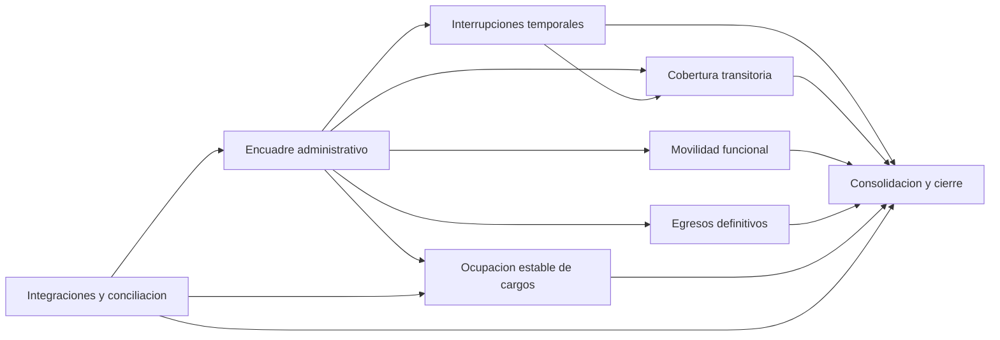

# Mapa de bounded contexts - Novedades laborales

> [!abstract] Proposito
> Este documento presenta el recorte estrategico vigente de bounded contexts para el dominio de novedades laborales. Su objetivo es sostener un mapa de problemas de negocio ya delimitado, con cierre ejecutivo de los hotspots principales del mapeo.

## 1. Criterio de particion

La particion propuesta no se organiza:

- por pantalla,
- por actor,
- por gobernanza,
- ni por una lista nominal infinita de novedades.

La particion se organiza por **patrones de negocio distintos**. Es decir: por grupos de decisiones que deben mantenerse consistentes juntas.

## 2. Lo que queda fuera de este recorte

Quedan explicitamente fuera del mapa principal de bounded contexts:

- la POF como sistema maestro externo,
- la administración estructural de plazas como dominio autónomo externo,
- la habilitación efectiva de pago como problema propio de liquidación,
- el inicio real de prestación como dominio autónomo,
- la liquidación completa como sistema posterior,
- la toma de posesión como subproceso local relevante pero no como bounded context autonomo.

> [!info]
> La toma de posesion sigue siendo importante. En este mapa se la trata como subproceso administrativo transversal de efectivizacion en las familias que lo requieran, especialmente coberturas, traslados y ocupaciones estables, pero no como contexto delimitado principal.

> [!info]
> `Vacante` tampoco se modela aqui como bounded context autonomo. Se la trata como concepto transversal central de plaza y estado de plaza, dependiente del dominio POF, que algunos contexts producen, transforman o consumen sin absorber la administracion estructural de plazas. Ver `[[Concepto transversal - Plaza, estado y vacante]]`.

## 3. Bounded contexts propuestos

1. [[BC-01 - Encuadre administrativo de la novedad]]
2. [[BC-02 - Interrupciones temporales]]
3. [[BC-03 - Cobertura transitoria]]
4. [[BC-04 - Movilidad funcional]]
5. [[BC-05 - Egresos definitivos]]
6. [[BC-06 - Ocupación estable de cargos]]
7. [[BC-07 - Integraciones y conciliación]]
8. [[BC-08 - Consolidacion y cierre]]

La numeracion busca expresar un orden secuencial de modelado del dominio: primero encuadre y familias funcionales, luego integraciones, y por ultimo consolidacion y cierre.

## 4. Lectura rápida del mapa

## 6. Para que sirve cada contexto

### 6.1 Encuadre administrativo de la novedad

Sirve para recibir, clasificar y derivar casos. No resuelve el negocio profundo de cada familia.

### 6.2 Interrupciones temporales

Sirve para tratar alteraciones transitorias de un vinculo laboral sin convertirlas en egresos definitivos.

### 6.3 Cobertura transitoria

Sirve para tratar la lógica de reemplazo o cobertura habilitada por ausencia o vacancia transitoria.

### 6.4 Movilidad funcional

Sirve para tratar movimientos de asignacion, destino o encuadre funcional que no son ni simple interrupcion ni egreso definitivo. En casos de mayor jerarquia, actua como contexto rector y deriva los efectos de suplencia u ocupacion estable a otros contexts.

### 6.5 Egresos definitivos

Sirve para tratar cierres definitivos del caso laboral.

### 6.6 Ocupacion estable de cargos

Sirve para tratar interinatos, titularizaciones y otras decisiones de ocupacion estable sobre cargo habilitado.

### 6.7 Integraciones y conciliación

Sirve para recibir eventos externos, conciliarlos y hacerlos aterrizar en el catalogo común del dominio.

### 6.8 Consolidacion y cierre

Sirve para decidir criticidad, consolidabilidad, arrastre y salida administrativa derivada.

## 7. Reglas de corte entre contextos

Estas reglas ayudan a evitar solapamientos:

1. Si el problema principal es `clasificar y derivar`, pertenece a `Encuadre administrativo de la novedad`.
2. Si el problema principal es `interrumpir temporalmente`, pertenece a `Interrupciones temporales`.
3. Si el problema principal es `cubrir una ausencia o vacancia transitoria`, pertenece a `Cobertura transitoria`.
4. Si el problema principal es `mover o reasignar funcionalmente`, pertenece a `Movilidad funcional`.
5. Si el problema principal es `cerrar definitivamente`, pertenece a `Egresos definitivos`.
6. Si el problema principal es `ocupar establemente un cargo`, pertenece a `Ocupacion estable de cargos`.
7. Si el problema principal es `traducir o conciliar eventos externos`, pertenece a `Integraciones y conciliacion`.
8. Si el problema principal es `decidir cierre, arrastre o consolidacion`, pertenece a `Consolidacion y cierre`.

## 8. Dependencias externas relevantes

- sistema maestro de POF,
- estado de plaza y carácter de vacante como información estructural de referencia,
- modulo externo de licencias medicas,
- actos administrativos y respaldo normativo,
- sistema o proceso de liquidación,
- procesos locales de toma de posesión y efectivizacion cuando la familia lo requiera.

## 9. Orden sugerido de investigación

Para seguir profundizando sin volver a mezclar todo, conviene investigar en este orden:

1. `Encuadre administrativo de la novedad`
2. `Interrupciones temporales`
3. `Cobertura transitoria`
4. `Movilidad funcional`
5. `Egresos definitivos`
6. `Ocupacion estable de cargos`
7. `Integraciones y conciliacion`
8. `Consolidacion y cierre`

Como artefacto complementario para refinar bordes antes de pasar a eventos o contratos técnicos, ver `[[Matriz de interfaces - Bounded contexts de novedades laborales]]`.

## 10. Preguntas de corte para continuar

- que decisiones deben quedar dentro de cada contexto y cuales deben salir,
- que eventos produce cada contexto,
- que eventos consume cada contexto,
- donde empieza y termina cada caso,
- que informacion minima necesita cada contexto para operar,
- y que parte del trabajo sigue siendo local aun en un modelo mas centralizado.
