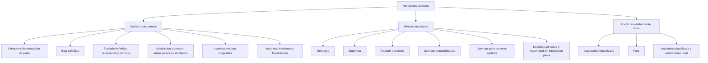
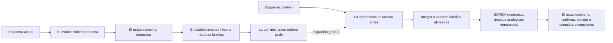
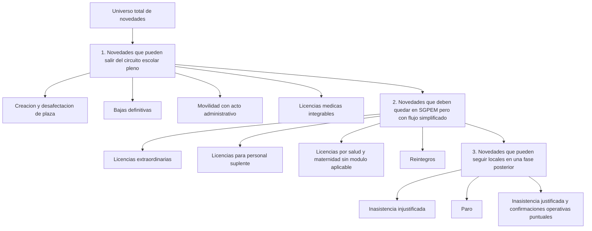
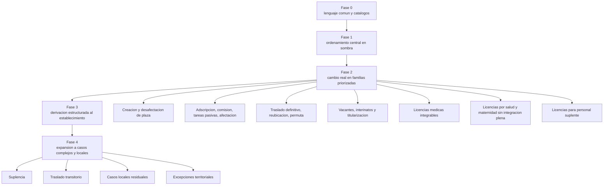
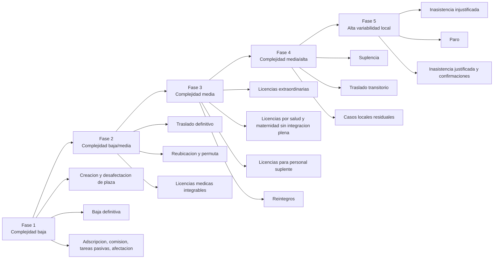

# Tipos de novedades laborales en primaria

> [!abstract] Resumen ejecutivo
>El objetivo debe ser reducir progresivamente la cantidad de novedades laborales que la escuela necesita informar directamente. Para eso, primero conviene modernizar los flujos hoy analogicos, manuales o redundantes, absorber por integracion o por ordenamiento central los casos que ya no necesitan originacion escolar plena, y dejar al establecimiento en un rol mas acotado de deteccion, confirmacion o ejecucion. En primaria, esto implica empezar por las familias con mayor naturalidad administrativa y mayor posibilidad de salir del circuito local intensivo.

## 1. Criterio de lectura

Esta nota reordena las novedades laborales segun una pregunta de gobernanza:

**que novedades deben seguir siendo informadas por el establecimiento y cuales deberían migrar progresivamente a circuitos mas centralizados, integrados o asistidos?**

## 2. Mapa general por gobernanza

## 3. Cambio de paradigma

## 4. Embudo de reducción de carga para el establecimiento

## 5. Familias principales y subfamilias relevantes

### 5.1 Estructura POF

- Creacion de plaza
- Desafectacion de plaza

### 5.2 Prestacion ordinaria

- Alta por designacion
- Baja por cese
- Reintegro
- Inasistencia justificada
- Inasistencia injustificada
- Paro

### 5.3 Cobertura y reemplazo

- Suplencia

### 5.4 Vacantes, interinatos y titularizacion

- Interinato sobre cargo vacante
- Pase de suplente a interino por vacancia definitiva
- Titularizacion por concurso de ingreso
- Titularizacion por concurso de ascenso

### 5.5 Movilidad funcional

- Traslado transitorio
- Traslado definitivo
- Adscripcion
- Comision de servicio
- Tareas pasivas
- Afectacion
- Permuta
- Reubicacion
- Mayor jerarquia como movimiento rector con efectos derivados sobre origen y destino

### 5.6 Licencias separadas en subfamilias

- Licencias medicas integrables por modulo externo
- Licencias por salud sin integracion plena
- Licencias por maternidad
- Licencias extraordinarias
- Licencias para personal suplente

> [!info]
> En esta nota, `licencias por salud y maternidad` se mantienen visibles como subfamilia diferenciada porque parte de esos casos puede convivir con integracion medica futura, mientras otra parte puede seguir requiriendo tratamiento propio dentro de SGPEM. A su vez, `licencias extraordinarias` y `licencias para personal suplente` deben quedar explicitamente fuera del supuesto de cobertura total del modulo de licencias medicas previsto.

## 6. Matriz sugerida por familia de novedad para primaria

| Familia de novedad                                     | Esquema actual dominante      | Objetivo ideal                                               | Sugerencia transicional                                                                       | Prioridad  |
| ------------------------------------------------------ | ----------------------------- | ------------------------------------------------------------ | --------------------------------------------------------------------------------------------- | ---------- |
| Creacion / desafectacion de plaza                      | Central                       | Min. ordena y deriva                                         | Mantener como caso ya alineado y usarlo como referencia                                       | Alta       |
| Adscripcion / comision / tareas pasivas / afectacion   | Mixto con peso central        | Central ordena primero                                       | Migrar temprano a bandeja central                                                             | Alta       |
| Traslado definitivo / reubicacion / permuta            | Mixto                         | Central ordena primero                                       | Reforzar origen administrativo y derivacion controlada                                        | Alta       |
| Vacantes / interinatos / titularizacion             | Mixto con acto externo o designacion administrativa | Ordenamiento central con confirmacion local obligatoria      | Tratar como provision de vacantes separada de suplencias                                      | Alta       |
| Licencias medicas integrables                          | Mixto con dependencia externa | Origen externo o central con ordenamiento temprano           | Integrar por eventos aprobados cuando el modulo este disponible                               | Alta       |
| Licencias por salud y maternidad sin integracion plena | Mixto                         | SGPEM ordena antes con circuito simplificado                 | Crear flujo propio simplificado dentro de SGPEM mientras no exista cobertura externa completa | Alta       |
| Licencias extraordinarias                              | Mixto o local segun caso      | Ordenamiento administrativo temprano con catalogo claro      | Estandarizar subtipos, respaldo minimo y derivacion asistida                                  | Media/Alta |
| Licencias para personal suplente                       | Local con alta ambiguedad     | SGPEM ordena sobre prestacion y condicion de suplencia       | Definir reglas especificas y evitar tratamiento residual manual                               | Alta       |
| Reintegro                                              | Local                         | Central ordena sobre antecedente valido                      | Mantener carga local asistida con validacion previa                                           | Media/Alta |
| Suplencia                                            | Mixto con peso local          | Central ordena sobre ausencia validada                       | Implementar preorden administrativo antes del reemplazo                                       | Media/Alta |
| Traslado transitorio                                   | Mixto y complejo              | Central ordena con doble control                             | Tratar como flujo especial con responsable bilateral                                          | Alta       |
| Baja definitiva                                        | Central                       | Central ordena sobre respaldo y efecto de plaza              | Mantener y formalizar trazabilidad completa                                                   | Alta       |
| Inasistencia injustificada                            | Inevitablemente local         | Registro local con ordenamiento administrativo posterior     | Mantener origen local y reforzar trazabilidad minima                                          | Media/Baja |
| Inasistencia justificada / paro                       | Fuertemente local             | Ordenamiento administrativo posterior o muestreo inteligente | Dejar para fase tardia del cambio                                                             | Media/Baja |

## 7. Matriz visual de prioridad y fase

## 8. Lectura ejecutiva

La reducción de carga para el establecimiento depende de tres movimientos simultáneos:

1. sacar del circuito escolar pleno las novedades que ya tienen naturalidad administrativa o acto central;
2. integrar las licencias medicas que puedan venir desde un modulo externo, sin convertir a ese modulo en el rector total de SGPEM;
3. modernizar dentro de SGPEM las familias que seguiran existiendo fuera de ese modulo, especialmente licencias no medicas, licencias para suplentes, reintegros y otros flujos todavia manuales.

## 9. Implicancia concreta para primaria

En primaria, el primer exito no deberia medirse por cantidad de pantallas nuevas ni por cantidad total de tipos cargables. Deberia medirse por una reduccion concreta de familias que la escuela necesita originar manualmente, interpretar sola o reconstruir al cierre.

Un objetivo razonable de primera etapa es este:

- que las novedades mas administrativas lleguen ya encuadradas;
- que las licencias medicas integrables se absorban por un circuito mas temprano;
- que las licencias no medicas remanentes se simplifiquen con catalogos, reglas y evidencia minima;
- y que el establecimiento quede cada vez menos expuesto a resolver por si mismo casos de alta complejidad normativa.

## 10. Referencias relacionadas

- [[10 - Proyectos/Planillas de novedades/03 - Diseño técnico/SGPEM - Plan técnico v5]]
- [[10 - Proyectos/Planillas de novedades/02 - Diseño funcional/SGPEM - Sugerencias para transición a ordenamiento administrativo central (Primario)]]
- [[10 - Proyectos/Planillas de novedades/02 - Diseño funcional/SGPEM - Marco base de novedades laborales]]
- [[10 - Proyectos/Planillas de novedades/02 - Diseño funcional/SGPEM - Paquete visual integral]]
- [[10 - Proyectos/Planillas de novedades/02 - Diseño funcional/SGPEM - Analisis de cambios del dia y matrices]]

## 11. Mini plan de accion por fases segun complejidad

El criterio recomendado es centralizar lo mas simple de absorber sin generar friccion operativa excesiva. Eso permite validar gobernanza, bandejas, derivaciones y trazabilidad con bajo riesgo antes de avanzar sobre familias mas sensibles.

### 11.1 Tabla compacta

| Fase   | Complejidad dominante   | Objetivo                                                                                | Familias sugeridas                                                                                                              |
| ------ | ----------------------- | --------------------------------------------------------------------------------------- | ------------------------------------------------------------------------------------------------------------------------------- |
| Fase 1 | Baja                    | Centralizar casos ya maduros administrativamente                                        | Creacion de plaza, desafectacion de plaza, baja definitiva, adscripcion, comision de servicio, tareas pasivas, afectacion       |
| Fase 2 | Baja/media              | Ampliar centralizacion a casos estructurados con acto definido                          | Traslado definitivo, reubicacion, permuta, licencias medicas integrables                                                        |
| Fase 3 | Media                   | Simplificar y centralizar asistidamente flujos aún analogicos o fragmentados            | Licencias extraordinarias, licencias por salud y maternidad sin integracion plena, licencias para personal suplente, reintegros |
| Fase 4 | Media/alta              | Avanzar sobre casos con mayor dependencia contextual                                    | Suplencia, traslado transitorio                                                                                                 |
| Fase 5 | Alta variabilidad local | Dejar para tratamiento local o selectivo los casos de menor retorno por centralizacion   | Inasistencia injustificada, inasistencia justificada, paro, confirmaciones operativas puntuales                                 |

### 11.2 Grafico por fases

### 11.3 Criterio ejecutivo de avance

Se debería pasar de una fase a otra solo si la anterior demuestra:

- reglas entendidas por los actores;
- menor carga real para el establecimiento;
- menor retrabajo manual;
- trazabilidad clara entre detección, ordenamiento y derivación;
- ausencia de aumento significativo de errores de liquidación.

### 12. Preguntas para decisiones ejecutivas
Analizar la complejidad de la reducción de carga manual para su implementación en POF.
- Si no se carga manualmente la información, el sistema actual permite una integración externa?
- Cómo impacta en la planta orgánica funcional el resultado positivo de una comisión de servicio, adscripción o tareas pasivas?
- [[Preguntas para continuar - Centralizacion de novedades laborales]]
