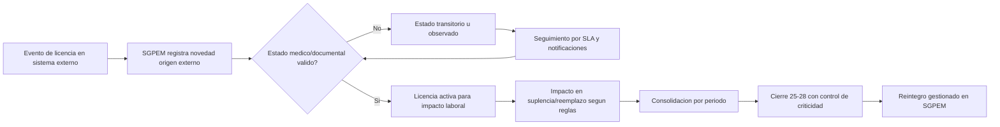

# Análisis detallado - Impacto en flujo y circuito SGPEM por integración de licencias en tiempo real

> [!abstract] Propósito del documento
> Exponer de manera integral cómo la integración del circuito de licencias por salud modifica el flujo operativo, el circuito administrativo, las reglas funcionales y la gestión temporal del Proyecto de Planilla de Novedades (SGPEM), pasando de un esquema posterior a uno en tiempo real.

---

## 1) Alcance y premisas

### 1.1 Alcance

Este análisis cubre:

- impacto en flujo end-to-end de novedades,
- impacto por actor institucional,
- impacto por tiempos de gestión y ventanas de cierre,
- impacto en reglas de negocio y estados,
- riesgos, mitigaciones y estrategia de transición.

No cubre diseño de interfaz final ni detalle de API contractual definitivo.

### 1.2 Premisas de contexto vigentes

1. SGPEM adopta como unidad primaria la **novedad individual por agente**.
2. La planilla es **consolidado administrativo por período**, no punto de entrada.
3. El proyecto debe sostener un **escenario dual** (con integración y sin integración) hasta estabilización total.
4. El **reintegro** permanece en SGPEM aun cuando la licencia de salud se origine externamente.

---

## 2) Línea base: cómo opera hoy sin integración plena

## 2.1 Patrón temporal histórico

- Predomina el registro posterior (mes vencido o con atraso).
- La validación fuerte ocurre cerca del cierre.
- Muchas inconsistencias aparecen cuando el margen de corrección es corto.

## 2.2 Efectos en el circuito

- Doble esfuerzo de carga/verificación.
- Dependencia de comunicaciones manuales entre áreas.
- Reprocesos de suplencias/reemplazos por cambios tardíos de estado.
- Mayor probabilidad de observaciones críticas al pre-cierre.

---

## 3) Circuito objetivo con integración en tiempo real

## 3.1 Qué se integra

Del circuito de licencias por salud se incorporan como eventos funcionales:

1. Inicio de solicitud de licencia.
2. Verificación de documentación mínima (incluye lógica de certificado).
3. Envío a Reconocimientos/Contralor.
4. Dictamen médico.
5. Determinación de días reconocidos y artículo.
6. Notificaciones de estado a partes intervinientes.
7. Cierre del trámite (incluyendo cierres automáticos por inacción/documentación).

## 3.2 Principio rector de integración

SGPEM no debe replicar el trámite médico completo; debe:

- consumir eventos de estado,
- materializar impacto laboral/liquidación,
- sostener trazabilidad,
- gobernar reintegro y consolidación.

---

## 4) Rediseño de flujo funcional SGPEM

## 4.1 Flujo macro propuesto

## 4.2 Cambios de lógica respecto al estado actual

1. **Desacople captura vs cierre:** la novedad nace antes, no al final.
2. **Estados intermedios reales:** aparecen estados de espera/revisión médica.
3. **Control por criticidad:** no todo estado pendiente bloquea igual.
4. **Consolidación de calidad:** al cierre se consolida, no se “descubre”.

---

## 5) Análisis por tiempos y fechas

## 5.1 Ejes temporales de referencia

- **T0:** inicio de solicitud de licencia.
- **T0 + 24h:** ventana para completar certificado/documentación (si aplica).
- **Tdict:** recepción de dictamen médico.
- **Tcorte (25-28):** ventana de pre-cierre/cierre de liquidación.
- **Tpost:** eventos tardíos posteriores al corte (arrastre controlado o ajuste).

## 5.2 Antes vs después (temporal)

| Momento      | Esquema posterior (actual)       | Esquema tiempo real (objetivo)                        | Efecto operativo                    |
| ------------ | -------------------------------- | ----------------------------------------------------- | ----------------------------------- |
| T0           | Muchas veces no visible en SGPEM | Novedad visible al iniciar licencia                   | Anticipación de cobertura y control |
| T0+24h       | Regla no sistematizada           | Vence espera documental y deriva a cierre/continuidad | Disminuye licencias “colgadas”      |
| Tdict        | Llega tarde al consolidado       | Recalcula estado en cuanto llega dictamen             | Menos correcciones manuales         |
| Tcorte 25-28 | Alta concentración de ajustes    | Pre-cierre con mayor madurez de datos                 | Menor riesgo de error salarial      |
| Tpost        | Ajustes reactivos frecuentes     | Excepciones delimitadas por política                  | Mejor gobernanza del arrastre       |

## 5.3 Implicancias para calendario operativo

- El trabajo mensual se distribuye durante todo el período.
- El cierre 25-28 deja de ser “zona de diagnóstico” y pasa a ser “zona de decisión”.
- Se requiere tablero diario de pendientes críticos y SLA por tipo de estado.

---

## 6) Impacto por actor del circuito

## 6.1 Agente (docente/solicitante)

- Pasa de informar por canales con latencia a dejar trazabilidad temprana de solicitud.
- La omisión documental dentro de la ventana definida impacta en cierre automático del trámite.

## 6.2 Gestión Escolar

- Toma mayor centralidad como orquestador del trámite y notificaciones.
- Debe garantizar calidad y oportunidad de eventos que SGPEM consumirá.

## 6.3 Establecimiento

- Recibe estados más tempranos y accionables (ausentismo, cantidad de días, artículo).
- Mejora capacidad de gestión de cobertura en tiempo útil.

## 6.4 Contralor/Recono-cimientos médicos

- Su dictamen deja de ser dato “de cierre” y pasa a ser dato “de operación”.
- Exige integración confiable para reflejar días/artículo en SGPEM sin reproceso.

## 6.5 SGPEM

- Se transforma en consumidor y normalizador de eventos de licencia.
- Conserva control del reintegro, consolidación y bloqueo por criticidad de liquidación.

---

## 7) Reglas funcionales que deben modificarse o formalizarse

## 7.1 Origen y correlación

- Cada novedad de licencia debe registrar `origen_novedad` y `id_tramite_externo`.
- Debe existir idempotencia (no duplicar misma licencia por reenvío de evento).

## 7.2 Estados de licencia en SGPEM

Estados mínimos recomendados:

- `REGISTRADA_EXTERNA`
- `PENDIENTE_DOCUMENTACION`
- `EN_REVISION_MEDICA`
- `APROBADA`
- `RECHAZADA`
- `CERRADA_POR_INACCION`
- `OBSERVADA`

## 7.3 Regla de criticidad para cierre

- Casos críticos pendientes (p. ej., sin dictamen cuando corresponde) bloquean consolidación/cierre.
- Casos no críticos pueden arrastrarse con trazabilidad y política explícita.

## 7.4 Regla de reintegro

- El reintegro no se infiere automáticamente por finalización médica externa.
- Debe registrarse en SGPEM como novedad propia, vinculada a licencia antecedente válida.

## 7.5 Regla de suplencia/reemplazo

- Alta de reemplazo condicionada a estado de licencia que habilite cobertura.
- Licencia rechazada o cerrada por inacción no debe mantener cobertura activa.

---

## 8) Impacto en planilla y liquidación

## 8.1 Planilla como consolidado

Con integración en tiempo real, la planilla consolida:

- estado validado,
- días reconocidos,
- artículo aplicable,
- observaciones auditables.

## 8.2 Calidad de cierre

Mejoras esperadas:

- menor devolución por inconsistencias evitables,
- menor retrabajo en ventana 25-28,
- menor desfasaje entre realidad operativa y salida de liquidación.

## 8.3 Gestión de excepciones

Se debe definir política de:

- arrastre al período siguiente,
- ajuste extraordinario,
- bloqueo duro por impacto salarial.

---

## 9) Riesgos, mitigaciones y controles

| Riesgo | Impacto | Prob. | Mitigación |
|---|---|---|---|
| Doble carga (externo + SGPEM) | Alto | Media | Id correlación + regla de unicidad |
| Eventos fuera de orden | Alto | Media | Procesamiento por versión/fecha de evento |
| Inconsistencia días solicitados vs reconocidos | Alto | Media | Campo oficial de días reconocidos con sello de origen |
| Dependencia de disponibilidad externa | Medio/Alto | Media | Cola de reintento + modo degradado con trazabilidad |
| Bloqueos excesivos al cierre | Alto | Baja/Media | Matriz de criticidad + política de arrastre |
| Falta de adopción operativa | Medio | Media | Capacitación por actor + tablero de SLA |

Controles recomendados:

- tablero diario de pendientes críticos,
- monitoreo de latencia de eventos,
- conciliación semanal entre circuitos,
- auditoría mensual de casos de excepción.

---

## 10) Estrategia de transición (sin cortar operación)

## 10.1 Fase 0 - Preparación

- Definir catálogo de estados y tabla de correlación de trámites.
- Definir matriz de criticidad para cierre.

## 10.2 Fase 1 - Escenario dual controlado

- Convivencia con carga manual y eventos externos.
- Priorización de licencias de mayor impacto (p. ej., complejas).

## 10.3 Fase 2 - Integración operativa principal

- Licencias de salud pasan a originarse por integración para la mayoría de casos.
- SGPEM conserva reintegro, excepciones y consolidado.

## 10.4 Fase 3 - Optimización

- Ajuste fino de SLA, notificaciones y políticas de arrastre.
- Indicadores ejecutivos de calidad de cierre y exactitud de liquidación.

---

## 11) Indicadores para validar que la integración mejora el circuito

1. % de licencias ingresadas en T0-T+1 día.
2. % de casos con dictamen recibido antes de Tcorte.
3. % de devoluciones por inconsistencias de licencia en cierre.
4. Tiempo medio desde inicio de licencia hasta estado consolidable.
5. % de reemplazos revertidos por estado inválido (debe bajar).
6. % de reintegros con licencia antecedente correctamente vinculada.

---

## 12) Conclusión

> [!success] Conclusión central
> La integración en tiempo real del circuito de licencias no es solo una mejora técnica: es una reconfiguración del circuito operativo del SGPEM. Traslada el control desde el final del período hacia todo el ciclo mensual, mejora la trazabilidad por actor, reduce riesgo de liquidación y fortalece el modelo de novedad individual por agente.

Si se implementa con escenario dual, correlación fuerte de trámites, estados claros y gobernanza de criticidad al cierre, el proyecto gana previsibilidad sin perder continuidad operativa.

---

## 13) Referencias utilizadas

- `RV_ Circuitos administrativos - Licencias por motivos de salud. /Circuito de licencias de Salud - Flujograma.pdf`
- `RV_ Circuitos administrativos - Licencias por motivos de salud. /Circuito de licencias médicas - Prosa.pdf`
- `RV_ Circuitos administrativos - Licencias por motivos de salud. /Presentación Proyecto de Solicitudes de Licencias Medicas.pdf`
- `RV_ Circuitos administrativos - Licencias por motivos de salud. /Proyecto de Decreto de Solicitud de Licencias Medicas .pdf`
- `RV_ Circuitos administrativos - Licencias por motivos de salud. /Proyecto de Resolución de Licencias Medicas.pdf`
- [[10 - Proyectos/Planillas de novedades/00 - Inicio]]
- [[10 - Proyectos/Planillas de novedades/01 - Reuniones/2026/2026-03-30 - Novedades laborales y licencias]]
- [[10 - Proyectos/Planillas de novedades/02 - Diseño funcional/SGPEM - Documento didactico integral]]
- [[10 - Proyectos/Planillas de novedades/02 - Diseño funcional/SGPEM - Marco base de novedades laborales]]
- [[10 - Proyectos/Planillas de novedades/02 - Diseño funcional/SGPEM - Sugerencias operativas]]
- [[10 - Proyectos/Planillas de novedades/03 - Diseño técnico/SGPEM - Plan técnico]]
